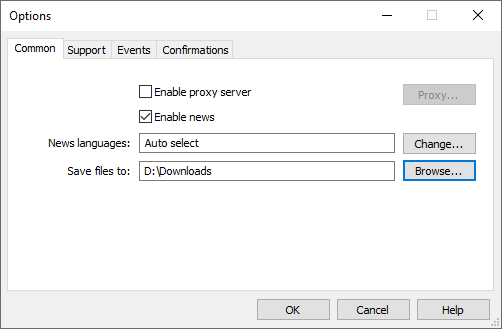
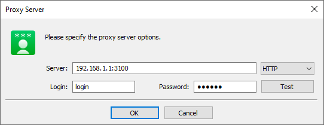
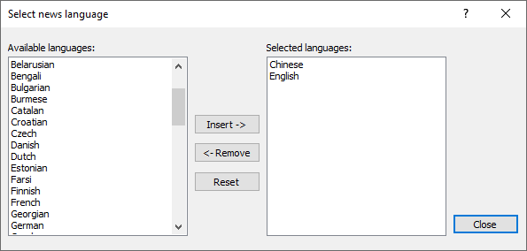

[🏠 Document Start](../../../README.md) / [MetaTrader 5 Trading Platform](../../../MetaTrader-5-Trading-Platform.md) / [MetaTrader 5 Administrator](../../MetaTrader-5-Administrator.md) / [Terminal Settings](../Terminal-Settings.md) / Common

[Previous](../Terminal-Settings.md) | [Next](Support.md)

# Common (#common)

The "Common" tab contains the connection settings of the administrator terminal and the settings of receiving news.

The following options are present here:

  * Enable proxy server — enable [connection](../Getting-Started/Connect-to-Server.md) to administrated servers through a proxy server. If this option is checked, the "Proxy..." button becomes active. Using it one can set up connection to administered servers through a [proxy server (#proxy)](Common.md#proxy).
  * Enable news — this option allows to enable or disable [news](../User-Interface/Toolbox/News.md). If it is disabled, news won't come to the terminal;
  * Languages — this option allows to filter news by their language. The window of choosing the [news language (#news-language)](Common.md#news-language) will appear as soon as the "Change" button is pressed. If the "Any language" parameter is indicated in this field then all news items will come to the terminal regardless of their language.
  * Save files to — the directory, to which files received via [internal email system](../../Platform-Setup/Mailbox.md) will be saved. When you open an attached file, the terminal checks its extension and the corresponds of file contents to this extension. If the file type is allowed and its contents are checked, the terminal will open the file and save it to the specified directory. Otherwise, a warning will be displayed, notifying that the file may harm the computer, and the file will not be saved. The following file types are allowed: PNG, JPG/JPEG, BMP, ZIP, 7Z, GIF, DOC, XLS, DOCX, XSLX, ODT, RTF, CSV, TXT, LOG.  
If a file with the same name and a different content exists in the directory, the manager's login and email arrival date/time up to a second will be added to the saved file name: [login]-[file name]-[date and time].[extension]. For example, the log file 20170501.log will be saved as 1001-20170501-20170502-170038.log.  
By default, files are saved to C:\Users\\[Windows username]\Downloads\MetaTrader. You can change the directory by clicking on "Browse".

## Setting Up Connection through Proxy Server (#proxy)

In the "Proxy Server" window it is necessary to specify the following parameters:

  * Server — IP address and server port number separated by a colon are specified here. To the right of this field the type of proxy server is selected: HTTP, SOCKS4 or SOCKS5. In HTTP mode NTLM authorization is also supported;
  * Login — account to access the proxy server. If login is not needed, the field should be empty
  * Password — password to access the proxy server. If password is not needed, the field should be empty.

In order to verify the correctness of the settings of connection to the proxy server, press the "Test" button. In case of receiving the message that the settings are correct it is necessary to press the "OK" button to save the settings. The error message indicates that the proxy server is set up incorrectly. To find out the reason, contact the system administrator or internet provider.

> The proxy server settings affect the connection to all the administered servers in the terminal.

## Selecting News Language (#news-language)

In order to select only necessary languages of incoming news, the "Change" button should be pressed against the corresponding field. After that the following window will be opened:

The left part of the window contains available languages, the right part - selected ones. In order to add a language, double-click on it or select it and press "Insert". Use "Remove" for removing languages from the list of selected ones. The "Reset" button returns default values. If "Any language" is indicated in the "News language" field, all news independent of the language will be received in the terminal.
