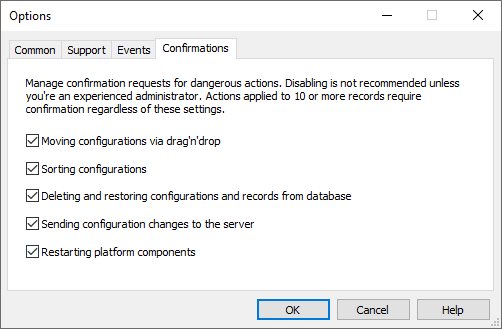

[🏠 Document Start](../../../README.md) / [MetaTrader 5 Trading Platform](../../../MetaTrader-5-Trading-Platform.md) / [MetaTrader 5 Administrator](../../MetaTrader-5-Administrator.md) / [Terminal Settings](../Terminal-Settings.md) / Confirmations

[Previous](Events.md) | [Next](../../App-Store.md)

# Confirmations

From this section, you can enable or disable additional confirmation requests for dangerous actions executed via the Administrator terminal.

The dangerous actions include:

  * Moving configurations via drag'n'drop (to protect against accidental actions)
  * Sorting and deleting configurations; sending configuration changes to the server (the Apply command)
  * Deleting and restoring records from backup
  * Restarting cluster components

When performing any of these actions, the terminal requests additional confirmation. Confirmations can be disabled for experienced administrators, or when performing a large platform reconfiguration.

The confirmation is always requested for actions applied to 10 or more entries.
