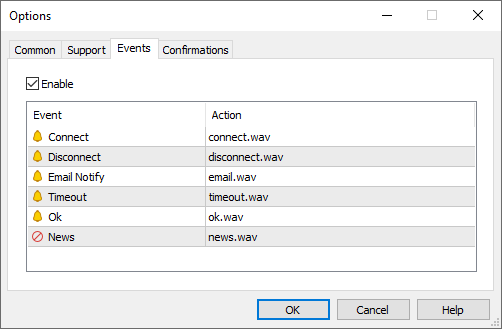

[🏠 Document Start](../../../README.md) / [MetaTrader 5 Trading Platform](../../../MetaTrader-5-Trading-Platform.md) / [MetaTrader 5 Administrator](../../MetaTrader-5-Administrator.md) / [Terminal Settings](../Terminal-Settings.md) / Events

[Previous](Support.md) | [Next](Confirmations.md)

# Events

At the "Events" tab you can set up the sound notifications about different events occurring in the administrator terminal.

All the events are displayed in the form of a table that contains their names and the sound files (on default) that are played when they occur. The following types of events are represented here:

  * Connect — signal of successful connection to a server;
  * Disconnect — signal of loosing connections with a server;
  * Email Notify — signal of receiving a message via the [mail system](../../Platform-Setup/Mailbox.md);
  * Timeout — a certain time range is predefined for performing different operations (for example, requesting data from a server or refreshing the settings). If this range has been exceeded for some reason, the operation will not be performed, and this signal will trigger;
  * Ok — signal of a successfully performed operation;
  * News — signal of received [news](../User-Interface/Toolbox/News.md).

If there is a need to disable any of the signals, it is necessary to double-click on its icon  or double-click on its name. After that the icon will change to . To enable a signal the same operation must be performed.

In order to change a file played at the signal activation, double-click on its name or select it and press the "Enter" key. After that click "Choose other..." in the pop-up list and indicate the necessary file in the appeared window.

> By default a file with *.wav extension is offered as a sound. However, another file can be indicated as a signal. If a *.wav file is selected, at the event triggering the file will be played. If another file is selected, it will be opened using application it is associated with in the operating system.

For changes to take effect the "OK" button should be pressed.
