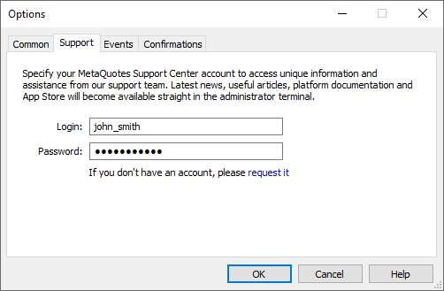

[🏠 Document Start](../../../README.md) / [MetaTrader 5 Trading Platform](../../../MetaTrader-5-Trading-Platform.md) / [MetaTrader 5 Administrator](../../MetaTrader-5-Administrator.md) / [Terminal Settings](../Terminal-Settings.md) / Support

[Previous](Common.md) | [Next](Events.md)

# Support

At this tab you can specify the authorization details (login and password) to access the special technical support website of MetaQuotes Software Corp.

This information will be used for contacting the technical support service right from the administrator terminal.
