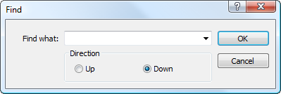

[🏠 Document Start](../../../README.md) / [MetaTrader 5 Trading Platform](../../../MetaTrader-5-Trading-Platform.md) / [MetaTrader 5 Administrator](../../MetaTrader-5-Administrator.md) / [User Interface](../User-Interface.md) / Search

[Previous](Status-Bar.md) | [Next](Hot-Keys.md)

# Search

Two types of search are implemented in the administrator terminal - one in the current section and a global one through the [search](Toolbar/Search.md) part of the toolbar.

Search in the current section allows to find elements in the currently selected section of [administration](../../Platform-Setup.md). To start searching, one should execute the " Find" command in the ["Edit" (#search)](Main-Menu/Edit.md#search) menu or press the "Ctrl+F" key combination. The following window will be opened then:

It contains the following parameters:

  * Find what — the field for specifying a word or phrase to be searched;
  * Direction — the direction of searching from the current cursor position — up or down. The searching of the currently chosen element is performed at the tab in the specified direction.

As soon as you press the "OK" button, search of the element will be performed. The first found element will be highlighted in the right part of the administrator terminal. In order to go to the next element it is necessary to execute " Find Next" command in the ["Edit" (#find-next)](Main-Menu/Edit.md#find-next) menu or press the "F3" key.
