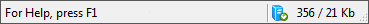
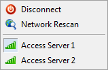

[🏠 Document Start](../../../README.md) / [MetaTrader 5 Trading Platform](../../../MetaTrader-5-Trading-Platform.md) / [MetaTrader 5 Administrator](../../MetaTrader-5-Administrator.md) / [User Interface](../User-Interface.md) / Status Bar

[Previous](Toolbar/Setup.md) | [Next](Search.md)

# Status Bar (#status-bar)

Status bar is located in the lower part of the administrator terminal. It contains tips of program commands, the connection status and the amount of sent and received data:

The following information is shown here from left to right:

  * Command hints;
  * Status of connection to the trade server. Icon  means that the terminal is currently connected to the server. If connection to the terminal is not established, icon . Hover over the icon to view additional connection details: ping to the trade server and packet loss. These variables measure connection quality between the terminal and the server.
  * Amount of incoming and outgoing traffic for the current session.

The status bar can be disabled by removing the check mark at the corresponding item of the ["View"](Main-Menu/View.md) menu.

## Access point changing menu (#access-servers)

The administrator terminal is connected to the trade server through [access servers](../../Platform-Setup/Network-cluster/Configuring-Servers/Access-Server.md). When connecting, the best access point is selected (the lowest load to server, the best quality of connection to it). The best access points are automatically checked every three hours of operation.

You can also switch between access servers using the menu that is opened by clicking on the connection status or traffic data in the status bar:

Menu | Commands  
---|---  
 | 

  *  Connect/ Disconnect — [connect](../Getting-Started/Connect-to-Server.md) or disconnect from the server.
  *  Network Rescan — this command is intended to manually start scanning of access points. If a server with connection quality better than the current by 30% is found, it is automatically switched to.
  * List of access servers — below all the available access servers are displayed. The indicator of the server quality is shown before the name of each access server. In order to switch to one of the access points, click on its name. It should be noted that in the next scanning of the network, the best server will be automatically choose. 

