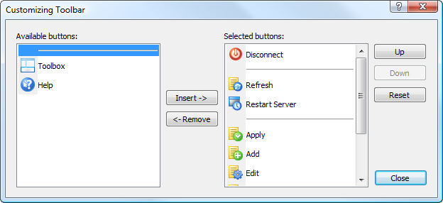

[🏠 Document Start](../../../../README.md) / [MetaTrader 5 Trading Platform](../../../../MetaTrader-5-Trading-Platform.md) / [MetaTrader 5 Administrator](../../../MetaTrader-5-Administrator.md) / [User Interface](../../User-Interface.md) / [Toolbar](../Toolbar.md) / Setup

[Previous](Search.md) | [Next](../Status-Bar.md)

# Setup

In order to start customizing the set of commands in the [standard](Standard.md) part of the toolbar, one should click with the right mouse button on it and choose the "Customize" item in the context menu. After that the window of customizing the toolbar will be opened:

In order to add a button into a toolbar, it should be moved from the left part of the window into the right one. This can be done by a double click on the button, or by selecting it and pressing "Insert". A button can be deleted from a toolbar by a double click on it in the right part of the window, or by selecting it and clicking "Remove". Buttons "Up" and "Down" in the right part of the window are used for changing the order of buttons displaying in a toolbar. In order to return default settings, the "Reset" button should be pressed.

The list of available buttons also contains a separating line. Adding it one can divide toolbar buttons into groups.
