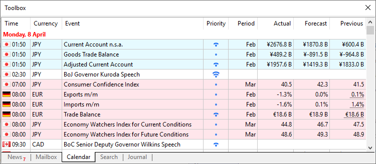

[🏠 Document Start](../../../../README.md) / [MetaTrader 5 Trading Platform](../../../../MetaTrader-5-Trading-Platform.md) / [MetaTrader 5 Administrator](../../../MetaTrader-5-Administrator.md) / [User Interface](../../User-Interface.md) / [Toolbox](../Toolbox.md) / Economic Calendar

[Previous](News.md) | [Next](Search.md)

# Economic Calendar

The administrator terminal contains the [Economic Calendar](https://www.mql5.com/en/economic-calendar). The calendar features publications of over 600 macroeconomic indicators concerning 15 largest global economies, including USA, European Union, Japan, UK, Canada, Australia, China, etc. Relevant data is collected from open sources in real time.

Macroeconomic indicators are parameters describing the state of the country they are calculated for. They characterize the level of economic development and may indicate either economic growth or a decline. By analyzing the macroeconomic indicators, it is possible to forecast future price movements.

The indicators and events can be viewed on the "Calendar" tab of the "Toolbox" window.

By default, the calendar displays current week events, including past and upcoming events. Use the context menu to switch to another period. You can access events for the previous, current and next week, as well as appropriate months. A deeper history is available in the [web version](https://www.mql5.com/en/economic-calendar).

Every indicator is provided with the release time, priority, as well as its current, forecast and previous values. The current value appears as soon as the indicator is released. If this value is less than the predicted one, the indicator is highlighted in red. If the current value is larger, the indicator is shown in blue.

To view a detailed event description or the history of its values as a graph or table, double click on its name.

For easier search, filter events in the list using the context menu:

  * by priority
  * by the currency of the country for which the indicator is published
  * by country for which the indicator is published

Economic calendar data can be saved as an HTM file. To do this, click  Export... in the context menu.

### Install the Calendar on your site

| 

### Download the mobile calendar version  
  
---|---  
You can add the Economic Calendar in your site free of charge. This can be done by pasting [the ready widget code](https://www.mql5.com/en/economic-calendar/widgets) in the desired web page. You do not have to worry about licensing risks. The Calendar is based on data collected from public sources. The advantages of the Calendar:

  * Useful content on your site: offer your visitors a powerful service for tracking global economic events.
  * Flexible customization for your website: set the desired widget width and height, the amount of data displayed, the language and date format.
  * Multilingual interface: all events and descriptions are fully translated into 9 languages, including English, Chinese, Japanese, Russian, Spanish, Portuguese, German, Turkish and Arabic.
  * Full representation: every event is provided with a detailed description and notes related to the release influence on individual currencies, as well as the source link, release date and charts.
  * No ads: you will not have to pay for the service by showing third-party ads.
  * Automatic time zone selection: event tracking is maintained via local time adaptation. Manual adaptation of time zones is also possible.
  * Automatic update: the calendar is automatically updated as soon as a new event appears in a source.
  * Continuous development: when a country is added, all economic indices which have a significant impact on the national currency are included in the calendar.

[Install the Calendar in your site >>](https://www.mql5.com/en/economic-calendar/widgets?utm_campaign=metatrader5.help) | The Economic Calendar is available as a separate [Tradays](https://www.tradays.com) application for mobile devices powered by iOS and Android. The mobile version features a complete set of functions for the full-fledged operation and a number of additional features:

  * More than 600 events related to the world's largest economies, including US, UK, European Union, japan, Canada, Australia, China, among others.
  * Detailed event descriptions.
  * Access to historic indicator values in the form of tables and charts.
  * Filters by priority and countries, to which the indicators are related.
  * Ability to create event reminders in a couple of clicks.

|   |    
---|---
