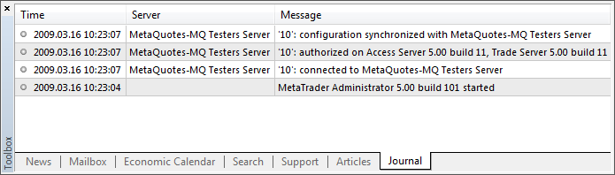

[🏠 Document Start](../../../../README.md) / [MetaTrader 5 Trading Platform](../../../../MetaTrader-5-Trading-Platform.md) / [MetaTrader 5 Administrator](../../../MetaTrader-5-Administrator.md) / [User Interface](../../User-Interface.md) / [Toolbox](../Toolbox.md) / Journal

[Previous](Search.md) | [Next](../../Terminal-Settings.md)

# Journal (#journal)

The "Journal" tab contains information about the registered actions of the administrator terminal for the current session of connection to the server. The information about the terminal start and events that occur during its working is registered in the journal. Only the last messages are displayed in the window. In order to view the folder that contains all the log files it is necessary to execute the " Open" command in the context menu.

The journal entries are marked with the corresponding icons depending on their types:

  *  — information message;
  *  — warning;
  *  — error message.

> Different types of errors returned by the server are described in the [separate section](../../../Platform-Components/Trade-Server/Return-Errors.md).

## Context Menu (#context)

Context menu of the "Journal" tab contains the following commands:

  *  Open — open the folder that contains the text files of the journal entries;
  *  Copy — copy a selected entry of the journal to clipboard. You can copy the selected record using the "Ctrl+C" key combination;
  * Auto Arrange — if this option is enabled, the size of columns is selected automatically;
  * Grid — this option shows/hides grid to separate the fields of the journal entries table.

