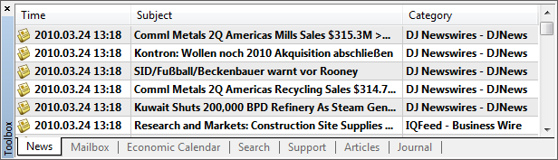
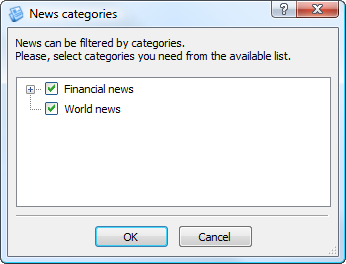
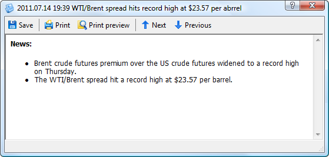

[🏠 Document Start](../../../../README.md) / [MetaTrader 5 Trading Platform](../../../../MetaTrader-5-Trading-Platform.md) / [MetaTrader 5 Administrator](../../../MetaTrader-5-Administrator.md) / [User Interface](../../User-Interface.md) / [Toolbox](../Toolbox.md) / News

[Previous](../Toolbox.md) | [Next](Economic-Calendar.md)

# News (#news)

In this tab you can work with news messages that come to the terminal.

News items are displayed in the form of a table with three columns:

  * Time — the time of news coming to the terminal;
  * Subject — title of news;
  * Category — category of news.

The news messages that has not been viewed yet are displayed with the bold font and have icon . Read messages are marked by icon . The  icon means that the news has a high priority. In order to read a news, one should click with the left mouse button on it.

## Context Menu (#context)

The context menu of news contains the following commands:

  *  View — opens the window of [viewing (#view)](News.md#view) news;
  *  Create — opens the window of [sending (#send)](News.md#send) news;
  * Categories — opens the submenu of choosing the news categories to be displayed in the list. To disable displaying of a category, remove the check against it. If the terminal receives only one category of news this menu is not displayed. If one of the categories contains two or more subcategories then the "Customize" command appears in this submenu. Using it one can [adjust (#customize)](News.md#customize) the news categories more precisely;
  * Category — show/hide the Category column in the list of news;
  * Auto Arrange — if this option is enabled, the size of columns is selected automatically; 
  * Grid — this option shows/hides grid to separate table fields.

## News Categories (#customize)

Using the Customize command of the [news categories (#categories)](News.md#categories) submenu, you can open the window of their detailed setup:

In the tree-like list, check the categories that shall be displayed in the administrator terminal.

## Viewing News (#view)

To start viewing news, click on its subject in the list. After that the following window will be opened:

The window header contains the date and time when the news was received and its title. The main part of the window is occupied by the text of news. The toolbar that contains the following commands is located in the upper part of the window:

  *  Save — save the news on a computer as a HTML file or a text file of the Unicode standard;
  *  Print — print the news;
  *  Print Preview — open the preview window before printing the news;
  *  Next — view the next news. The same action can be performed using the "Page Up" key;
  *  Previous — view the previous news. The same action can be performed using the "Page Down" key.

## Sending News (#send)

  * To be able to send news, the [group (#news)](../../../Platform-Setup/Groups/Group-Settings.md#news) the manager belongs to must be allowed to work with news, and the manager must have the [permission to send news (#news)](../../../Platform-Setup/Managers.md#news).
  * Also a manager should belong to a [group (#trade-server)](../../../Platform-Setup/Groups/Group-Settings.md#trade-server) that is created at the main trade server.

  
---  
  
In order to write and send a news, press " Create" in the context menu of the "News" tab.

This window contains the following fields:

  * Subject — subject of the news;
  * Template — in this field you can specify a previously created news [template (#templates)](News.md#templates);
  * High priority — if this option is checked, a high priority will be assigned to the message. The priority news messages are marked with the special  icon;
  * Language — choice of the language. There is an option of receiving internal news in the terminals. A user can adjust the receiving of news only in one of the languages. The "Language" option allows to send the news by separate language groups of users. In this field you can also specify "Any", in that case the news will be sent to all users regardless of the language settings in their terminal;
  * Category — the field for entering or choosing the news category. In order to create a subcategory, specify its name with the "\" symbols after the name of the main category. For example, "Financial news\Free".

Below is a window for working with the news text. The editor features commands for creating lists, as well as inserting images, links and tables. To view or edit the source HTML code of the news, click  on the toolbar.

The context menu of the text editor window contains standard commands for working with a text: Copy, Cut, Paste, Insert Link, Insert Table and Insert Image. The context menu also allows working with the news templates.

In order to send the news, press the "Send" button.

## Templates (#templates)

The Templates submenu of the context menu of the [news editing (#send)](News.md#send) window allows working with templates:

  * Save Template — save the current text of the news as a template in the *.htm format. All templates are stored in the [/templates/news (#news-templates)](../../Getting-Started/Structure-of-Directories-and-Files.md#news-templates) folder of the administrator terminal;
  * Load Template — open the window of choosing a previously created template for loading it;
  * Remove Template — remove the currently selected template.

> When executing the "Remove Template" command a template is irrecoverably deleted from PC.
