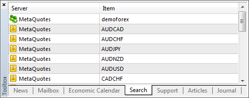

[🏠 Document Start](../../../../README.md) / [MetaTrader 5 Trading Platform](../../../../MetaTrader-5-Trading-Platform.md) / [MetaTrader 5 Administrator](../../../MetaTrader-5-Administrator.md) / [User Interface](../../User-Interface.md) / [Toolbox](../Toolbox.md) / Search

[Previous](Economic-Calendar.md) | [Next](Journal.md)

# Search (#search)

The result of [global searching](../Toolbar/Search.md) through the administrator terminal is displayed at this tab.

In this window elements found according to the search request are displayed. The information is shown in two columns:

  * Server — name of the platform component where the searched element was found.
  * Item — name of the found element.

If you click on the name of the found element, you will be moved to viewing it.

You can edit or delete records directly from search results, without opening the corresponding section of the Administrator terminal. The relevant operations can be performed using the context menu.

Also, the tab provides options for [batch editing (#groupwork)](../../../Platform-Setup/General-Information/Working-with-Instructions.md#groupwork) of same type elements. Select the required records by holding Shift or Ctrl+Shift, and then select "Edit" from the context menu.

## Context Menu (#context)

The context menu of this tab allows to execute the following commands:

  * Open — open a selected element. When this command is executed the window of viewing and editing the selected element will be opened, also you will go to the corresponding section of the terminal. The same action can be performed by a double click with left mouse button on the line or by pressing the "Enter" key;
  * Auto Arrange — enable/disable the automatic setting of column size;
  * Grid — show/hide grid to separate fields.

