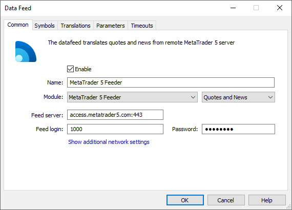
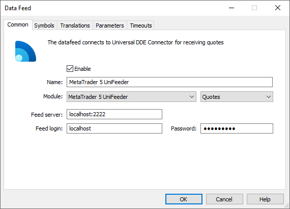
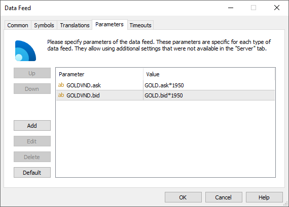

[🏠 Document Start](../../README.md) / [MetaTrader 5 Trading Platform](../../MetaTrader-5-Trading-Platform.md) / [Migration from MetaTrader 4](../Migration-from-MetaTrader-4.md) / Data Feeds

[Previous](Manager-Accounts.md) | [Next](../MetaTrader-5-Administrator.md)

# Data Feeds

Any sources of quotes and news used in the MetaTrader 4 platform can be easily moved to MetaTrader 5. There are three options to receive a stream of quotes:

  * From the MetaTrader 4 server having a trading account via [MetaTrader 4 Feeder](../Platform-Components/Data-Feeds/MetaTrader-4-Feeder.md).
  * From other data terminals via [UniDDE Connector](../Platform-Components/Data-Feeds/Universal-DDE-Connector.md).

Apart from quote and news already working in the MetaTrader 4 platform, you can receive data via the new feeders designed specifically for MetaTrader 5. You can find out the details in the [Data Feeds](../Platform-Components/Data-Feeds.md) section.

## Receiving Quotes from the MetaTrader 4 Server

If both platforms work simultaneously, use [MetaTrader 4 Feeder](../Platform-Components/Data-Feeds/MetaTrader-4-Feeder.md) to receive quotes and news from the MetaTrader 4 server. Add the new [data source](../Platform-Setup/Data-Feeds.md):

Select MetaTrader4Feeder in the Module field and enter server's IP address and port, as well as account login and password in the Feed server, Feed login and Password fields to connect to the MetaTrader 4 server.

MetaTrader 5 allows sorting out news by language. To do this, set the Language parameter on the Parameters tab:

News coming from MetaTrader 4 servers can be in text or HTML formats. In case of a text format, setting the Language parameter is desirable for a proper language recognition and correct news display.

The news language in HTML format is automatically defined by the "charset" attribute built in the news. The language name is specified in the format that is standard for Windows operating systems without defining the dialectical features by geographic location, for example, English, Russian, etc.

## Receiving Quotes via UniDDE Connector

If your MetaTrader 4 server receives quotes via [UniDDE Connector](../Platform-Components/Data-Feeds/Universal-DDE-Connector.md), you can use MetaTrader5UniFeeder component to receive them in MetaTrader 5.

DDE Connector allows collecting quotes from various data sources that support the DDE (Dynamic Data Exchange) protocol. The feeder translates quotes received from it to the MetaTrader 5 History Server.

Add the necessary data source via the corresponding section of MetaTrader 5 Administrator:

Set the server address where UniDDE Connector is installed, as well as connection port and account preliminarily created in UniDDE Connector (login and password) in the source settings.

MetaTrader5UniFeeder allows receiving quotes for the symbol data not transmitted via UniDDE Connector. This is achieved by mathematical conversion of other symbols' quotes transmitted via UniDDE Connector. This method of calculation can be applied to non-freely convertible currencies with their exchange rates to the major world currencies defined by the central bank.

To receive quotes for such symbols, specify the quote calculation equations on the Parameters tab of a data source:

