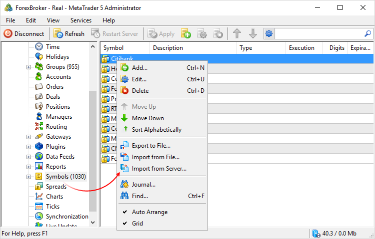
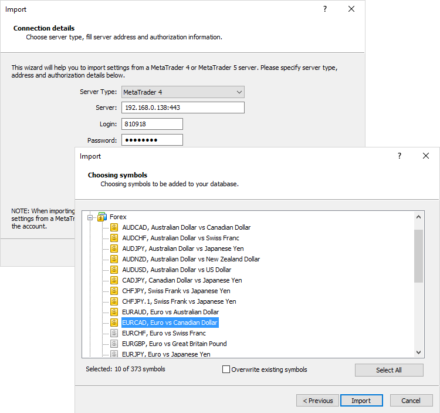
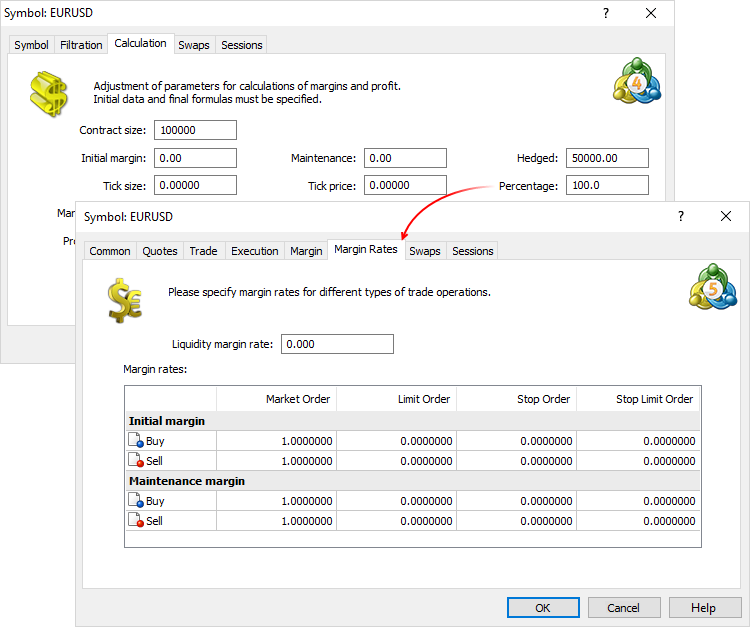
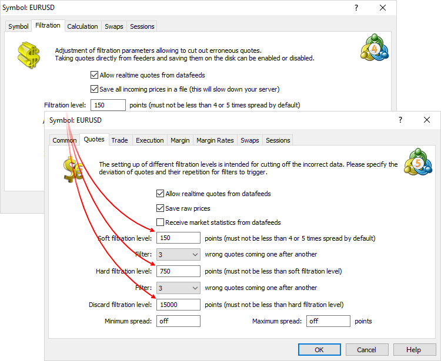
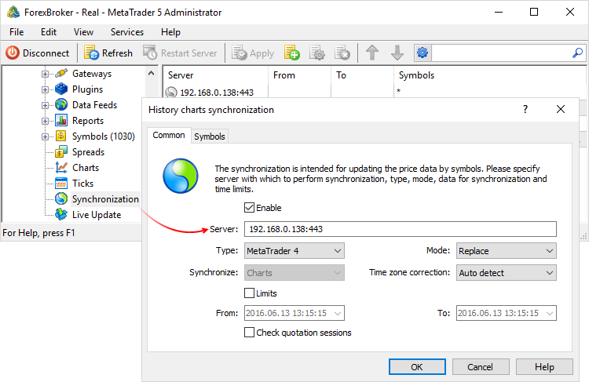

[🏠 Document Start](../../README.md) / [MetaTrader 5 Trading Platform](../../MetaTrader-5-Trading-Platform.md) / [Migration from MetaTrader 4](../Migration-from-MetaTrader-4.md) / Financial Instruments

[Previous](General-Settings.md) | [Next](Trade-Groups.md)

# Importing and Setting Financial Instruments

Please keep in mind the following when working with MetaTrader 5 symbols:

  * Unlike MetaTrader 4, the fifth version allows you to create symbol groups (similar to Securities in MetaTrader 4) directly in Symbols section. Moreover, you can create a tree-like symbol structure.
  * In MetaTrader 5, it is not necessary to collect individual symbol into groups. However, it is still recommended to divide symbols into some logical groups to make system administration more convenient.
  * MetaTrader 5 has no limitations on the number of financial instruments and their groups.

## Importing Symbols

Use the [import of symbols](../Platform-Setup/Symbols/Import-of.md) to copy all symbols and their settings from MetaTrader 4 server to the MetaTrader 5 platform.

> When you import symbols, existing settings are converted and default values are assigned to missing settings.

Select "MetaTrader 4" server type and specify connection data: IP address and server port, as well as account login and password. The account used for importing symbols may be opened in any group except for a manager one ("manager"). The group, in which the account is opened, should have access to all symbols to be imported from MetaTrader 4 server.

The next window shows the list of all symbols that can be imported from MetaTrader 4 server. Selected symbols are imported to MetaTrader 5 platform after pressing Import button.

In case of successful import, the symbols appear in the Symbols section of the group, from which the import command has been called.

  * By default, all imported symbols are not available for trading.
  * Check the settings carefully before making any symbol available for trading.

  
---  
  
In order to distribute imported symbols among symbol groups, select the necessary symbols and drag them by mouse to a necessary group (or subgroup).

## Configuring the Symbols

All symbol settings from MetaTrader 4 are automatically converted to the appropriate symbol settings for MetaTrader 5. Since the MetaTrader 5 platform features the new parameters that are not present in MetaTrader 4, such parameter values are set to default ones for each symbols imported from MetaTrader 4.

"Percentage" value used to calculate the margin in the MetaTrader 4 symbol settings (Calculation tab) has been redefined and expanded in MetaTrader 5. Therefore, it is not imported. In MetaTrader 5, you can assign the necessary ratio for each trading operation type and direction separately:

> Due to differences in [hedged margin (#hedged)](../Platform-Setup/Symbols/Symbol-Settings/Trade/Margin-Calculation/Retail-Forex-CFD-Futures-—-Hedging.md#hedged) calculation between the platforms, the hedged margin value is doubled during the import making margin calculation in MetaTrader 5 similar to the one in MetaTrader 4.

"Filtration level" in MetaTrader 4 symbol filtration settings is inserted into "Soft filtration level" in the MetaTrader 5 symbol settings. Its five-fold value is used as "hard filtration level" parameter, while the hundred-fold one — as "Discard filtration level".

The minimum and maximum volume, as well as step in MetaTrader 5 are set by default.

## History Data Synchronization between MetaTrader 5 and MetaTrader 4

After importing the symbols, you can download history data for them from your MetaTrader 4 Server. There are some synchronization features to be considered before the start of the process:

  * In order to synchronize history data with MetaTrader 4 server, the latter should have at least one demo group. The group can be disabled.
  * MetaTrader 5 history data is stored only as 1-minute data and converted programmatically into larger timeframes on request from the client terminal, while MetaTrader 4 stores different timeframes.
  * When synchronizing with MetaTrader 4 servers, the system consistently selects the most complete data beginning from one-minute timeframe.  
M1 data is fully taken first. Next, the system attempts to receive the missing part from H1 data. MetaTrader 4 server's hour reading is recorded to the first minute of an hour at MetaTrader 5 server. After that, the attempt is made to receive missing data from D1 timeframe. Daily data of MetaTrader 4 server (for example, 01.03.2009) is recorded to the first minute of a day at MetaTrader 5 server (for example, 01.03.2009 00:00).  
Therefore, clients will be able to receive a complete chart for a historical period only on the timeframe, from which the data has been imported.

Before launching synchronization, specify the source server (your MetaTrader 4 Server) in [Synchronization](../Platform-Setup/Synchronization.md) section of MetaTrader 5 Administrator. The Symbols tab allows you to specify the symbols, the data for which is to be synchronized.

To start synchronization, select Services -> Synchronize History in the terminal's main menu.

Data synchronization process can be tracked in the history server [journal](../Platform-Setup/Network-cluster/Journal.md). To do this, enter "Synchronization" (without the quotes) in the search bar of the filtration settings, set Full for a request type and All for an event type, specify the current day and click Request. The following journal entry indicates the completion of a synchronization process:

history synchronization with xxx.xxx.xxx.xxx:xxx finished  
---  
  
Synchronized data can be seen in [Charts](../Platform-Setup/1-Minute-History-Charts.md) section of MetaTrader 5 Administrator.

> MetaTrader 5 has no limitations on the depth of history data and the number of symbols.
