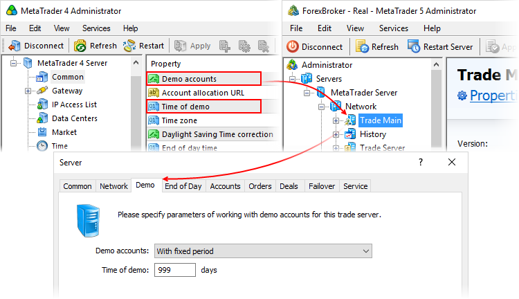
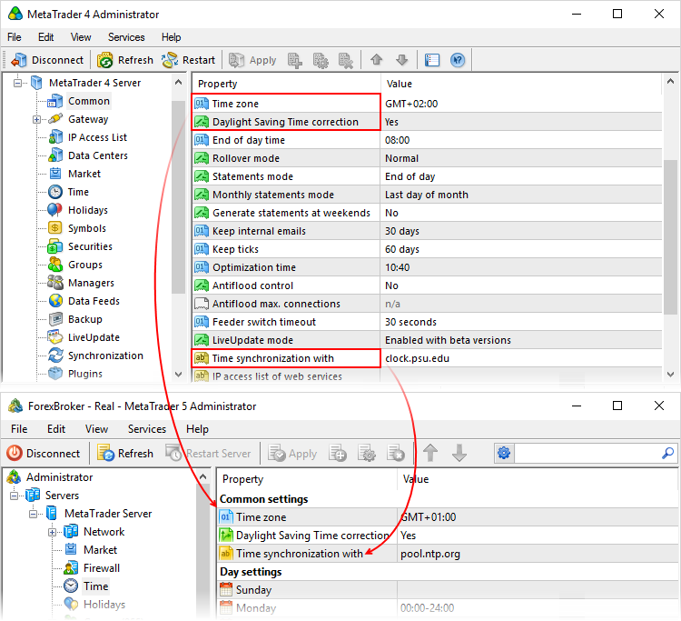
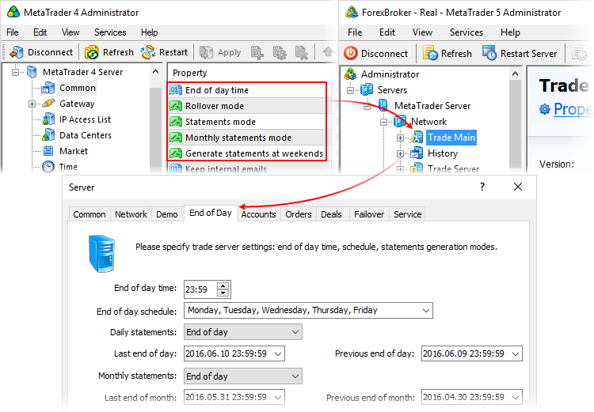
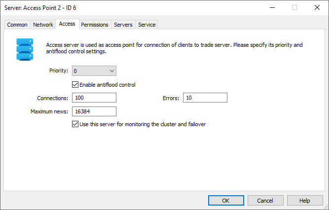
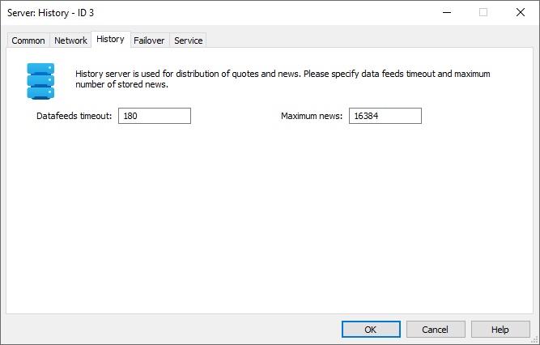
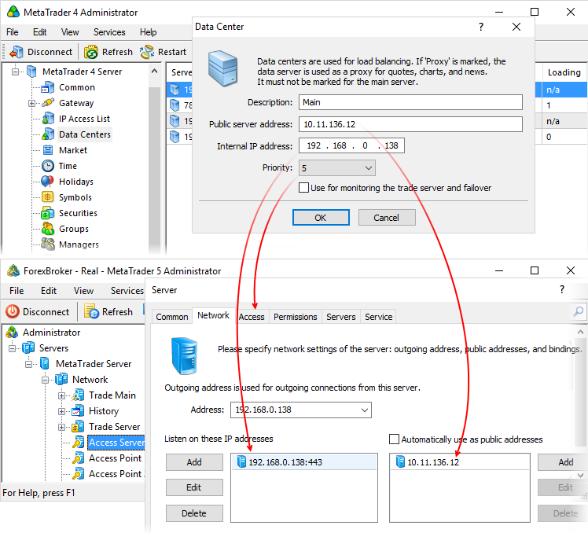
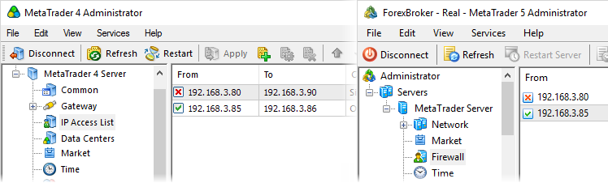
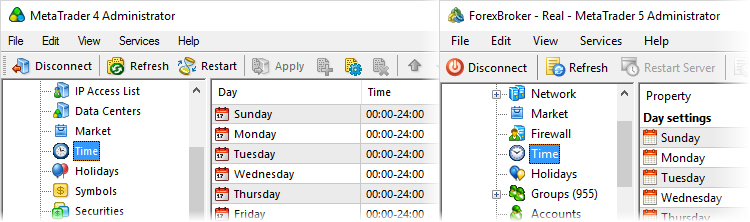
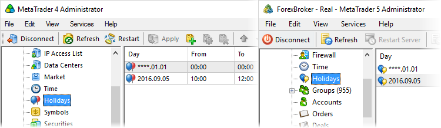

[🏠 Document Start](../../README.md) / [MetaTrader 5 Trading Platform](../../MetaTrader-5-Trading-Platform.md) / [Migration from MetaTrader 4](../Migration-from-MetaTrader-4.md) / General Settings

[Previous](../Migration-from-MetaTrader-4.md) | [Next](Financial-Instruments.md)

# Migrating the Platform General Settings

Here you can find out how to relocate the general settings of the platform.

## Common

The Common section of MetaTrader 4 contains quite a large number of various platform settings. In MetaTrader 5 these settings are allocated among different sections depending on their destination.

### License data and server name

You can view license data and set the server name to be displayed to clients at the [start page](../Platform-Setup/Start-Page.md) of the platform.

### Server IP address and communication port

It is specified separately for each of the platform servers on the [Network (#network)](../Platform-Setup/Network-cluster/Configuring-Servers.md#network) tab:

### Demo accounts

Demo account settings are specified separately for each [trade server (#demo)](../Platform-Setup/Network-cluster/Configuring-Servers/Trade-Server.md#demo) of the platform:

Account allocation URL is set at the platform [start page](../Platform-Setup/Start-Page.md). From there you can also specify certain groups, in which clients are to open demo accounts via the terminals.

### Time zone and daylight saving time

General time settings are specified together with the operation schedule in the [Time](../Platform-Setup/Time.md) section:

### End of day, swap operation and report generation

Trading days and months closing settings are located in the [trade server (#end-of-day)](../Platform-Setup/Network-cluster/Configuring-Servers/Trade-Server.md#end-of-day). The main distinguishing feature of the settings block is that swap operation method in MetaTrader 5 is defined separately for each [trading instrument](../Platform-Setup/Symbols/Symbol-Settings/Swaps.md), rather than for the entire server.

### Storing emails and ticks

MetaTrader 5 does not allow specifying email and tick data storage parameters. This data is always stored without depth limitations.

### Time optimization

The time of conducting all operations necessary to increase performance and reliability is set separately for each platform server on the [Service (#service)](../Platform-Setup/Network-cluster/Configuring-Servers.md#service) tab.

### Protection against DDoS attacks

These settings are located in the [access server (#antiflood)](../Platform-Setup/Network-cluster/Configuring-Servers/Access-Server.md#antiflood). Apart from the number of allowed connections, MetaTrader 5 enables you to configure the number of connection errors.

### Data feed switch timeout

This parameter is located in the [history server](../Platform-Setup/Network-cluster/Configuring-Servers/History-Server.md):

### Version update mode

The mode is set at the platform [start page](../Platform-Setup/Start-Page.md). In MetaTrader 5, the update settings are similar: you can disable them completely, allow updates to release versions or allow updates both to release and beta versions.

### List of IPs for access of Web services

There is no such parameter in MetaTrader 5. In order to connect to the trade platform via Web API, create a special manager account having the right to ["Enable API/FIX connection" (#account)](../Platform-Setup/Accounts/Editing-Account.md#account) and an [API password (#security)](../Platform-Setup/Accounts/Editing-Account.md#security).

### Paths to databases

In MetaTrader 5, these parameters are not available since data storage has been allocated among different platform components. If you need to allocate the databases, simply install the platform components on different servers.

  * Trade and client databases — [trade server directory]\bases\
  * History data — [history server directory]\history\
  * Logs — [server directory]\logs\

### Network adapter for monitoring

The network controller for monitoring is set separately for each platform server on the [Service (#service)](../Platform-Setup/Network-cluster/Configuring-Servers.md#service) tab:

## Data Centers

MetaTrader 5 [Access Servers](../Platform-Setup/Network-cluster/Configuring-Servers/Access-Server.md) are similar to data centers. They also act as intermediate servers reducing the load on the main one and protecting it against DDoS attacks. Access servers can also be installed on dedicated PCs and enabled as a new access point via MetaTrader 5 Administrator. 

> Unlike MetaTrader 4, the fifth version of the platform does not allow direct connection to the trade server. You need at least one access server to do that.

Each access server can run at multiple IP addresses of a dedicated server (if the server provides such an ability) and listen to multiple ports. If the system has multiple access servers, you can set MetaTrader 5 access server priorities on the Access tab.

In MetaTrader 5, all users (administrators, managers and traders) can connect to and work in the system only via MetaTrader 5 Access Server. Permissions tab allows you to configure access to the system to various connection types, thus allocating manager and client connections among different access servers.

Servers tab allows you to specify trade servers the current access server is used with.

In MetaTrader 5, the number of access servers is not limited.

## Access by IP

Relocation of settings for [access by an IP address](../Platform-Setup/Security/Firewall.md) from MetaTrader 4 Server to MetaTrader 5 is simple since the settings are similar in both systems.

## Working Time

The [working time](../Platform-Setup/Time.md) settings in MetaTrader 4 and MetaTrader 5 are similar:

## Holidays

[Holiday](../Platform-Setup/Holidays.md) settings in MetaTrader 4 and MetaTrader 5 are similar.

