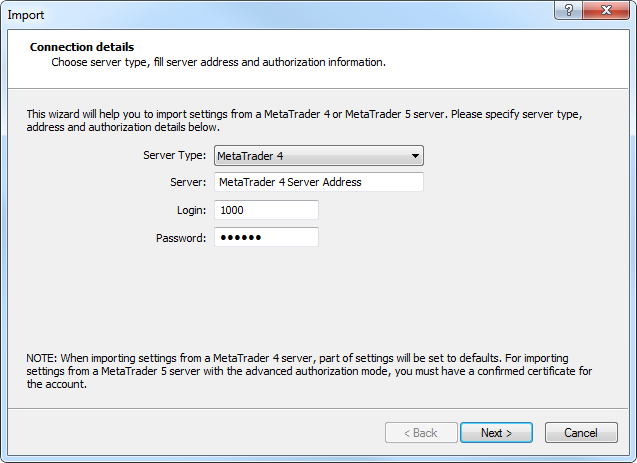
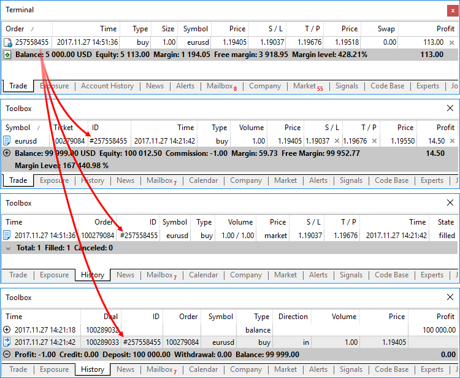
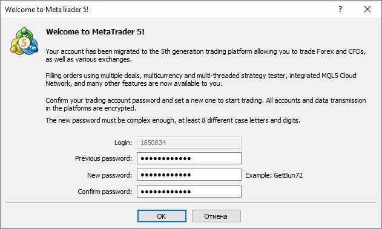

[🏠 Document Start](../../README.md) / [MetaTrader 5 Trading Platform](../../MetaTrader-5-Trading-Platform.md) / [Migration from MetaTrader 4](../Migration-from-MetaTrader-4.md) / Import of Accounts and Trades

[Previous](Trade-Groups.md) | [Next](Manager-Accounts.md)

# Import of Accounts and Trades from MetaTrader 4 (#import-of-accounts-and-trades-from-metatrader-4)

You can easily import your client database from MetaTrader 4 to MetaTrader 5, including clients' trading operations and history. You will need Administrator accounts in MetaTrader 4 and MetaTrader 5 with permissions to access clients, groups and trading operations.

  * When importing accounts and orders from MetaTrader 4, all related data is transferred as well. Some new order and trade fields that were not present in MetaTrader 4 [are filled with default values (#order-features)](Import-of-Accounts-and-Trades.md#order-features).
  * Before importing clients and trading operations, be sure to configure/import all required [trading instruments](Financial-Instruments.md) and [groups](Trade-Groups.md).

  
---  
  
Open the "[Trading Accounts](../Platform-Setup/Accounts.md)" section in MetaTrader 5 Administrator and click "Import from Server":

Specify the server address and the details of the administrator/management account on it. The account must have the following permissions:

  * Manager (add/edit/delete accounts)
  * Supervise trades
  * Personal details

On the receiving server, the account must have the following permissions:

  * Connection type: MetaTrader 5 Administrator
  * Accounts section: "Accountant", "Access accounts", "Access account personal details"
  * Dealing section: Access to trading orders (if import includes trading history)
  * Configuration settings section: group settings

## Request Accounts (#request-accounts)

The first step is to request the accounts you want to import from the source server. Enter your request in the "Choose groups" field. Here you can specify a comma separated list of logins or a more complex query using the "*" masks and the "!" negation symbol.

The "Choose groups" field contains the default request of "!demo*,!manager*,!coverage*,!contest*,*", which allows to select all accounts except those from the groups of demo and manager accounts, as well as coverage and contest groups.

To execute the request click "Request".

Some of the accounts may have a red background, which means they cannot be imported. You can check the reason for that from the tooltip. The following reasons are possible:

  * The currency of the account deposit does not match the deposit currency of the group to which you want to import the account.
  * An account with the same number already exists on the current server or on one of other trade servers of the platform.
  * The account number is out of the range of accounts allowed for the current server.
  * The symbol, for which the account to import has orders or positions, does not exist on the server.
  * The symbol, for which the account to import has orders or positions, has different numbers of decimal places on the source and target servers.
  * The manager account group on the MetaTrader 4 server side does not have access to the financial instrument settings or the group of symbols.

Accounts from MetaTrader 4 can only be imported to groups with the [hedging system of position accounting](../Platform-Setup/Groups/Position-Accounting-Systems.md). Select a group with the hedging system in the "Move to group" field.

Double click on an account to view how it would look like after import. This will open a standard [account viewing](../Platform-Setup/Accounts/Editing-Account.md) window.

You can disable import of individual accounts from the list. To do this, click on the icon at the beginning of the account row, and then it will change to . 

> If a client's name in MetaTrader 4 contains non-Latin characters, it may be imported incorrectly. During import, the current code page of MetaTrader 5 Administrator is used, which corresponds to the selected interface language. For example, a name with Chinese characters will be imported incorrectly if the Administrator terminal is used with English interface.

## Enable Import of Trading Operations (#enable-import-of-trading-operations)

To import trading operations of selected clients, enable the "Import balance, trades and trade history" option.

In MetaTrader 4, all trading operations are represented as a single entity — an order, which can be open, closed and pending. Additional notions are used in the 5th generation platform for a more detailed and clear presentation: deal and position. During import, each operation can be divided into an order, deal and position depending on the type of a source operation.

Source operation | History in MetaTrader 4 | History in MetaTrader 5  
Open order | 1 operation | 2 operations: an order to open a position, an opening deal  
Closed order | 1 operation | 4 operations: an order to open a position, an order to close a position, an opening deal, a closing deal  
Pending order | 1 operation | 1 operation  
  

### Note when importing orders (#order-features)

  * "Migration" is specified in the "Reason" field of orders
  * Fill or Kill policy is set for all orders
  * If the expiry type is not specified in the source order, Good Till Canceled is set, otherwise the specified date is used.
  * Standard commission specified in the source open order in MetaTrader 4 is imported to the "Swap" field of the relevant position on the MetaTrader 5 side

### Note when importing deals (#note-when-importing-deals)

  * Balance operations are imported "as is"
  * Entry and exit trades are created based on the orders in accordance with the above table

### Importing Tickets (#ticket)

Up to four history records in MetaTrader 5 can correspond to one MetaTrader 4 history record. That is why MetaTrader 4 tickets of orders and positions (including history orders) are not written directly to the appropriate fields of MetaTrader 5 orders, deals and positions during import. New tickets are given to all imported trading records. Ticket numbers are assigned in the ascending order from the appropriate range of order, deal and position tickers set for the MetaTrader 5 trade server.

Tickets of orders from MetaTrader 4 are copied to the 'ID' field (ID in the external trading system) of orders, deals and positions created on their basis. For example, when you import an open order from MetaTrader 4, three trade records are created in MetaTrader 5: an opening order, an opening deal, and an open position. The ticket of the MetaTrader 4 order will be written to the ID field of each of these trading records. The # character is added before the ticket number.

> If the comment of the source order contains non-Latin characters, it can be imported incorrectly. During import, the current code page of MetaTrader 5 Administrator is used, which corresponds to the selected interface language. For example, a comment written in Chinese will be imported incorrectly if the Administrator terminal is used with English interface.

## Result of Import (#result-of-import)

The total number and the number of imported accounts will be shown on the last step:

Import details are also available in the trade server journal.

  * After import, the appropriate accounts on the MetaTrader 4 server must be disabled or set to the "read-only" mode to avoid trading state mismatch with MetaTrader 5.

  * After completing the import for accounts having open positions, you can see the differences in equity and free margin in the Manager terminal. This may happen if quotes in your MetaTrader 5 platform are significantly different from the ones in MetaTrader 4 or a data feed is not configured at all. The Manager terminal calculates these values in real time according to the current prices in the platform. In the Administrator terminal, there are no differences (the values coincide with MetaTrader 4) since the data is taken directly from the accounts and are not recalculated.

  
---  
  

## Client connection and passwords (#client-connection-and-passwords)

Random passwords are generated for imported accounts. Hashes of passwords that were used on the MetaTrader 4 accounts are saved in the client record. They are used for verification during the first account connection in MetaTrader 5.

During the first connection to the imported account, the client will attempt to connect using the old password. Upon entering the incorrect password (since a new random password has been generated), a welcome dialog will be displayed:

The old password used in MetaTrader 4 should be specified here. The client will not be able to continue without this password. A new password should be set here, which will later be used to connect to the account.

If authenticated successfully, the dialog will not be displayed again. Once connected, the client will be able to continue using the account, just as if it has been opened in MetaTrader 5.

> You can set a new password for the imported account via the administrator or manager terminal and provide it to the client. The welcome dialog will not be displayed in this case. After password change, the hash of the MetaTrader 4 password is deleted from the client record.

## Import Features (#import-features)

Accounts are imported in packages each containing 100 account. If an account from the package could not be imported, you will need to repeat the import. If errors occur, the previous state will not be restored. The accounts and trade operations from the package successfully imported before the error will not be removed. Before re-import, remove them manually in the following order:

  * Orders
  * Deals
  * Positions
  * Accounts

Importing may take a long time: it depends on the database size and your Internet connection speed.
