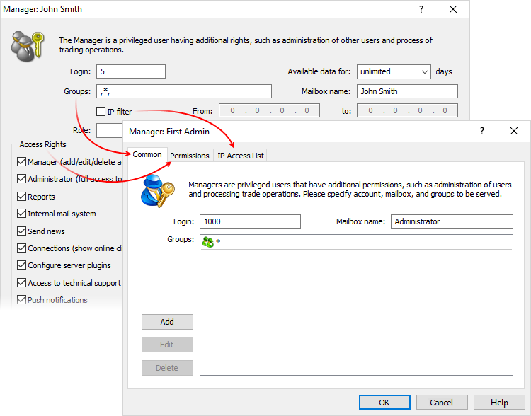
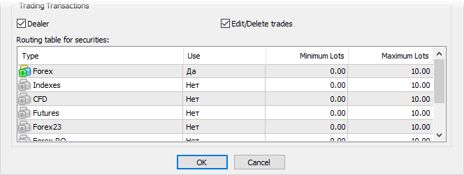
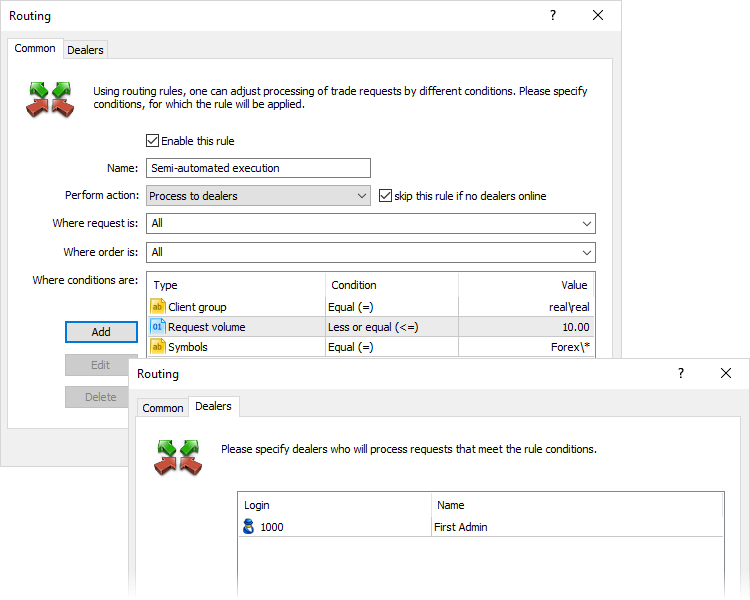

[🏠 Document Start](../../README.md) / [MetaTrader 5 Trading Platform](../../MetaTrader-5-Trading-Platform.md) / [Migration from MetaTrader 4](../Migration-from-MetaTrader-4.md) / Manager Accounts

[Previous](Import-of-Accounts-and-Trades.md) | [Next](Data-Feeds.md)

# Manager Accounts

The essential difference between the MetaTrader 5 system from the MetaTrader 4 server is an ability to create multiple manager\* groups. This means that it is now possible to divide manager accounts so that different symbols (symbol groups) are available to them. Besides, they may receive different news, have different security settings and connect to different trade servers.

After installing the MetaTrader 4 server, the manager "1" with the highest server access level rights is created. In MetaTrader 5 platform, such an account is created by default as well but it has the login "1000".

Similarly to the fourth platform version, [open an account](../Platform-Setup/Accounts/Creating-Account.md) in the manager group and add a new entry in the [Managers](../Platform-Setup/Managers.md) section to create a manager account in MetaTrader 5. After that, configure the rights.

## Setting the Manager Rights

Most MetaTrader 4 access rights have retained their functions in MetaTrader 5. When you start working in MetaTrader 5, you are able to open manager accounts identical to MetaTrader 4 server ones in terms of access right settings.

  * Login, Groups and Email fields on the MetaTrader 4 server match the [Common (#common)](../Platform-Setup/Managers.md#common) tab settings of MetaTrader 5 manager account.
  * "Access Rights" block corresponds to the [Permissions (#permissions)](../Platform-Setup/Managers.md#permissions) tab in MetaTrader 5.
  * "IP filter" field matches the "IP Access List" tab.

The table below shows the correlation between MetaTrader 4 and MetaTrader 5 access rights:

MetaTrader 4 | MetaTrader 5  
---|---  
Manager (add/edit/delete accounts) | Access accounts Access the account personal details Edit accounts  
Administrator (full access to server configuration) | It corresponds to enabling all permissions.  
Reports | Receive reports  
Internal mail system | Send emails  
Send news | Send news  
Connections (show online clients) | View currently connected clients  
Configure server plugins | Configure plugins  
Access to technical support page | Access technical support page  
Push notifications | Push notifications  
Supervise trades | Access orders and positions  
Accountant (deposit/credit/withdrawal money) | Accountant (deposit/withdraw)  
Risk manager | Risk manager  
Journals (direct access to server journals) | Access server logs  
Edit prices, spreads, execution types | Throw in quotes  
Personal details | Access the account personal details  
Automatic server reports | Receive automatic server reports  
Access to Applications Market | Access to Applications Market  
  
## Request Routing

The MetaTrader 5 manager settings have no parameters similar to symbol routing table of MetaTrader 4. However, the identical parameters can be configured in a separate [Routing](../Platform-Setup/Routing.md) section of the Administrator terminal. The new section allows configuring routing in MetaTrader 5 in a more flexible and efficient manner.

Below you can see how to reproduce the settings of the MetaTrader 4 routing table in the MetaTrader 5 Routing section. In our example, the manager "1" is responsible for processing all trade requests with the volumes from 0 to 10 lots at "Forex" group symbols on MetaTrader 4 server:

First, create a custom rule and set conditions for processing trade operations. Then use the Dealers tab to specify the manager who will process trade requests that meet the rule conditions.

Specify the following parameters:

  * Rule name.
  * Perform action — "Process to dealers". Enable "skip this rule if no dealers online" option to avoid missing trade requests if there are no managers online. In this case, if there is no appropriate manager online, all requests meeting the rule are processed according to the next rule in the list (with the lower priority).
  * Select All for "Where request is:" and "Where order is:" options.
  * Add the following rules for "Where conditions are:" section:

  * "Client group" — set "real\real" in order to limit the manager operation by processing client requests from the real account group.
  * "Request volume" — this condition corresponds to the level of maximum and minimum lots of the MetaTrader 4 routing table (from 0 to 10).
  * "Symbols" — select Forex symbols similar to the MetaTrader 4 settings.

Next, add the manager "1000" on the Dealers tab of the rule. Please note that you can assign more than one dealer for a single rule.
