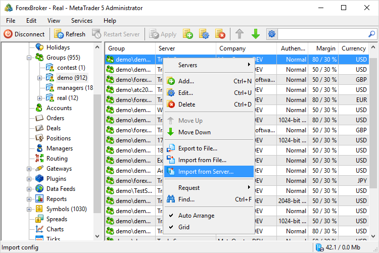
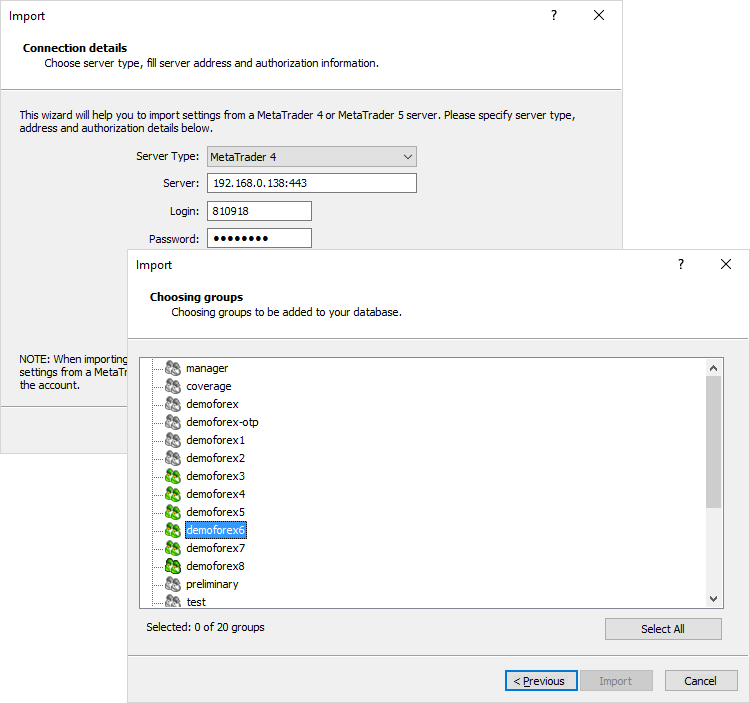
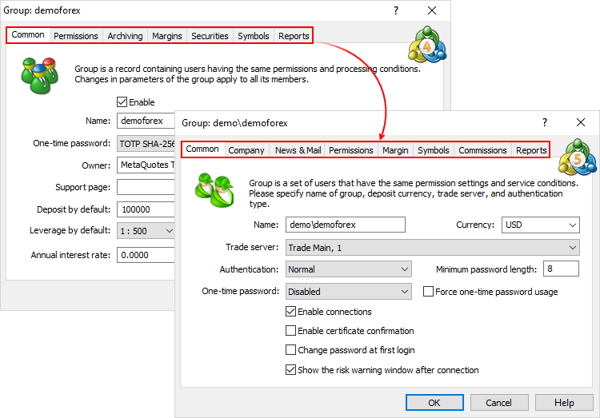
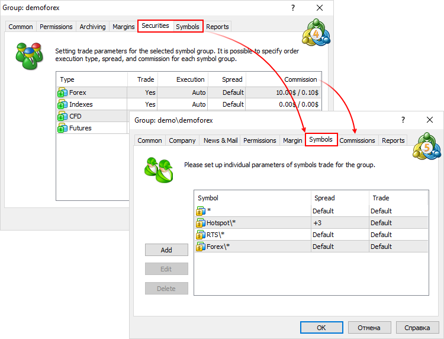
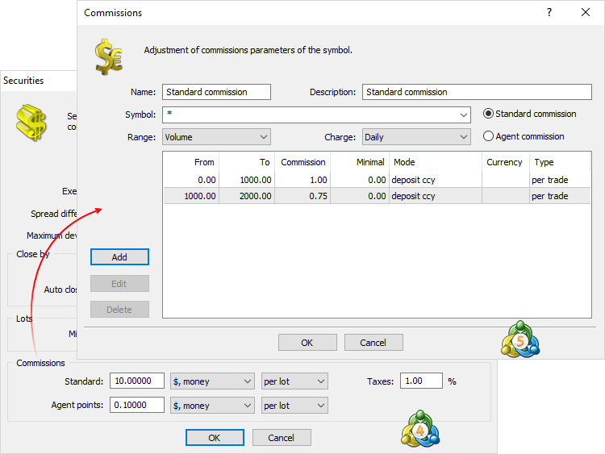
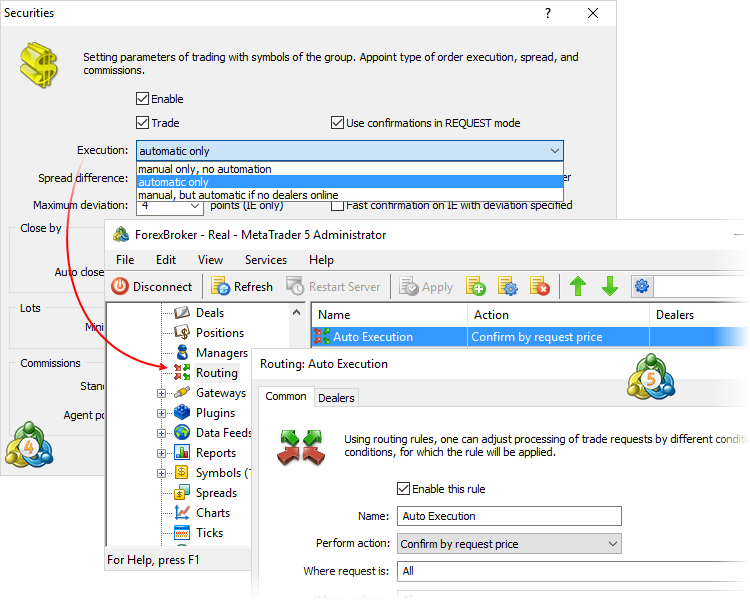

[🏠 Document Start](../../README.md) / [MetaTrader 5 Trading Platform](../../MetaTrader-5-Trading-Platform.md) / [Migration from MetaTrader 4](../Migration-from-MetaTrader-4.md) / Trade Groups

[Previous](Financial-Instruments.md) | [Next](Import-of-Accounts-and-Trades.md)

# Importing and Setting Trade Groups

[Group](../Platform-Setup/Groups.md) parameters in MetaTrader 5 provide more flexibility as compared to MetaTrader 4. The total number of groups in MetaTrader 5 is not limited.

MetaTrader 5 supports the same functions as MetaTrader 4 except for a few functions related to hedging. MetaTrader 5 does not have the "Multiple Close by orders" and "Auto close-out" functions.

## Import of Groups

Use the [import of groups](../Platform-Setup/Groups/Import-of.md) to copy all groups and their settings from MetaTrader 4 server to the MetaTrader 5 platform. 

  * When you import groups, existing settings are converted and default values are assigned to missing settings.
  * Trade settings of symbols for the groups are not imported.
  * Groups from the MetaTrader 4 server are imported into the currently selected groups section.

  
---  
  

Select "MetaTrader 4" server type and specify connection data: IP address and server port, as well as account login and password. The account used for importing symbols should be opened in the manager group and have Administrator right.

The next window shows the list of all groups that can be imported from MetaTrader 4 server. Selected groups are imported to MetaTrader 5 platform after pressing Import button.

  * After importing, check the settings of all groups.
  * All groups [are bound (#trade-server)](../Platform-Setup/Groups/Group-Settings.md#trade-server) to the main trade server. After importing the binding can be changed.
  * Only new groups are imported. Settings of existing groups of the same name are not overwritten.

  
---  
  
## Account Group Settings

MetaTrader 5 platform group settings have more tabs. This is due to the fact that MetaTrader 5 features additional group settings not present in MetaTrader 4. Most MetaTrader 4 settings have remained in MetaTrader 5.

## Individual Symbol Settings

MetaTrader 5 features considerably expanded [trading symbol settings redefining (#symbols)](../Platform-Setup/Groups/Group-Settings.md#symbols) options.

## Commission Settings

In MetaTrader 5, [commission (#commissions)](../Platform-Setup/Groups/Group-Settings.md#commissions) settings can be found on a separate tab. The number of settings has significantly increased: charging time, dependence on trade volume and turnover, etc.

## Processing Trade Requests

Now, trade request execution settings are not limited to three types ("Manual only, no automation", "Automatic only" and "Manual, but automatic if no dealers online") like in MetaTrader 4. [Routing](../Platform-Setup/Routing.md) section introduced in MetaTrader 5 allows you to create custom rules and conditions with virtually any combination of settings and execution types.

