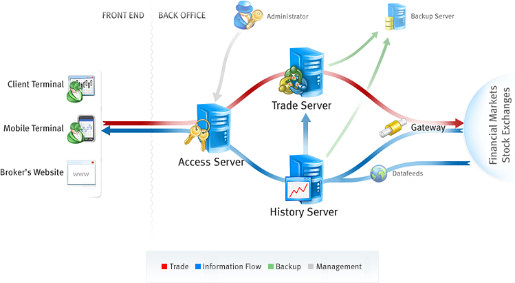

[🏠 Document Start](../README.md) / [MetaTrader 5 Trading Platform](../MetaTrader-5-Trading-Platform.md) / Platform Components

[Previous](Platform-Installation/Platform-Uninstall.md) | [Next](Platform-Components/Trade-Server.md)

# Platform Components

The trading platform consists of the following components:

  * [Main Trade Server](Platform-Components/Trade-Server.md)  
Besides the tasks of maintaining trading, this sever is designed for managing the entire platform. It means that the administrator of the main trade server can control the entire system.
  * [Trade Servers](Platform-Components/Trade-Server.md)  
Besides the main trade server, the unlimited number of trade servers can be installed. They are intended for storing and managing all client and trade databases; trading activities are performed through them.
  * [Access Server](Platform-Components/Access-Server.md)  
Access servers are proxy servers and firewalls of the system at the same time. They check clients' connections, collect authorization information and route clients' connections. Besides that access servers cache the largest part of all data transmitted to a client (including history data and terminal updates).
  * [History Server](Platform-Components/History-Server.md)  
History server receives, processes and stores price data, news and updates, and transmits them to other components of the system.
  * [Backup Server](Platform-Components/Backup-Server.md)  
Backup servers create backups of both history and trade servers.
  * [Data Feeds](Platform-Components/Data-Feeds.md)  
Data feeds are special components of the platform that are implemented as separate executable files that enable the receipt of news and quotes from different providers.
  * [Gateways](Platform-Components/Gateways.md)  
Gateways are intended for integration of the MetaTrader 5 platform with ECNs and exchanges. Gateways allow bringing out trade operation to external systems as well as translating quotes and news from them.
  * [Administrator Terminal](MetaTrader-5-Administrator.md)  
This terminal enables the remote control of the entire MetaTrader 5 platform. It allows changing any platform settings, managing client and trade databases and perform other operation.
  * [Manager Terminal](Platform-Installation/White-Label.md)  
This terminal is used for working with the broker's clients: managing databases, servicing trading operations, reporting and managing risks.
  * [Client Terminal for Windows](https://support.metaquotes.net/en/docs/mt5/client)  
The trader's main workstation enabling traders to analyze quotes and to execute trading operations. It features algo trading and strategy testing facilities.
  * [Mobile Terminal for iOS](https://support.metaquotes.net/en/docs/mt5/iphone)  
It enables traders to manage their trading accounts, to view symbol charts and to perform trading operations using iPhone or iPad.
  * [Mobile Terminal for Android](https://support.metaquotes.net/en/docs/mt5/android)  
The terminal enables traders to manage their trading accounts, to view symbol charts and to perform trading operations using Android powered smartphones and tablets.
  * [WebTerminal](Platform-Components/WebTerminal.md)  
MetaTrader 5 WebTerminal allows trading in the financial markets via a web browser. It works in all operating systems and browsers requiring no additional software.
  * [MetaTrader 5 API](https://support.metaquotes.net/en/docs/mt5/api)  
It is a toolkit which allow further expansion of the platform capabilities, integration with other trading systems and back-office components, as well as platform customization for specific business needs.

## Interaction of Components

The MetaTrader 5 trading platform is a distributed system. It is divided into separate components that are connected to each other via the main trade server. Configurations of all the platform components are stored on the main server. Other components refer to the main trade server, read the configurations and operate then in accordance with them.

The internal identification of servers is performed using IDs and passwords set during their [installation](Platform-Installation.md). You can view or change identifiers and passwords in the ["Network" (#identifier)](Platform-Setup/Network-cluster/Configuring-Servers.md#identifier) section. The main trade server identifies a component that has referred to it by its ID and passes to it configurations set for this component.

> The minimal working configuration of the platform is the installed main trade server and an access server. The access server allows the connection to the main server using terminals (client, manager or administrator terminal).
