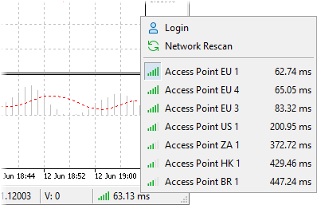

[🏠 Document Start](../../../README.md) / [MetaTrader 5 Trading Platform](../../../MetaTrader-5-Trading-Platform.md) / [Platform Components](../../Platform-Components.md) / [Access Server](../Access-Server.md) / Priority

[Previous](Antiflood-Control.md) | [Next](../History-Server.md)

# Priority

The preference of an access server for client terminals to connect to a trade server is defined by its priority and connection quality. The lower the value if priority is, the more preferable the access server is. A [base priority (#priority)](../../Platform-Setup/Network-cluster/Configuring-Servers/Access-Server.md#priority) (from 0 to 15) can be specified in its settings. It defines the server preference if all other conditions are equal. The final analysis of an access server is conducted upon the ping and the current priority, which depends on the basic priority and the number of current connections. Also, the quality of connection to the server is shown in the client, manager and administrator terminals based on the same data:

The current priority is calculated according to the following formula: Current Priority = (Base Priority + Connections / 1000),

where:

  * Current Priority is the priority at the server current moment;
  * Base Priority is the base priority set in its [parameters (#priority)](../../Platform-Setup/Network-cluster/Configuring-Servers/Access-Server.md#priority);
  * Connections — the number of current connections.

Every 1000 client connections increase the current priority of a server by one. The value of the current priority of access servers is available on the ["Network"](../../Platform-Setup/Network-cluster.md) tab.
