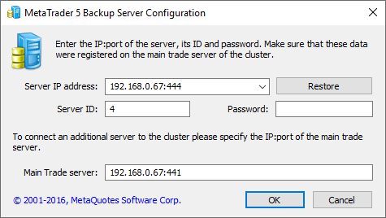
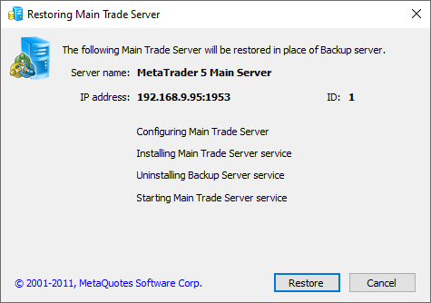
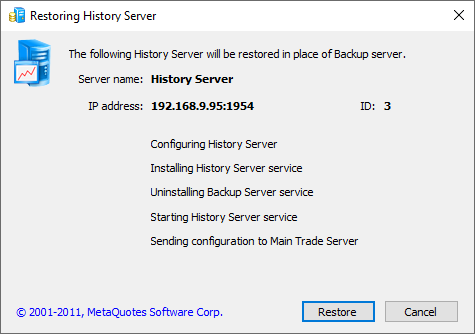

[🏠 Document Start](../../../README.md) / [MetaTrader 5 Trading Platform](../../../MetaTrader-5-Trading-Platform.md) / [Platform Components](../../Platform-Components.md) / [Backup Server](../Backup-Server.md) / Restoring Server

[Previous](Switching-to.md) | [Next](SQL-Export.md)

# Restoring Server

If the main trade server fails, you will not be able to switch to the backup server manually using the MetaTrader 5 Administrator, because you will not be able to connect to the server. Managing other cluster components will also be impossible. The system of [automatic switching to the backup server (#auto)](Switching-to.md#auto) allows avoiding such a situation. However, if the system was not enabled, you will need to recover the server manually:

1\. Go to the computer where the main trade server is installed, and stop the system service if it runs. The default name of the main trade server service is mt5tmsrv. It can be stopped in the Control Panel — Administrative Tools — Services, as well as using the command line:

net stop mt5tmsrv   
or   
D:\MetaTrader 5 Platform\Main Trade\mt5trade64.exe /stop.  
---  
  
If the computer is down (is unavailable), skip this step. However, once the computer is back up, please make sure that the old trade server service has not been restarted.

2\. Go to the computer where the backup server is installed, and stop the system service. The default name of the backup server service is mt5bsrv. It can also be stopped using the Control Panel or the command line:

net stop mt5bsrv   
or   
D:\MetaTrader 5 Platform\Backup Main Trade\mt5backup64.exe /stop.  
---  
  
3\. Run the backup server file from the command line with the /gui parameter. For example:

D:\MetaTrader 5 Platform\Backup Main Trade\mt5backup64.exe /gui.  
---  
  
Click Restore in the window that appears.

After that, the recovery process is started. Other components of the cluster will automatically switch to the new main server.

The process of restoring is run automatically in several steps:

  * Configuring Main Trader Server  
At this stage, the IP address and port of the main server are replaced with those of the backup server, which are displayed in the upper part of the window. [The password and identifier (#identifier)](../../Platform-Setup/Network-cluster/Configuring-Servers.md#identifier) are not changed.
  * Installing Main Trade Server service
  * Uninstalling Backup Server service
  * Starting Main Trade Server service

  * Before you launch the backup server, make sure the main server is stopped. Otherwise, your clients may start working with different servers. For example, your main server and access server are located at the same provider. The provider has issues with the internet connection and the servers became unavailable. The backup server is deployed in this case. After a while, connection to the main server is restored causing two servers to work simultaneously. In this case, contact your provider and request the immediate disabling of the main server.

  * If one of the stages cannot be completed, all the changes made during restoring will be rolled back.
  * As soon as restoring is finished, it is recommended to setup a new [backup server](../../Platform-Setup/Network-cluster/Configuring-Servers/Backup-Server.md).

  
---  
  
After the recovery of the main trade server, you will be able to connect to the cluster via MetaTrader 5 Administrator. Other components can be switched to backup servers in a regular way through the interface. For example, if the history server was installed on the same machine, you can switch to the backup server by running the appropriate command in its context menu.

The described procedure can also be used to restore other servers, including additional trade servers and history server. When restoring servers, new configuration data will be sent to the main trade server. A restored server will connect to the cluster without additional settings, and you will be able to control it via MetaTrader 5 Administrator.

