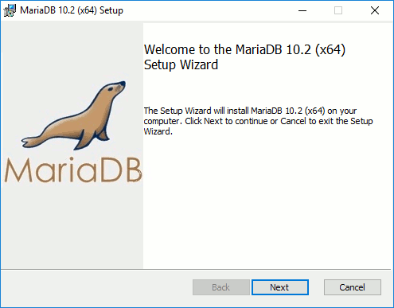
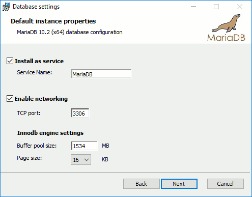
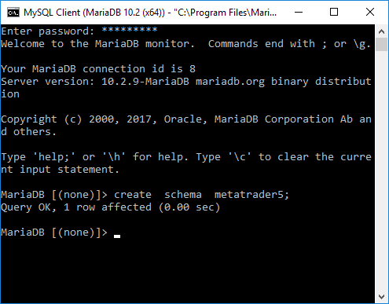
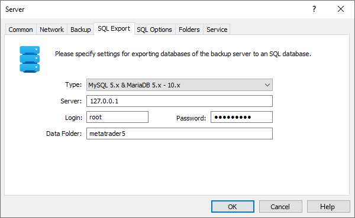
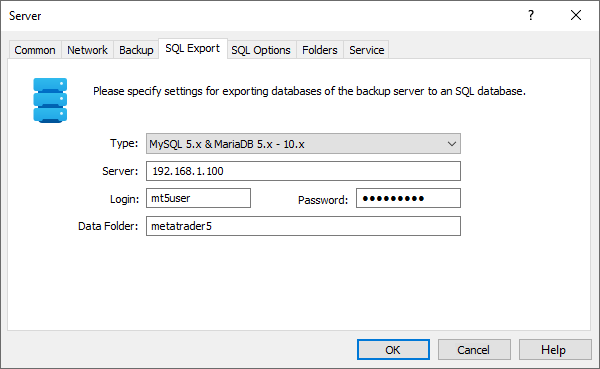

[🏠 Document Start](../../../../README.md) / [MetaTrader 5 Trading Platform](../../../../MetaTrader-5-Trading-Platform.md) / [Platform Components](../../../Platform-Components.md) / [Backup Server](../../Backup-Server.md) / [SQL Export](../SQL-Export.md) / Installation and Setup of MariaDB

[Previous](Installation-and-Setup-of-MySQL.md) | [Next](Installation-and-Setup-of-MS-SQL.md)

# Installation and Setup of MariaDB

To install MariaDB, download the required version from the official product website <https://downloads.mariadb.org/>. At the time, the platform supports all available MariaDB versions.

> Choose between 32-bit and 64-bit versions based on the evaluated potential volume of data bases. The 64-bit server version is more preferable, as it makes possible to have data caches of more than 2 Gb and has better scalability due to increasing RAM on the server.

Run the installation file and follow the on-screen instructions. The below example shows the installation of MariaDB 10.2 (x64).

After selecting components for the installation (you can install with default settings), specify the password for the "root" administrator account. For security reasons, it is recommended that you do not allow the use of the "root" account during remote connections (leave the "Enable root access from remote machines" option disabled). Instead, after installing the MariaDB server and creating a scheme (database) for working with MetaTrader 5, create a separate account with access only to the desired schema, and allow remote connections to it.

It is also recommended to enable the "Use UTF8 as default server's character set" option.

Then, specify network settings (default settings can be used) and the parameter for sending anonymous reports on the DBMS operation (can be disabled). After that, start the installation process and wait for it to finish.

Now create a schema (a database) to which data from MetaTrader 5 will be exported. To do this, launch the MySQL Client (MariaDB) program from the Start menu. In the window that appears, enter the password for the "root" account and press Enter. Then enter a command to create a data base, e.g. "create schema metatrader5;". Here "metatrader5" is the name of the schema. You can use any other name.

Next, configure data export on the MetaTrader 5 side. If the backup server and the MariaDB server are installed on the same computer, the following settings will be used:

If the database is installed separately from the backup server, specify its address in the "Server" field. In the Login and Password fields, specify he details of the account that has access to the required schema and is allowed for use during remote connection.

> It is recommended to install MariaDB and the backup server on the same computer for faster export. However, it should also be kept in mind that the backup server consumes resources. Also, remember that it is possible to deploy several backups for a trade server. These backup servers will run close to necessary DBMS. 

Additional export parameters can be selected at [SQL Options (#sql-settings)](../../../Platform-Setup/Network-cluster/Configuring-Servers/Backup-Server.md#sql-settings) tab.
