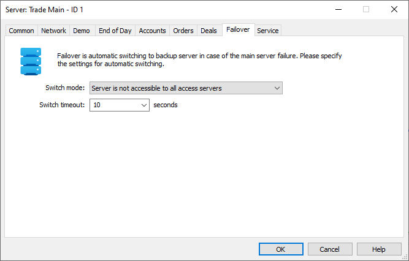
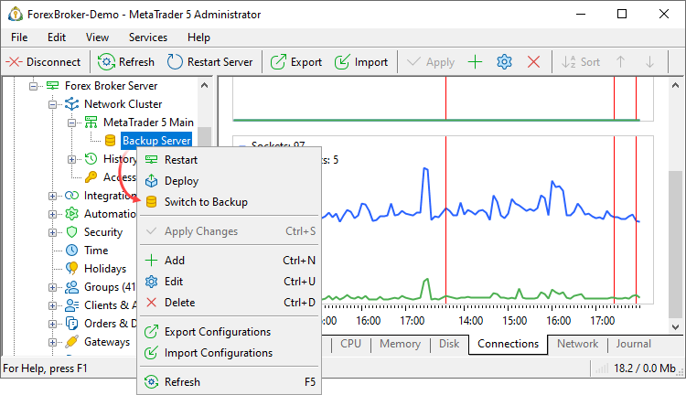
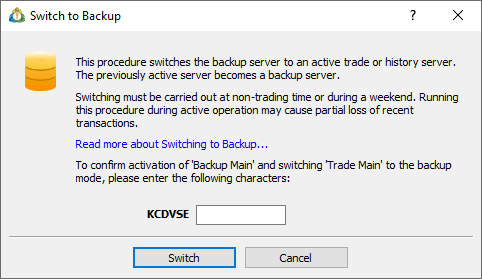
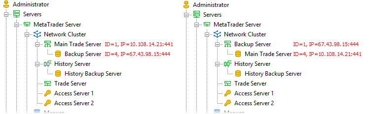

[🏠 Document Start](../../../README.md) / [MetaTrader 5 Trading Platform](../../../MetaTrader-5-Trading-Platform.md) / [Platform Components](../../Platform-Components.md) / [Backup Server](../Backup-Server.md) / Switching to

[Previous](Backup-Features.md) | [Next](Restoring-Server.md)

# Switching to Backup Server (#switching-to-backup-server)

The MetaTrader 5 platform can automatically monitor the availability of trade and history servers. The monitoring is performed by the backup server itself as well as by access servers. Each server monitors the availability of the main server and polls other monitoring servers to check whether the main server is available to them.

If the main server is unavailable for some time, the platform will automatically switch to the backup server. The downtime is minimal, while switching usually takes less than a minute.

In the platform, you can also [switch to a backup server manually (#manual)](Switching-to.md#manual). In case of a failure of the history server or a non-main trade server, you can quickly switch to the backup server in the automated mode. The same procedure provides for an easy migration of servers to new hardware. You will only need to properly setup the backup server via MetaTrader 5 Administrator, use the [fast deployment](../../Platform-Installation/Fast-Deployment.md) procedure and switch to the newly installed backup server afterwards.

> [All critical trade and history server data](Backup-Features.md) is backed up in real time. Some non-critical trade server data, as well as history server data are backed up every hour. When switching to the backup server, critical data obtained during the procedure may be lost (the procedure itself usually takes less than a minute). Therefore, we strongly recommend that you switch to the backup server only outside of working hours.

## Switching to the Backup Server Automatically (#auto)

Automatic switching to a backup server allows minimizing the platform unavailability time in case of emergency situations. The platform automatically monitors the performance of its components and switches to backup servers if necessary.

The necessity to switch to the backup server is defined by the monitoring ("witness") servers. The backup server itself and access servers (with monitoring mode enabled) act as the monitoring ones. The backup server monitors the availability of the master server in real time mode and checks if it is available for the access servers as well.

Automatic switching can be enabled in the master server's settings (either a trade or a history one):

There are two scenarios for determining the unavailability of the main server:

  * Server is not accessible to most access servers — the number of the monitoring servers unable to access the master server should exceed the ones able to access it at least by one for the switch to occur. If you have configured five monitoring servers, the main server should be unavailable to at least three of them, or to four of six monitoring servers. If you are using two monitoring servers (the minimum allowed number), the main server should be unavailable for both of them.
  * Server is not accessible to all access servers — the master server should be unavailable for all monitoring servers for the switch to occur.If you have configured five monitoring servers, the main server should be unavailable to all of them.

If several backup servers are used for one main server, then each of the backup servers will start switching to the master server mode in case of the main server failure. The last switched server will be used as the main server, while all the rest of them will switch back to backup mode.

If a certain backup server should not be used for automatic switching, disable in its settings the following option: ["Use this backup server for failover" (#failover)](../../Platform-Setup/Network-cluster/Configuring-Servers/Backup-Server.md#failover). This may be needed if the backup server is used only for [exporting data to SQL database](SQL-Export.md).

  * The number of monitoring servers should not be less than 2.
  * It is recommended to install access servers on different computers (different data centers), separate from the main and history servers. This will provide the most relevant server monitoring data.

  
---  
  
In "Switch timeout" parameter, you can specify the time (in seconds) during which the server should be unavailable for monitoring servers to start switching to the back-up server. Also, after this time period, other platform components start their attempts to connect to the [access points (#network)](../../Platform-Setup/Network-cluster/Configuring-Servers.md#network) of the current backup server (trying to connect to it as to the master one).

> When measuring the time of the master server's unavailability, its cause is considered. In case of a manual restart of the server, the unavailability time is increased according to the time required for restart.

To make an access server a monitoring one, enable "Use this server for monitoring the cluster and failover" option in the server's settings:

  * If the access server is unavailable for the backup one, that does not mean that the master server is also unavailable. In this case, the number of monitoring servers is reduced.

  * In case of the master and other servers' simultaneous failure, the master server is restored first.

  
---  
  

### Features of Connecting to Monitoring Servers (#features-of-connecting-to-monitoring-servers)

The backup server uses the following algorithm for connecting to the monitoring servers:

  * As soon as the main server becomes unavailable for the backup server, the backup server checks all monitoring servers one by one and trues to connect to them.
  * First, the backup server tries to connect to the monitoring server via the local address if available. Connection to a local address is performed if [listen addresses (#bind)](../../Platform-Setup/Network-cluster/Configuring-Servers.md#bind) of the backup and access servers are located in 10.*, 172.16.* — 172.31.* or 192.168* subnet. The first three octets in their addresses should coincide. In that case, both servers are deemed to be located in a single subnet, and the backup server tries to connect directly to the listen address of the access server. Example: the backup server has 192.168.0.100:1951 listen address, while the access one - 192.168.0.105:1950.
  * If connection via the local address has failed, the backup server uses [public points (#public)](../../Platform-Setup/Network-cluster/Configuring-Servers.md#public) of the access server.

> In order for the switch to occur as fast as possible, all access servers should be available. There should be no disabled servers among the monitoring ones. The backup server spends 5 seconds trying to connect to a non-existent address.

### Using Several Backup Servers (#using-several-backup-servers)

If several backup servers are used for a single main one, then each of the backup servers starts switching to the master server mode in case of the main server's failure. The last switched server is used as the master one, while all the rest of them switch back to backup server mode.

### Logging Monitoring Results (#logging-monitoring-results)

You can request the backup server's log using "Failover" keyword to control the process of monitoring the master server. Sample entries:

2013.09.09 09:07:33 Failover master server '1' - 'Trade Main' is available  
2013.09.09 09:07:33 Failover master server '1' - 'Trade Main' is available for witness server '2' - 'Access Point 1'  
2013.09.09 09:07:34 Failover master server '1' - 'Trade Main' is available for witness server '6' - 'Access Point 2'  
2013.09.09 09:07:54 Failover witness access server '7' is not available  
2013.09.09 09:07:54 Failover master server '1' - 'Trade Main' is available for witness server '11' - 'Access Point 3  
2013.09.09 09:07:54 Failover master server '1' - 'Trade Main' is available for 4 witnesses and unavailable for 0 witnesses [0 min]  
---  
  
These entries mean as follows:

  * Master server with identifier 1 is available.
  * Master server with identifier 1 is available for monitoring server 2 named Access Point 1.
  * Master server with identifier 1 is available for monitoring server 6 named Access Point 2.
  * Monitoring server with identifier 7 is unavailable for the backup server.
  * Master server with identifier 1 is available for monitoring server 11 named Access Point 3.
  * Master server is available for 4 witnesses and not available to 0 witnesses. The time, during which the server has been unavailable, is shown in brackets.

### Working after Switching to the Backup Server (#working-after-switching-to-the-backup-server)

After the backup server has switched to the trading one, the client terminals scan public access points of the access server in order to connect to it. The time of going through the access points depends on the following factors:

  * Actual accessibility of the public point for a client. If an address is not available for the client (for example, a local IP address is specified in the settings as a public access point), the terminal spends 10 seconds trying to connect to it. An attempt to connect to the next access point is made only in 10 seconds.
  * The number of the access server addresses unavailable for clients. For example, if two local addresses 192.168.0.100 and 192.168.0.101, as well as an external one - access.server.com (available external address of the server) are specified among the public access points, the client terminals will first spend 20 seconds trying to connect to local addresses before successfully connecting to the external one.
  * Availability of the trade and history servers for the access one. The access server goes through the access points of the trade and history servers according to their [network settings (#network)](../../Platform-Setup/Network-cluster/Configuring-Servers.md#network). Correctness of the network settings defines how quickly the access server becomes ready for work.

> It is recommended that the access servers having local IP addresses in the list of [public points (#public)](../../Platform-Setup/Network-cluster/Configuring-Servers.md#public) are made available only for the administrators and managers working in the same local network. To do this, uncheck all options except "Allow administrator connection" and "Allow manager connection" ones in the [Permissions (#permissions)](../../Platform-Setup/Network-cluster/Configuring-Servers/Access-Server.md#permissions) tab of the access server.

## Manual Switching to a Backup Server and Migration of Servers (#manual)

In the platform, it is possible switch to a backup server from the main one manually. It is a quick and automatic procedure. In addition to emergency cases, the procedure can be used for migrating servers to new hardware.

Install the backup server on the computer, to which you plan to migrate the server. After installing and launching the backup server, it is recommended to let it operate for a few days on the new machine to make sure it operates well.

  * If you want to avoid the loss of data that is backed up every hour, the backup server should be restarted before switching to it. The server creates the latest data backup. While the server is busy backing up data, the following sign is displayed on its icon  (the icon itself has the following look ). Start switching to the backup server only after the backup process is complete.
  * Server migration must only be performed in non-trading hours. During the switching procedure, the main server continues to receive data, which will not be copied to the backup server.
  * In order to prevent important information from being lost, trading and changes in the client base are not allowed on the main server right after the start of switching to the backup server. The ban is valid for one minute. If the platform fails to switch to a backup server within this period, the ban is removed.

  
---  
  
Execute " Switch to backup server" command:

To avoid accidental switching, the platform requires an additional confirmation. In the dialog that appears, enter the required characters and click "Switch".

After the procedure is complete, you will see that the trade/history server has changed places with the backup server in Network section.

## The Features of the Switching Procedure (#features)

On the backup server's side, the switching process is performed as follows:

  * The backup server stops Windows service.
  * It also updates the network settings of the platform. The servers exchange roles, while the main server becomes the backup one, and the backup server starts operating as the main trade server:

  *     * The network settings (IP addresses, outgoing address, public points) and the name of the former backup server are set for the main server in the platform configuration.
    * The IP address and the name of the former main server are set for the backup server in the platform configuration.
    * On the servers, only their internal IDs change. The ID of the former main server is set for the new backup server, and the ID of the former backup server is set for the new main one.

  * The master server's Windows service is installed
  * Notification is sent to the master server, waiting for confirmation.
  * The master server's Windows service is launched.
  * The former backup server's Windows service is deleted.

If the backup server has been active during the switch, it is switched to the backup mode:

  * The master server's Windows service is stopped.
  * Network settings are updated similar to how it is done for the backup server.
  * The backup server's Windows service is installed and launched.
  * The former master server's Windows service is deleted.

  * If the former master server was inactive during the switch to the backup one (for example, the server computer was shut down) and the copy restored from backup is already working by the moment the server is restored, the former master server switches to the backup mode automatically (unless switching to a backup server is prohibited in its [settings (#backup)](../../Platform-Setup/Network-cluster/Configuring-Servers/Trade-Server.md#backup)).

  * Physically (on the hard drive), the new trade/history server operates from the former backup server's directory, while the new backup server operates from the trade/history server's one.

  
---
