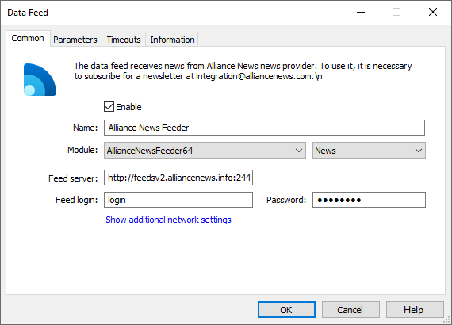
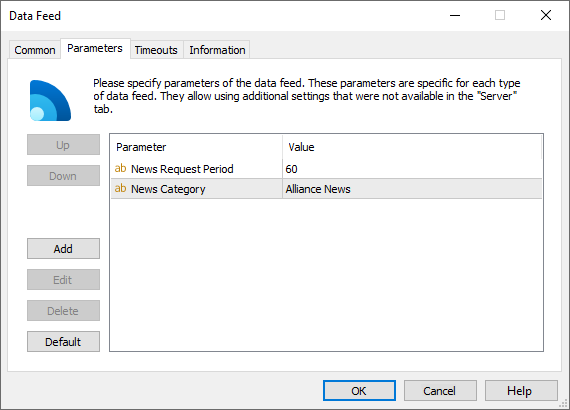

[🏠 Document Start](../../../README.md) / [MetaTrader 5 Trading Platform](../../../MetaTrader-5-Trading-Platform.md) / [Platform Components](../../Platform-Components.md) / [Data Feeds](../Data-Feeds.md) / Alliance News Feeder

[Previous](UniNewsFeeder.md) | [Next](Newsquawk.md)

# Alliance News Feeder

The data feed allows receiving financial news and analytics from the British [Alliance News](https://alliancenews.com/) agency. The service provides traders with extensive selection of news for making informed decisions when trading stocks, currencies, CFDs, options and futures. Alliance News covers over 2 400 companies, including FTSE giants, as well as smaller AIM participants and investment funds.

Blue-chip companies, British and international economic indicators, market reviews and broker ratings — [more than 500 daily news items](https://alliancenews.com/service/professional/) provide a complete picture of the day. News articles are written in an easy-to-understand way, while maintaining the high level of information content.

## Why Alliance News?

  * The core aim of the company is serving financial professionals and independent investors.
  * Founders have well over 50 years of financial news and technology experience.
  * Concise news service provides the most relevant information for trading without clutter.

## What The Alliance News Professional Service Offers Your Clients

  * News articles written in an easy-to-understand way, with the informed but not expert, reader in mind.
  * Blanket coverage of UK-listed companies and the global, political and macro-economic influences on their share prices.
  * Coverage of global blue-chip companies, as well as the forex and commodities markets.
  * Concise bullet point 'flash headline' reporting as the news unfolds, with full articles published soon thereafter.
  * Helps your clients get ideas, uncover opportunities and check facts while there is still money to be made.

## Ordering Subscription

Order subscription right from the [Buy](https://support.metaquotes.net/en/market/product/292) page of the technical support website. After submitting your request, managers of Alliance News will contact you and provide all information.

Another way is to send an email to [support@alliancenews.com](mailto:support@alliancenews.com) or call +44 207 199 0347.

## Configuration of the Data Feed

After requesting a subscription and receiving connection details from Alliance News, add the new Alliance News Feeder configuration via the [corresponding section](../../Platform-Setup/Data-Feeds.md) of MetaTrader 5 Administrator:

The following parameters should be specified on the [Common (#common)](../../Platform-Setup/Data-Feeds/Configuration-of.md#common) tab of the data feed:

  * Module — AllianceNewsFeeder.
  * Feed server — URL of news feed server provided by Alliance News representatives. By default it is http://feedsv2.alliancenews.info:24413
  * Feed login — authorization login acquired from Alliance News representatives.
  * Password — authorization password acquired from Alliance News representatives.

> The port used for connection to Feed server must be allowed on the internal or external firewall of the server where the data feed is operating.

The data feed features the following additional [parameters (#parameters)](../../Platform-Setup/Data-Feeds/Configuration-of.md#parameters):

  * News Category — the name of the category of news received from this data feed. Further this category name can be used to specify news to be received by separate [groups](../../Platform-Setup/Groups.md).
  * News Request Period — the period of checking and downloading new information in seconds.

