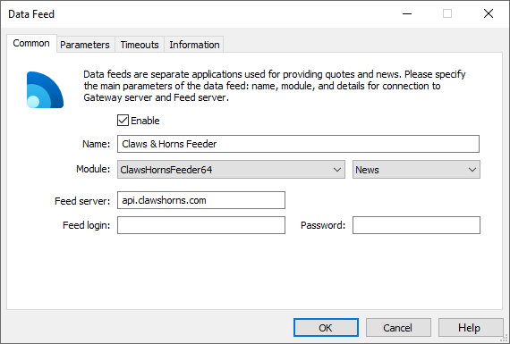
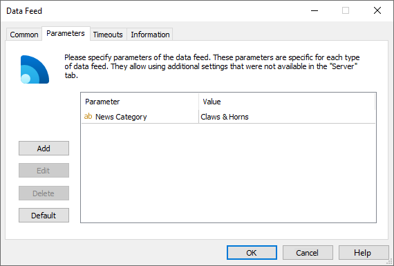

[🏠 Document Start](../../../README.md) / [MetaTrader 5 Trading Platform](../../../MetaTrader-5-Trading-Platform.md) / [Platform Components](../../Platform-Components.md) / [Data Feeds](../Data-Feeds.md) / Claws & Horns Feeder

[Previous](Financial-Source-News-Feeder.md) | [Next](UniNewsFeeder.md)

# Claws & Horns Feeder

This data feed allows you to provide your clients with financial news and analytics from [Claws & Horns](https://www.clawshorns.com/):

  * economic calendar featuring all the important fundamental data
  * technical analysis
  * fundamental analysis
  * signals (market entry recommendations with entry/exit points that are updated throughout the day)
  * daily video podcasts with long-term outlook for the major currency pairs
  * daily analysis of Russian shares traded on the Moscow Exchange

Materials are provided in 15 languages, including Russian, English, Chinese, Spanish, French, German, etc.

Claws & Horns Feeder is free and included in the platform standard delivery. You can purchase subscription on the [Claws & Horns official website](https://www.clawshorns.com).

## Setup

Add the new Claws & Horns Feeder data source configuration via the [corresponding section](../../Platform-Setup/Data-Feeds.md) of MetaTrader 5 Administrator:

The following parameters should be specified on the [Common (#common)](../../Platform-Setup/Data-Feeds/Configuration-of.md#common) tab of the data source:

  * Module — ClawsHornsFeeder64.
  * Feed server — Claws & Horns server address. api.clawshorns.com is set by default. There is no need to change it.
  * Password — when purchasing the subscription, you receive a special ID (token) consisting of 32 symbols. Enter it here.

On the ["Parameters" (#parameters)](../../Platform-Setup/Data-Feeds/Configuration-of.md#parameters) tab, you can also use an additional parameter "News Category" — the name of the category of news received from this data feed. Further this category name can be used to specify news to be received by separate [groups](../../Platform-Setup/Groups.md).

The client terminals will start receiving news right after enabling the data source. The data source [journal](../../Platform-Setup/Data-Feeds/Journal-of.md) can be requested to check its operation.
