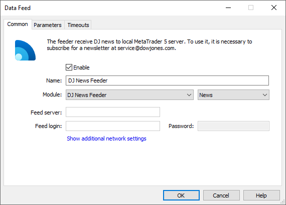
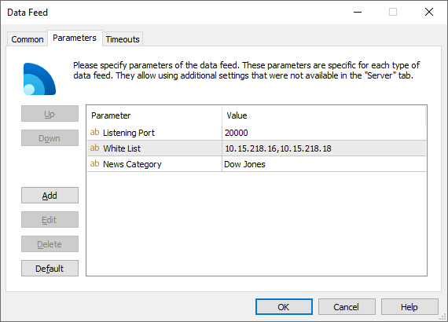

[🏠 Document Start](../../../README.md) / [MetaTrader 5 Trading Platform](../../../MetaTrader-5-Trading-Platform.md) / [Platform Components](../../Platform-Components.md) / [Data Feeds](../Data-Feeds.md) / DJ News Feeder

[Previous](Dow-Jones-Prime-Tass-News-Feeder.md) | [Next](IQFeeder.md)

# DJ News Feeder

DJ News Feeder (DJNewsFeeder.exe) is the news feeder from the world-famous news agency Dow Jones. Dow Jones Newswires include comprehensive reviews and analytical materials, macroeconomic events and speeches of officials, rolling market commentary and expert analysis, company reports, breaking news and much more.

## How it works

To start receiving news, you should request a subscription at <https://www.dowjones.com>. In a contract with the news provider, you will receive the port number for the data feed to listen to. Specify this port number in data feed settings. You should also receive the list of IP addresses, from which the new content will be provided. These addresses must also be specified in the data feed settings for additional security. Otherwise, the data feed will accept connections from any addresses at the specified port.

## Setup

Open the [Common (#common)](../../Platform-Setup/Data-Feeds/Configuration-of.md#common) tab of the data feed settings and set the DowJonesNewsFeeder module.

Additional settings should be configured in the [Parameters (#parameters)](../../Platform-Setup/Data-Feeds/Configuration-of.md#parameters) tab:

  * Listening Port — the port number, at which the data feed will listen to connections from the data provider. Available in an agreement with the news provider. 
  * White List — one or more IP addresses, from which connection to the data feed is allowed. If this parameter is not set, connection from any address is allowed.  
If the exact IP address is not known, you can identify it by requesting the [logs](../../Platform-Setup/Network-cluster/Journal.md) of the history server or the [data feed](../../Platform-Setup/Data-Feeds/Journal-of.md). The provider sends out news content, and if their address is not included in the list of allowed IPs, the data stream is blocked and an appropriate message is added to the journal. The logs also contain the address of the server, from which the data is sent. The log may look like this: address X.X.X.X is not white listed, disconnecting.
  * News Category — the category name for the newsletters received from the data feed. The category name can then be used for specifying news to be delivered to client [groups](../../Platform-Setup/Groups.md).

> It is recommended that you specify the provider's IP address in the WhiteList parameter. This will increase the safety of operation.
