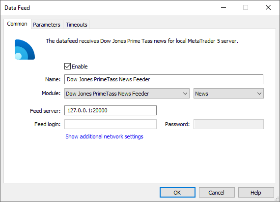
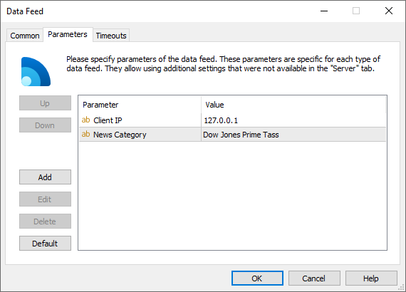

[🏠 Document Start](../../../README.md) / [MetaTrader 5 Trading Platform](../../../MetaTrader-5-Trading-Platform.md) / [Platform Components](../../Platform-Components.md) / [Data Feeds](../Data-Feeds.md) / Dow Jones Prime Tass News Feeder

[Previous](../Data-Feeds.md) | [Next](DJ-News-Feeder.md)

# Dow Jones Prime Tass News Feeder

Dow Jones Prime Tass News Feeder (DJPrimeTassNewsFeeder.exe) is the news feeder for receiving [Dow Jones Newswires](https://1prime.ru/docs/product/dowjones/) from the Prime agency.

## How it works

To start receiving news, you should request a subscription at [https://www.1prime.ru/](https://1prime.ru/). You should provide to Ptime Tass the IP address, at which the data feed will operate. It will be added to the list of addresses, to which the provider sends news. The data feed will enable external connections for this IP address and will start receiving incoming news. This connection scheme does not require additional data (such as login and password).

## Setup

Specification of the following parameters is required on the ["Common" (#common)](../../Platform-Setup/Data-Feeds/Configuration-of.md#common) tab of the data feed settings:

  * Module — DowJonesNewsFeeder;
  * Feed server — IP address (or domain name) and port that will be opened for receiving news from the news provider.

On the ["Parameters" (#parameters)](../../Platform-Setup/Data-Feeds/Configuration-of.md#parameters) tab, you can set:

  * Client IP — IP address for the news provider, from which connection to the data feed will be allowed. If the parameter is absent, connections from all addresses are allowed.  
If you do not know the exact IP address of the news provider, you can find it out by requesting the [journal](../../Platform-Setup/Network-cluster/Journal.md) of the history server or the data feed. The news provider sends information, and if their IP is not added to the list of allowed addresses, the data thread is blocked which is reflected in the journal. The address of the server the data is sent from is also specified in the entries.
  * News Category — the name of the category of news received from this data feed. Further this category name can be used to specify news to be received by separate [groups](../../Platform-Setup/Groups.md).

> It is recommended to specify an allowed IP address in the ClientIP parameter. It increases the security of operation.
