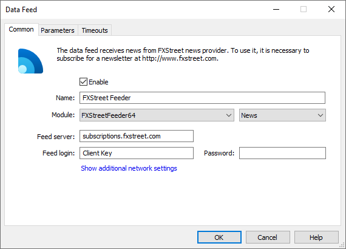
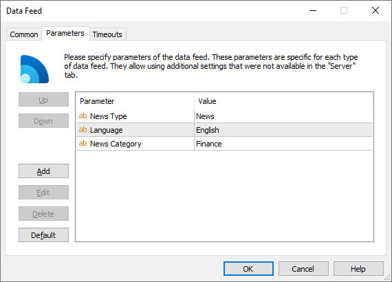

[🏠 Document Start](../../../README.md) / [MetaTrader 5 Trading Platform](../../../MetaTrader-5-Trading-Platform.md) / [Platform Components](../../Platform-Components.md) / [Data Feeds](../Data-Feeds.md) / FXstreet Feeder

[Previous](KnowledgeView-News-Feeder.md) | [Next](Financial-Source-News-Feeder.md)

# FXstreet Feeder

FXstreet Feeder for MetaTrader 5 provides your clients with financial news, as well as the data on technical analysis from the [FXstreet.com](https://www.fxstreet.com/ "FXstreet.com") financial web portal. The news are provided in eight languages: English, Russian, Arabic, Chinese, German, Indonesian, Spanish and Turkish.

FXstreet Feeder is free and included in the platform standard delivery. Contact FXstreet.com to subscribe to the news. Contact details can be found on the web portal at ["Contact Us"](https://www.fxstreet.com/info/contact-us "Contact FXstreet.com") section.

## Setup

Add the new FXstreet Feeder data feed configuration via the [corresponding section](../../Platform-Setup/Data-Feeds.md) of MetaTrader 5 Administrator:

The following parameters must be specified on the ["Common"](../../Platform-Setup/Data-Feeds/Configuration-of.md) tab of the data feed:

  * Module — FXstreetFeeder(64);
  * Feed server — FXstreet server address. subscriptions.fxstreet.com is set by default;
  * Feed login — login (or Client Key) for connection to FXstreet server. Submitted by FXstreet when concluding an agreement for providing news feed.

Specify additional settings in the [Parameters (#parameters)](../../Platform-Setup/Data-Feeds/Configuration-of.md#parameters) tab:

  * Language — the language in which you wish to receive news. For each language, create a separate "Language" parameter with the appropriate value. For example, in order to receive news in English and Russian, you need to create two parameters: Language = english, Language = russian. If no language is specified, the datafeed will only deliver news in English.  
The following languages are supported:
    * arabic
    * chinese
    * english
    * french
    * german
    * indonesian
    * russian
    * spanish
    * thai
    * tradchinese
    * turkish
    * japanese
    * vietnamese
  * News Type — the type of news you wish to receive:
    * News — standard subscription.
    * FXBeat — news from famous Forex market participants featuring their personal opinion. To receive such newsletters, contact FXStreet.com for an appropriate subscription. FXStreet.com will provide a new Client Key or include the FXBeat subscription into the key your are using.
    * Crypto — cryptocurrency market news.
  * News Category — the category name for the newsletters received from the data feed. The category name can then be used for specifying news to be delivered to client [groups](../../Platform-Setup/Groups.md).

The client terminals will start receiving news right after enabling the data feed. The data feed [logs](../../Platform-Setup/Data-Feeds/Journal-of.md) can be requested to check its operation.
