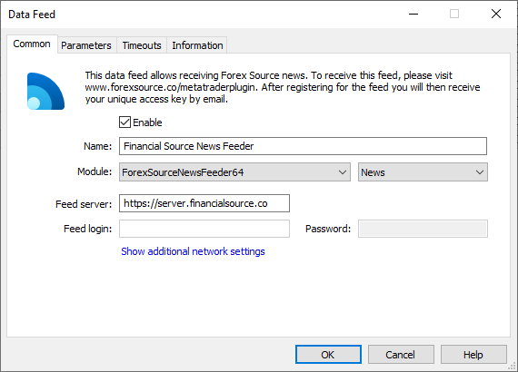
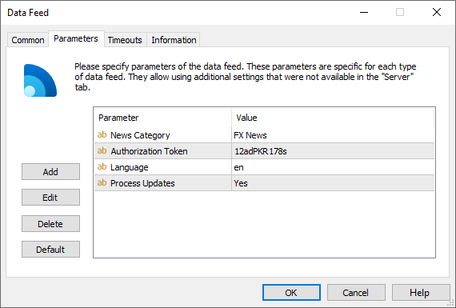

[🏠 Document Start](../../../README.md) / [MetaTrader 5 Trading Platform](../../../MetaTrader-5-Trading-Platform.md) / [Platform Components](../../Platform-Components.md) / [Data Feeds](../Data-Feeds.md) / Financial Source News Feeder

[Previous](FXstreet-Feeder.md) | [Next](Claws-&-Horns-Feeder.md)

# Financial Source News Feeder

Financial Source News Feeder enables the real-time delivery of news related to global currencies as well as trading analytics. In their <https://financialsource.co> website, Forex News state that they aim to be the first to deliver forex news to users and bring high probability trading opportunities. Their professional analysts scour global newswires so you catch every currency move.

Financial Source news items are divided into the following categories: Central Banks, Market Insights, Must Read, Order Flow Levels and Risk Events. The size of news items ranges from brief informative reports to copyright analytical articles, which describe the full picture of the global market.

The data feed module is free and is included in the platform standard delivery package. To start receiving news, you should request a subscription via the [official website](https://financialsource.co/). After that you will be provided with an Authorization Token for the data feed configuration.

## Setup

Add the new Financial Source News Feeder configuration via the [corresponding section](../../Platform-Setup/Data-Feeds.md) of MetaTrader 5 Administrator:

The following parameters should be specified on the [Common (#common)](../../Platform-Setup/Data-Feeds/Configuration-of.md#common) tab of the data source:

  * Module — ForexSourceNewsFeeder64.
  * Feed server — Financial Source server address. https://server.financialsource.co is set by default.

Specify the following settings in the Parameters tab:

  * Authorization Token — API Key, a special key to connect to the server. provided after subscribing to the news.
  * Language — the news language. For example, en for English, es for Spanish, it for Italian, ar for Arabic, ru for Russian, de for German. Please contact Financial Source for the full list of supported language. English is used by default.
  * Process Updates — the news items broadcasted by Financial Source may change over time. For example, they may be adjusted or clarified. If the parameter is set to "Yes", the data feed will process these changes and send new versions of these news items to the platform (earlier received news letters cannot be changed). If the parameter value is "No", the data feed will not process changes and this only initial news versions will be available in the trading platform. The default value is "Yes".
  * News Category — the category name for the newsletters received from the data feed. The category name can then be used for specifying news to be delivered to client [groups](../../Platform-Setup/Groups.md).

> In order to receive news in several languages, create several data source configurations.

The client terminals will start receiving news right after enabling the data source. The data source [journal](../../Platform-Setup/Data-Feeds/Journal-of.md) can be requested to check its operation.
