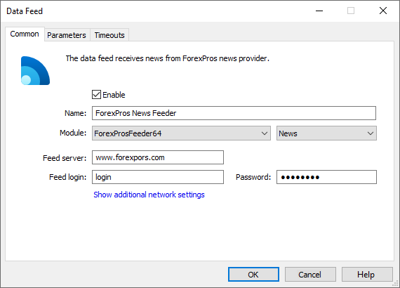
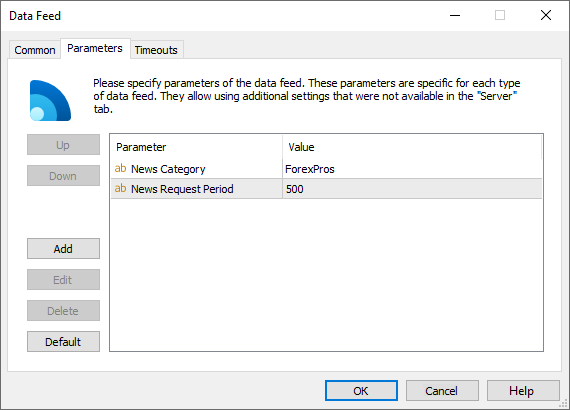

[🏠 Document Start](../../../README.md) / [MetaTrader 5 Trading Platform](../../../MetaTrader-5-Trading-Platform.md) / [Platform Components](../../Platform-Components.md) / [Data Feeds](../Data-Feeds.md) / ForexPros Feeder

[Previous](IBTimes-News-Feeder.md) | [Next](KnowledgeView-News-Feeder.md)

# ForexPros Feeder

ForexPros Feeder is a data feed that allows receiving financial news from ForexPros ([www.forexpros.com](https://www.forexpros.com)).

Information from this company is broadcast though web services. In order to get access to these services, it is necessary to conclude a special agreement with ForexPros. The corresponding contact information is published on the [official website](https://www.forexpros.com/about-us/contact-us) of this company.

After signing the contract, you will be given a login and password. Use these data to configure the data feed.

## Setup

On the ["Common" (#common)](../../Platform-Setup/Data-Feeds/Configuration-of.md#common) tab of the data feed specify the following parameters:

  * Module — ForexProsFeeder;
  * Feed server — specify here one of the addresses of the data source, depending on the language of news:

  * News in English — www.forexpros.com;
  * News in Spanish — www.forexpros.es;
  * News in French — www.forexpros.fr;
  * News in German — www.forexpros.de;
  * News in Italian — www.forexpros.it;
  * News in Russian — www.forexpros.ru;
  * News in Arabic — www.forexpros.ae;
  * News in Hebrew — www.forexpros.co.il;
  * News in Dutch — nl.forexpros.com;
  * News in Galician — www.forexpros.com.pt;
  * News in Japanese — www.forexpros.jp;
  * News in Chinese — cn.forexpros.com;
  * News in Turkish — www.forexprostr.com;
  * Feed login — authorization login received after you've signed an agreement with the ForexPros company.
  * Password — authorization password received after you've signed an agreement with the ForexPros company.

The data feed features the following additional [parameters (#parameters)](../../Platform-Setup/Data-Feeds/Configuration-of.md#parameters):

  * News Category — the name of the category of news received from this data feed. Further this category name can be used to specify news to be received by separate [groups](../../Platform-Setup/Groups.md).
  * News Request Period — the period of checking and downloading new information in seconds. During the first connection the data feed will receive all the available news items. Further checks for news are performed at the specified intervals.

