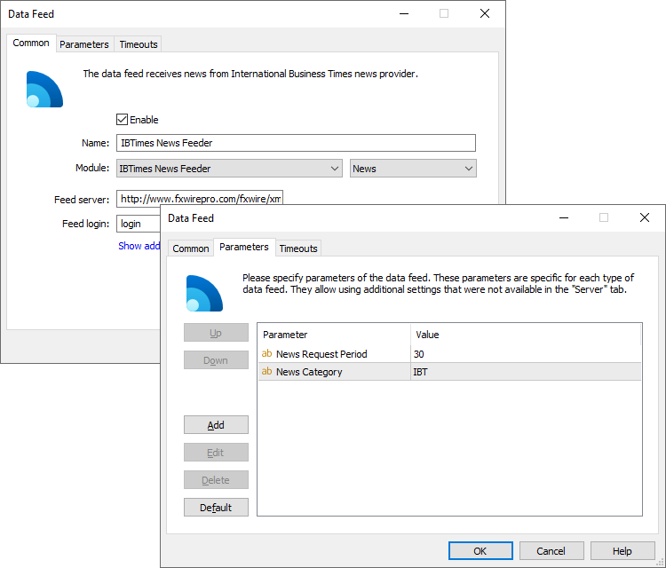

[🏠 Document Start](../../../README.md) / [MetaTrader 5 Trading Platform](../../../MetaTrader-5-Trading-Platform.md) / [Platform Components](../../Platform-Components.md) / [Data Feeds](../Data-Feeds.md) / IBTimes News Feeder

[Previous](RSS-News-Feeder.md) | [Next](ForexPros-Feeder.md)

# IBTimes News Feeder

IBTimes News Feeder delivers FxWire Pro™ Forex news from [International Business Times](https://www.fxwirepro.com/). 

With an existing network of 13 newsrooms worldwide, IBTimes has the adequate infrastructure necessary to create a fresh and new professional FX newswire service. FxWire Pro™ is a precise and timely newswire service for the modern day Forex trader. Each trading day FxWire Pro™ publishes over 600 news items in real time to help traders understand market-moving forces and make better and quicker trading decision.

## Unique news feed for the modern-day FX trader

FxWire Pro™ was conceived to integrate perfectly into the most popular trading platforms 

  * Succinct News: Short, Concise and To-The-Point  
FxWire Pro™ by IBTimes publishes news in an innovative format that significantly minimizes the information overload faced by modern day traders. The published items are sub categorized into News, Quotes and where applicable, Analysis. Rather than having to browse through lengthy paragraphs, the end-user will find clear and concise bullet points. The key objective in the development of FxWire Pro™ has been to transfer the maximum amount of information to the trader in the least possible time frame. IBTimes is proud to present a newswire that has been praised by several leading industry's analysts and traders for its unique and useful format of publishing.
  * Expert Forex Analysts and Editors Filter Information Noise  
The editorial process at publishing news on FxWire Pro™ involves Expert FX analysts and editors who act as a strong knowledge filter to remove any news item that is deemed irrelevant to the Forex trader.

FxWire Pro's 600+ a-day rolling news in an innovative format allow traders to be completely on top of the financial markets, economic and geo-political developments across the globe in real time.

## News categories of FxWire Pro™

The core areas covered by IBTimes' Professional Forex newswire service are:

  * Macro-Economy News & Data
  * Currencies Movement
  * Geo Politics
  * Real Time Economic Indicators
  * Treasury
  * Ratings
  * Money Market
  * Central Bank
  * Market Moving Talks
  * Media Round Ups & Picks
  * Generic FX Relevant News
  * Commodities
  * Stocks & Indices
  * Research Notes
  * Currencies covered: Major, minor and exotic currencies are covered as part of this service along with economic indicators in real-time from the major economies.

## Pre-setup

Information is broadcast via web service. To gain access to the web service, you should sign an agreement with International Business Times by sending a request via [App Store](https://support.metaquotes.net/en/market/product/288). You will receive a special login and password which should be used to set up the data feed in the platform.

## Setup

On the ["Common" (#common)](../../Platform-Setup/Data-Feeds/Configuration-of.md#common) tab of the data feed specify the following parameters:

  * Module — IBTNewsFeeder;
  * Feed server — specify here one of the addresses of the data source, depending on the language of news:

  * News in English — http://www.fxwirepro.com/fxwire/xml/newswire.php
  * News in Chinese — http://www.fxwirepro.com/fxwire/cn/xml/newswire.php
  * News in Japanese — http://www.fxwirepro.com/fxwire/jp/xml/newswire.php
  * Feed login — authorization login received after you've signed an agreement with the International Business Times company.
  * Password — authorization password received after you've signed an agreement with the International Business Times company.

On the ["Parameters" (#parameters)](../../Platform-Setup/Data-Feeds/Configuration-of.md#parameters) tab, you can specify additional settings:

  * News Category — the name of the category of news received from this data feed. Further this category name can be used to specify news to be received by separate [groups](../../Platform-Setup/Groups.md).
  * News Request Period — the period of checking and downloading new information in seconds. During the first connection the data feed will receive all the available news items. Further connections are established at the intervals set in this parameter, default period is 30 seconds. Contact IB Times support service for the best news request interval as it may vary for different clients.

> If you want to receive news in all the three languages, create three separate data feeds with different names in MetaTrader 5 Administrator. In the Server field specify the appropriate address, in the fields of login and password specify the details of your subscription allowing to receive news in the appropriate language.
