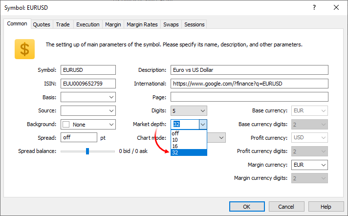
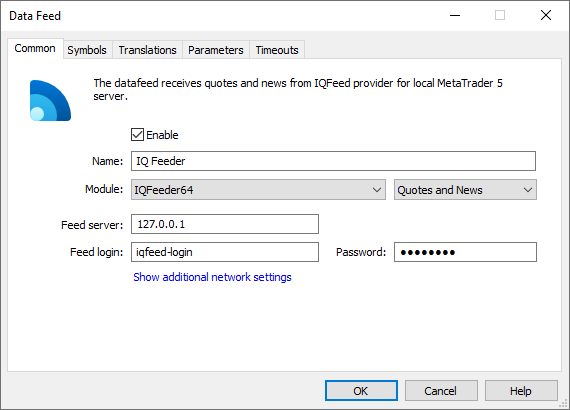
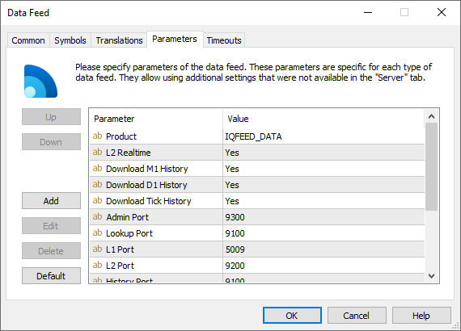
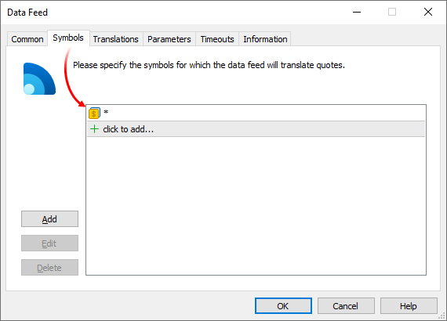

[🏠 Document Start](../../../README.md) / [MetaTrader 5 Trading Platform](../../../MetaTrader-5-Trading-Platform.md) / [Platform Components](../../Platform-Components.md) / [Data Feeds](../Data-Feeds.md) / IQFeeder

[Previous](DJ-News-Feeder.md) | [Next](MetaTrader-4-Feeder.md)

# IQFeeder

The IQFeeder is designed for receiving news and price data from [IQFeed](https://www.iqfeed.net). The company offers brokers a wide range of services:

  * Real-time quotes for financial instruments traded on the US and Canadian exchanges: NYSE, NASDAQ and Canadian Securities Exchange, among others
  * Real-time quotes for Forex instruments
  * Level II data (order book)
  * More than 700 market stats/breadth indicators, most of which are updated every second
  * Up to 180 calendar days of tick history
  * More than 11 years of one-minute historical data
  * Fundamental data on US stocks
  * Real-time news from leading agencies

IQFeeder is free and is included in the standard platform delivery package. You only need to subscribe for the data by contacting [IQFeed](https://www.iqfeed.net) and then to configure the data feed in the platform.

## How It Works

IQFeed provides a special software (IQFeed Client) that is responsible for information delivery from the provider to the local server where this software is installed. These data are translated to the history server via the IQFeeder data feed. Interaction between the data feed and the IQFeed client is implemented through the local IP address 127.0.0.1.

IQFeed Client is already available in the data feed. During data feed configuration in the platform, the required components will be installed automatically and thus no additional installation will be required.

## Setup

IQFeed provides data for a variety of trading instruments. In order to be able to receive relevant data, you need to [create corresponding symbols](../../Platform-Setup/Symbols.md). If you want to receive the order book in addition to quotes, enable the appropriate option in symbol settings:

Set a value other than "off" for the Market Depth parameter. If the initial depth of the Market Depth is different, the data feed will automatically align it with the value specified in the symbol settings in the platform. The price accuracy in the Market Depth will be automatically adjusted to the value specified in symbol settings.

> If symbol names on you platform side differ from those available in IQFeed, you can match corresponding symbols in the data feed settings, under the "[Translation (#translation)](../../Platform-Setup/Data-Feeds/Configuration-of.md#translation)" settings.

Once you have prepared the symbols, create a new [data feed configuration](../../Platform-Setup/Data-Feeds.md) for IQFeeder.

The following parameters should be specified on the ["Common" (#common)](../../Platform-Setup/Data-Feeds/Configuration-of.md#common) tab of the data feed:

  * Module — IQFeeder.
  * Feed server — 127.0.0.1, this address is used to implement connection between the data feed and the IQFeed client, it cannot be changed.
  * Feed login — login for connection, which is provided by IQFeed upon subscription
  * Password — password for connection, which is provided by IQFeed upon subscription.

On the ["Parameters" (#parameters)](../../Platform-Setup/Data-Feeds/Configuration-of.md#parameters) tab, specify "Product ID" that was received from the news provider and additional settings (if needed).

  * News Category — the name of the category of news received from this data feed. Further this category name can be used to specify news to be received by separate [groups](../../Platform-Setup/Groups.md).
  * Product — product identifier. It is provided by IQ Feed upon subscription.
  * L2 Realtime — set "Yes" to be able to receive the Market Depth data. Access to the relevant data must be granted by your IQFeed subscription and the [Market Depth feature must be allowed (#dom)](../../Platform-Setup/Symbols/Symbol-Settings/Common.md#dom) in symbol settings on the platform side.
  * Download Tick History — if set to "Yes", the data feed will download the available tick history of trading instruments.
  * Download M1 History — if set to "Yes", the data feed will download the available one-minute history of trading instruments.
  * Download D1 History — if set to "Yes", the data feed will download the available daily history for trading instruments. If this parameter is enabled along with the "Download M1 History" option, the daily history will only be downloaded for the periods for which one-minute history is not available.
  * Admin Port, Lookup Port, L1 Port, L2 Port, History Port — the ports on which IQFeed Client waits for incoming connections to feed appropriate data (L1 and L2 prices, quoting history). The default values correspond to IQFeed Client ports.
  * Quotes Delay — delay of transmitted quotes in seconds. The maximum duration of quotes delay is 20 minutes (1200 seconds). The flow of delayed quotes is neither thinned out, nor changed. A quote is passed to MetaTrader 5 History Server only after the expiration of delay period since the quote has arrived to Gateway API. If the temporary delay parameter is not defined, the quote delay is not used. Changes in depth of market and price statistics are delayed together with the quotes flow.
  * Quotes Tickstats Sample — the minimum frequency of sending price statistics in milliseconds. This parameter allows thinning out updates of price statistics reducing the traffic.
  * Quotes Ticks Sample — the minimum frequency of sending quotes in milliseconds. This parameter allows thinning out updates of quotes reducing the traffic. It is recommended for use on demo servers only.
  * Quotes Books Sample — the minimum frequency of depth of market updates in milliseconds. This parameter allows thinning out updates of the depth of market reducing the traffic. It is recommended for use on demo servers only.

Before importing the price history, check the list of symbols configured in the data feed. If the data feed is allowed to download history, it will replace the history of all symbols within the platform, for which the data feed has permissions.

