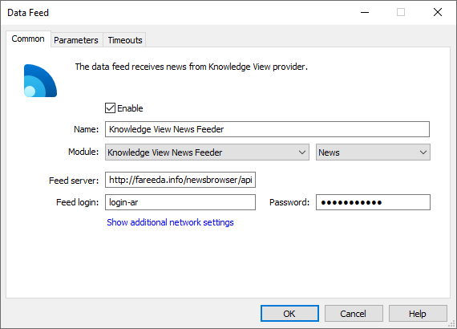
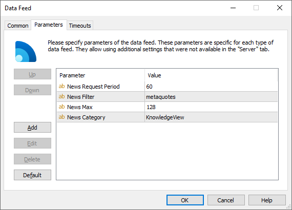

[🏠 Document Start](../../../README.md) / [MetaTrader 5 Trading Platform](../../../MetaTrader-5-Trading-Platform.md) / [Platform Components](../../Platform-Components.md) / [Data Feeds](../Data-Feeds.md) / KnowledgeView News Feeder

[Previous](ForexPros-Feeder.md) | [Next](FXstreet-Feeder.md)

# KnowledgeView News Feeder

KnowledgeView News Feeder is designed to receive news from [KnowledgeView](https://www.knowledgeview.co.uk/), a partner of [Dow Jones](https://www.dowjones.com/). It allows to receive news in real time in three languages: Arabic, Farsi and Turkish.

If you want to start getting the news, you need to contact KnowledgeView or Dow Jones to sign the agreement. The contact information can be found on the official websites of these companies: [Offices](https://www.knowledgeview.co.uk/aboutus/offices "Offices") section of the KnowledgeView official web site and [Contact Us](https://www.dowjones.com/contactus/contactus.aspx?sect= "Contact Us") section of the Dow Jones official web site. After concluding the contract you will receive the parameters for connecting a data feed to KnowledgeView server: address, login, password and additional Filter parameter.

## Setup

Add the new KnowledgeView News Feeder data feed configuration via the [corresponding section of the administrator terminal](../../Platform-Setup/Data-Feeds.md).

The following parameters must be specified on the ["Common"](../../Platform-Setup/Data-Feeds/Configuration-of.md) tab of the data feed:

  * Module — KnowledgeViewNewsFeeder(64);
  * Feed server — KnowledgeView server web address. The default web address is http://fareeda.info/newsbrowser/api.
  * Feed login — login for connection to KnowledgeView server;
  * Password — password for connection to KnowledgeView server.

> Address, login and password are submitted by KnowledgeView during the agreement conclusion. A separate login and password are submitted for each news language. Thus, you should create several configurations for that data feed to get news in several languages simultaneously.

Specify the following parameters in the [Parameters (#parameters)](../../Platform-Setup/Data-Feeds/Configuration-of.md#parameters) tab:

  * News Request Period — intervals to check and download new data in seconds. The data feed receives all available news during the first connection. After that, the latest news are checked at the specified intervals. The lower the value, the faster the news will appear in the platform. But this will increase the network load. The default value is 60 seconds.
  * News Filter — the value is provided by KnowledgeView upon the execution of an agreement. Separate Filter parameter value is specified for each news language in the same way as it is done with a login and a password.
  * News Max — the maximum number of news items which can received by the data feed. If this parameter value is low while "News Request Period" is large, some of the news items provided by the source can be lost. The default value is 128.
  * News Category — the category name for the newsletters received from the data feed. The category name can then be used for specifying news to be delivered to client [groups](../../Platform-Setup/Groups.md).

If the Filter value is incorrect, the data feed will not be able to connect to the server. These parameters can be checked in the [data feed log](../../Platform-Setup/Data-Feeds/Journal-of.md):

2012.03.28 09:59:59 Gateway datafeed initialized, connecting to http://fareeda.info/newsbrowser/api   
2012.03.28 09:59:59 Gateway available datafeed filter: 'Forex Turkish'   
2012.03.28 09:59:59 Gateway available datafeed filter: 'Forex Turkish - month'   
2012.03.28 09:59:59 Gateway specified filter 'Turkish' is incorrect, check datafeed parameters   
2012.03.28 09:59:59 Gateway filter checking failed  
---  
  
In addition to the entries indicating the errors in the filter specification, the data feed log also displays available filter values (the entries of "available datafeed filter" type). The terminal will start receiving news right after the successful connection.
