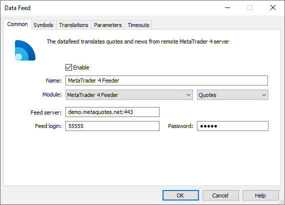
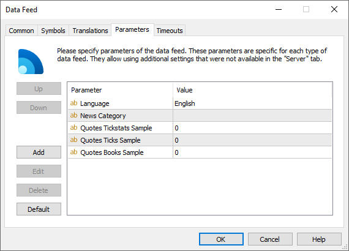

[🏠 Document Start](../../../README.md) / [MetaTrader 5 Trading Platform](../../../MetaTrader-5-Trading-Platform.md) / [Platform Components](../../Platform-Components.md) / [Data Feeds](../Data-Feeds.md) / MetaTrader 4 Feeder

[Previous](IQFeeder.md) | [Next](MetaTrader-5-Feeder.md)

# MetaTrader 4 Feeder

MetaTrader 4 Feeder is the data feed that enables receipt of quotes and news from MetaTrader 4 servers. This solution is built into the platform, which ensures minimal delays in quote delivery.

## How It Works

The data feed creates a common client connection with any MetaTrader 4 server, authorizing using a login and a password.

  * Connection can be established using any account (demo or real).
  * You can receive only quotes and news that are available to the account that is used for connection.

  
---  
  
## Automatic Opening of Demo Accounts

The data feed is capable of automatic of opening of demo accounts on the source server.

If the account details (login and password) are not specified in the data feed settings or the account has become invalid (expired), the data feed will open a new demo account and will use it for connecting.

## Setup

The data feed must be added via the [corresponding section](../../Platform-Setup/Data-Feeds.md) of the administrator terminal.

The following parameters should be specified on the ["Common" (#common)](../../Platform-Setup/Data-Feeds/Configuration-of.md#common) tab of the data feed:

  * Module — MetaTrader4Feeder;
  * Feed server — address of the MetaTrader 4 server and the port number to connect to it (separated by a colon);
  * Feed login — login (account number) for the authorization on the server;
  * Password — password of the account for the authorization on the server.

The data feed features the following additional [parameters (#parameters)](../../Platform-Setup/Data-Feeds/Configuration-of.md#parameters):

  * Language — the language to be used for the news with their language not specified on the source server. This is necessary for correct conversion and further sorting of such news. "English" is applied by default. The language should be specified in the format standard for the Windows operating systems, though without the regional dialectic specifications. E.g. English, Russian, etc.
  * News Category — the name of the category of news received from this data feed. Further this category name can be used to specify news to be received by separate [groups](../../Platform-Setup/Groups.md).
  * Quotes Tickstats Sample — the minimum frequency of sending price statistics in milliseconds. This parameter allows thinning out updates of price statistics reducing the traffic.
  * Quotes Ticks Sample — the minimum frequency of sending quotes in milliseconds. This parameter allows thinning out updates of quotes reducing the traffic. It is recommended for use on demo servers only.
  * Quotes Books Sample — the minimum frequency of depth of market updates in milliseconds. This parameter allows thinning out updates of the depth of market reducing the traffic. It is recommended for use on demo servers only.

