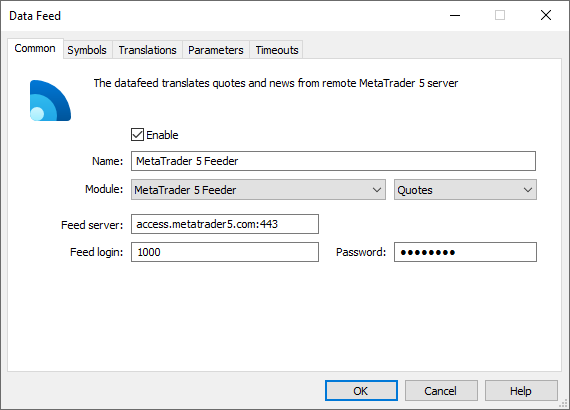
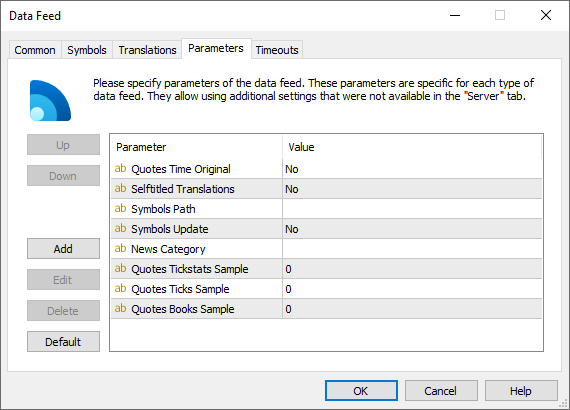

[🏠 Document Start](../../../README.md) / [MetaTrader 5 Trading Platform](../../../MetaTrader-5-Trading-Platform.md) / [Platform Components](../../Platform-Components.md) / [Data Feeds](../Data-Feeds.md) / MetaTrader 5 Feeder

[Previous](MetaTrader-4-Feeder.md) | [Next](Trading-Central-News-Feeder.md)

# MetaTrader 5 Feeder (#metatrader-5-feeder)

MetaTrader 5 Feeder is a data feed which enables the delivery of news, quotes and Market Depth data from any MetaTrader 5 servers.

This solution is built into the platform, which ensures minimal delays in quote delivery. To speed up data delivery, the data feed operates works in multiple streams, and also it automatically selects the best access points for connection.

## Setup (#setup)

Contact the desired broker and agree on data delivery terms and conditions. To connect to the source broker, you will need a regular trading account (demo or real), with access to the required news and trading instruments. The data feed will create a client connection and will deliver data through this connection.

The data feed must be added via the [corresponding section](../../Platform-Setup/Data-Feeds.md) of the administrator terminal.

The following parameters should be specified on the ["Common" (#common)](../../Platform-Setup/Data-Feeds/Configuration-of.md#common) tab of the data feed:

  * Module — MetaTrader5Feeder;
  * Feed server — address of the MetaTrader 5 server and the port number to connect to it (separated by a colon);
  * Feed login — login (account number) for the authorization on the server;
  * Password — password for the authorization. If the extended authorization mode is enabled on the server you are going to receive data from, you should use an investor password instead of the main one. Otherwise connection will be impossible.

The data feed features the following additional [parameters (#parameters)](../../Platform-Setup/Data-Feeds/Configuration-of.md#parameters):

  * Quotes Time Original — if "Yes", the datafeed itself sets the time for ticks considering the time zone of the recipient trade server. If the parameter is absent or set to "No", the time for ticks is set by the history server according to the trade time used.
  * Selftitled Translations — this parameter is used to prevent quotes from looping when connecting to the server on which the datafeed is installed. The default value is No. For more details please see [below (#retranslation)](MetaTrader-5-Feeder.md#retranslation).
  * Symbols Update — mode applied to the import of trading instruments to the platform from an external source. If set to No (default), the data feed will only add symbols from the source server that do not yet exist in the platform. If set to Yes, the data feed will also update the settings of already existing symbols, which may affect the broadcasting of quotes (general description, currency data, accuracy, order book depth, tick value and size, accrued interest on bond, settlement price, price limits, splicing data, and quoting sessions). Settings are updated in real time. Quoting sessions are updated taking into account server time zones.  
Symbol settings are only imported/updated, if the [appropriate option (#import)](../../Platform-Setup/Data-Feeds/Configuration-of.md#import) is enabled in the data feed settings.
  * Symbols Path — path to import trading instruments to. If this parameter is absent (by default), the data feed will import trading instruments into the \Preliminary subgroup with the trading option disabled. If this parameter has a non-empty value, the data feed will import trading instruments into the specified location.
  * News Category — the name of the category of news received from this data feed. Further this category name can be used to specify news to be received by separate [groups](../../Platform-Setup/Groups.md).
  * Quotes Tickstats Sample — the minimum frequency of sending price statistics in milliseconds. This parameter allows thinning out updates of price statistics reducing the traffic.
  * Quotes Ticks Sample — the minimum frequency of sending quotes in milliseconds. This parameter allows thinning out updates of quotes reducing the traffic. It is recommended for use on demo servers only.
  * Quotes Books Sample — the minimum frequency of depth of market updates in milliseconds. This parameter allows thinning out updates of the depth of market reducing the traffic. It is recommended for use on demo servers only.

## Automatic Opening of Demo Accounts (#automatic-opening-of-demo-accounts)

The data feed is capable of automatic of opening of demo accounts on the source server.

If the account details (login and password) are not specified in the data feed settings or the account has become invalid (expired), the data feed will open a new demo account and will use it for connecting.

## Transferring quotes (#transferring-quotes)

For symbols with the [disabled market depth (#dom)](../../Platform-Setup/Symbols/Symbol-Settings/Common.md#dom) (on the external server side), MetaTrader 5 Feeder passes ticks with Bid and Ask prices.

For symbols with the enabled market depth, the data feed transfers the market depth changes as well as ticks with Last prices and volumes. Ticks containing only Bid and Ask price changes are not transferred. If the best supply and demand prices change in the market depth, the history server generates the necessary tick with Bid and Ask prices and adds it to the flow.

The data feed features the built-in switching mechanism to prevent the quote flow from stopping in case the external server stops transmitting the market depth changes. If not a single market depth change for a symbol arrives from the external system within 30 seconds, the data feed stops sorting out ticks having only Bid and Ask prices. In other words, it starts transferring to the platform both Last/Volume and Bid/Ask ticks.

The following entries are shown in the data feed journal when the market depth is no longer transmitted:

2017.09.12 15:20:25.412 Feeder books stream for EURUSD stopped (no books during 31 sec)   
2017.09.12 15:20:25.873 Feeder books stream for USDJPY stopped (no books during 31 sec)  
---  
  
If the flow is resumed:

2017.09.12 15:21:29.759 Feeder books stream for EURUSD resumed   
2017.09.12 15:21:30.060 Feeder books stream for USDJPY resumed  
---  
  

## Symbol masks and own price retranslation (#retranslation)

In [datafeed translation settings (#translation)](../../Platform-Setup/Data-Feeds/Configuration-of.md#translation), the "*" mask can be used as the source symbol and as the destination symbol in the platform. For example, the settings Symbol="*", Source="*" mean that the names of the symbols will be used as they are provided in the external system. If the symbol is entitled EURUSD in the external system, then its data will be feed to the symbol with the same name on the trading platform side. The only situation in which such settings cannot be used is the connection of the data feed to the platform on which it is installed. In this case, receiving and feeding of quotes by the datafeed into the same symbols will lead to looping.

To avoid such situations, the datafeed provides the parameter "[Selftitled Translations (#selftitled-translations)](MetaTrader-5-Feeder.md#selftitled-translations)". If it is set to "No" (default) and the datafeed has a translation setting "*" <\- "*", the datafeed will not start. An appropriate entry will be added into the journal:

translation rule for symbols to themselves '* <\- *' not allowed but exists, remove this rule or allow it by 'Selftitled Translations' parameter  
---  
  
Before enabling this parameter, make sure that the data feed is not connected to the same cluster on which it is running. Otherwise, this can lead to quote looping in the platform.
