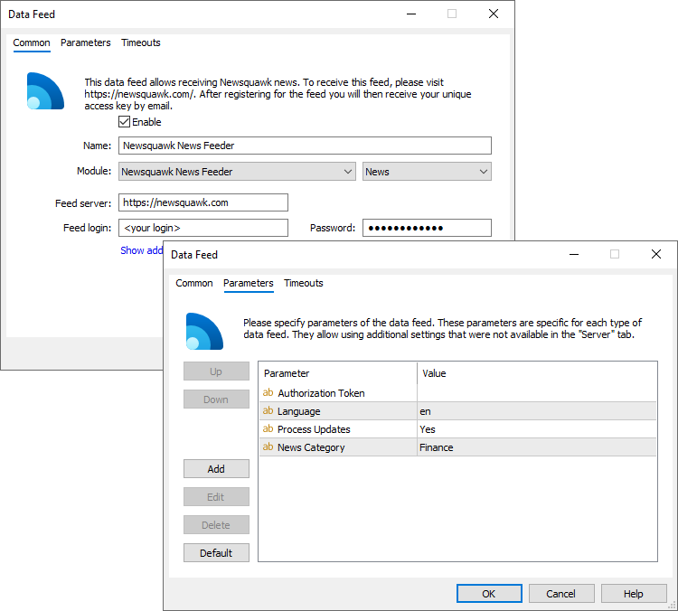

[🏠 Document Start](../../../README.md) / [MetaTrader 5 Trading Platform](../../../MetaTrader-5-Trading-Platform.md) / [Platform Components](../../Platform-Components.md) / [Data Feeds](../Data-Feeds.md) / Newsquawk

[Previous](Alliance-News-Feeder.md) | [Next](Remote-Datafeed.md)

# Newsquawk Feeder

Data feed for receiving financial newsletters from the [Newsquawk](https://newsquawk.com/) company. Newsquawk provides real-time access to the most important financial news, filtering data streams from hundreds of sources, such as Reuters, Bloomber and Daily Mail, among others. Additionally, you can receive daily market overviews across various categories of financial instruments, including forex, metals, stocks and commodities.

## Preparation

Fill our a form on the [Newsquawk website](https://www.newsquawk.com/sign_up.html). The company offers a free one-week trial subscription. After registration, you will receive a login/password or key to your email, which will be required to set up the data feed in the platform.

The built-in data feed module is already available in your platform. No fee is charged for the module use.

## Configuring the Data Feed

Add a new data feed configuration via the [corresponding section](../../Platform-Setup/Data-Feeds.md) of MetaTrader 5 Administrator:

Specify the following parameters:

  * Feed server — news provider's server address. The default address is https://newsquawk.com. In most cases, there is no need to change it.
  * Feed login — login for connection provided by Newsquawk upon subscription.
  * Password — password for connection provided by Newsquawk upon subscription.
  * Authorization Token — key for connection provided by Newsquawk upon subscription. You can use either this parameter or Login/Password, depending on the credentials provided.
  * Language — a two-letter language code in ISO 639 format that will be included in incoming news. For example, en, es, pt, etc. It will be used to filter news by language on the client terminal side. Fill in this parameter in accordance with the language selected during subscription, that is, the language in which you actually receive the news. To receive news in different languages, create separate data source configurations.
  * Process Updates — Newsquawk may update and supplement previously published news. The parameter determines whether the data feed will transmit such updates to the platform. On the MetaTrader 5 side, each update will create additional news; previously transmitted news will not be changed. The default is "Yes" meaning updates are transmitted.
  * News Category — the category to which newsletters from the data source will be assigned. The category name can then be used for specifying news to be delivered to certain client [groups](../../Platform-Setup/Groups.md).

Once the data feed is enabled, client terminals will start receiving newsletters. To check the data feed operation, request its [logs](../../Platform-Setup/Data-Feeds/Journal-of.md).
