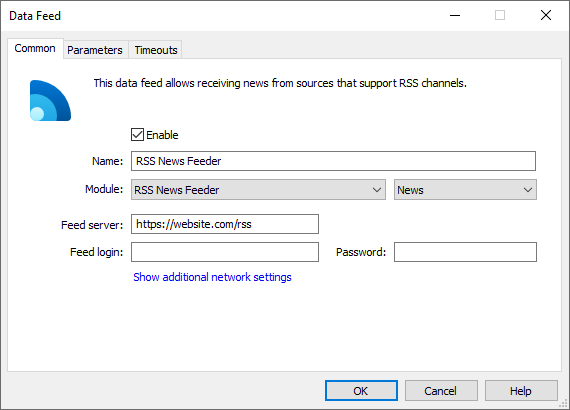
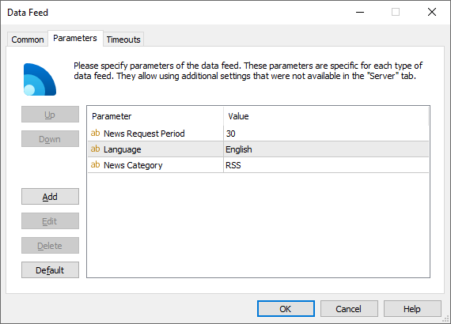

[🏠 Document Start](../../../README.md) / [MetaTrader 5 Trading Platform](../../../MetaTrader-5-Trading-Platform.md) / [Platform Components](../../Platform-Components.md) / [Data Feeds](../Data-Feeds.md) / RSS News Feeder

[Previous](Thomson-Reuters-Feeder.md) | [Next](IBTimes-News-Feeder.md)

# RSS News Feeder

The RSS News Feeder data feed enables the receipt of news from any sources that support the RSS channels. Such sources are various websites, as a rule.

For each source of news (each URL), you need to set up a separate [configuration](../../Platform-Setup/Data-Feeds.md) of RSS News Feeder data feed. During the first connection to a source, all the available news are downloaded and transferred. Further, requests for information updates are performed once in five minutes. Obtained information is cached on the hard drive. Therefore, only newly coming news items are downloaded if the data feed is turned on after standing idle for a while.

RSS News Feeder supports [categories (#categories)](../../MetaTrader-5-Administrator/User-Interface/Toolbox/News.md#categories) of incoming news, if any are implemented in the data source. All news items will be divided into subcategories of a category specified on the "Server" tab of the data feed settings.

> If you leave the "Category" field empty, the categories of incoming news will be written to the highest level. This may negatively affect the whole categorization of news received in the terminals.

## Setup

On the "Common" tab of the [data feed (#common)](../../Platform-Setup/Data-Feeds/Configuration-of.md#common), specify the following parameters:

  * Module — RSSNewsFeeder;
  * Feed server — address (url) of the data source. Additionally you can specify a port for connection separated with a colon from the address. If a port is not specified, port 80 is used on default.
  * Feed login — in case authentication is required for connecting to the data source, specify the login for connection in this field. Otherwise leave this field empty.
  * Password — in case authentication is required for connecting to the data source, specify the password for connection in this field. Otherwise leave this field empty.

The data feed features the following additional [parameters (#parameters)](../../Platform-Setup/Data-Feeds/Configuration-of.md#parameters):

  * News Category — the name of the category of news received from this data feed. Further this category name can be used to specify news to be received by separate [groups](../../Platform-Setup/Groups.md).
  * News Request Period — the period of checking and downloading new information in seconds.
  * Language — the language of news received from the data source. This parameters is necessary for correct conversion and further sorting of news. "English" is applied by default. The language should be specified in the format standard for the Windows operating systems, though without the regional dialectic specifications. E.g. English, Russian, etc.

