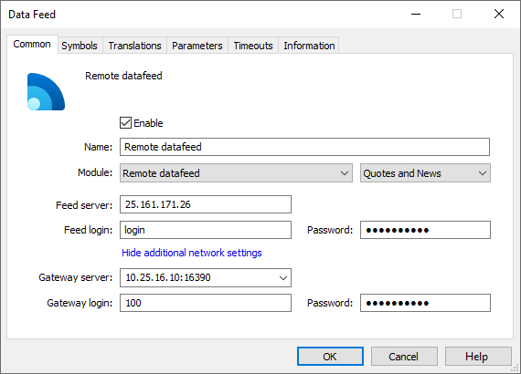

[🏠 Document Start](../../../README.md) / [MetaTrader 5 Trading Platform](../../../MetaTrader-5-Trading-Platform.md) / [Platform Components](../../Platform-Components.md) / [Data Feeds](../Data-Feeds.md) / Remote Datafeed

[Previous](Newsquawk.md) | [Next](Universal-DDE-Connector.md)

# Remote Datafeed

This option in the data feed [settings (#file)](../../Platform-Setup/Data-Feeds/Configuration-of.md#file) is intended for the connection of the server to a data feed located on a remote server. This data feed can be written using API.

In the parameters of connection to the data feed, the following needs to be specified:

  * Gateway server — the address of the server where the data feed is installed (module written using API, translating information from the provider), as well as the port number for connection, separated by a colon. For example, 192.168.0.180:443;
  * Gateway login — a login for connecting to the server;
  * Password — a password for connecting to the server;
  * Feed server — address of the data feed server;
  * Feed login — login to access the data feed server;
  * Password — password to access the data feed server.

