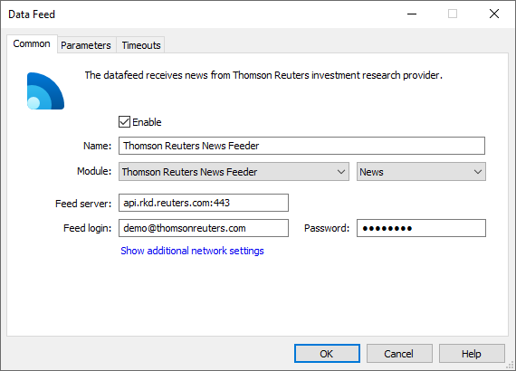
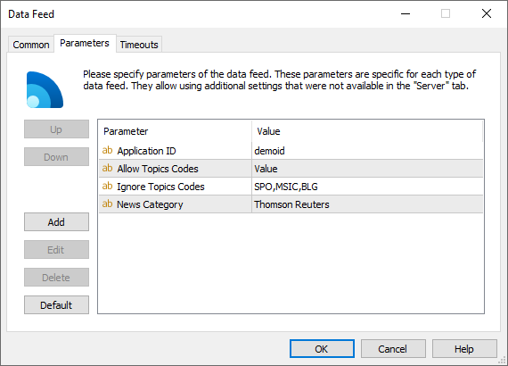

[🏠 Document Start](../../../README.md) / [MetaTrader 5 Trading Platform](../../../MetaTrader-5-Trading-Platform.md) / [Platform Components](../../Platform-Components.md) / [Data Feeds](../Data-Feeds.md) / Thomson Reuters Feeder

[Previous](MetaTrader-5-UniFeeder.md) | [Next](RSS-News-Feeder.md)

# Thomson Reuters Feeder

Thomson Reuters Feeder is a data feed that enables receiving of financial information from Thomson Reuters ([http://thomsonreuters.com](https://thomsonreuters.com "Thomson Reuters")).

Information from this company is transferred through web services. In order to get an access to them, you will need to conclude a special agreement. Please contact the company representative in your region. The corresponding contact information can be found on the company's website mentioned above.

Once the agreement is concluded, a user is given an IP address, login and password to access the service, as well as a unique ID (AppID). All this information must be provided when setting up the data feed in the administrator terminal.

## Setup

On the "Common" tab of [data feed (#common)](../../Platform-Setup/Data-Feeds/Configuration-of.md#common), specify the following parameters:

  * Module — ThomsonReutersFeeder;
  * Feed server — address of the server of Thomson Reuters and port to connect to it separated with colon. A port that is used for connecting, must support connection through the secured https protocol (SSL), usually port 443 is used;
  * Feed login — login to authorize on the server;
  * Password — password for the authorization.

  * IP address of the server, login and password are given when concluding the agreement.
  * A port that is used for the connection must be allowed on the server where the data feed is installed.

  
---  
  

On the ["Parameters" (#parameters)](../../Platform-Setup/Data-Feeds/Configuration-of.md#parameters) tab, specify one parameter — "Application ID". This parameter is a unique identifier of an application that connects to the server of Thomson Reuters. Its value is also given when concluding the agreement.

News can be filtered by categories (topics) using additional optional parameters Ignore Topics Codes and Allow Topics Codes. To allow news from specified categories and disable all other news, specify the codes of the desired categories in the Allow Topics Codes parameter, separated by commas. To disable selected categories and enable all others, specify the categories to disable in Ignore Topics Codes, separated by commas. In the above example, the following codes are specified in Ignore Topics Codes:

  * SPO: sport
  * MSIC: music news
  * BLG: blogs

In this case, the datafeed will receive all news letters, except those from the specified categories.

Please note that a news item can relate to several categories. If the news belongs to at least one of the categories specified in the parameter, it will be filtered out.

  * The full list of topic codes can be obtained from Thomson Reuters.
  * News are filtered on Thomson Reuters side, the data feeds does not receive news by specified topics.

  
---  
  
Do not use the Language parameter to filter news. It won't affect the data feed. The filtration of news by language is set up in the [group configuration](../../Platform-Setup/Groups/Group-Settings.md). Some news from Thomson Reuters may be transmitted without indication of the language. In this case the news will be passed to the terminals regardless of the languages specified in the group settings.

### Additional Settings

On the "Parameters" tab, you can specify additional settings:

  * News Category — the name of the category of news received from this data feed. Further this category name can be used to specify news to be received by separate [groups](../../Platform-Setup/Groups.md).
  * Quotes Delay — delay of transmitted quotes in seconds. The maximum duration of quotes delay is 20 minutes (1200 seconds). The flow of delayed quotes is neither thinned out, nor changed. A quote is passed to MetaTrader 5 History Server only after the expiration of delay period since the quote has arrived to Gateway API. If the temporary delay parameter is not defined, the quote delay is not used. Changes in depth of market and price statistics are delayed together with the quotes flow.
  * Quotes Tickstats Sample — the minimum frequency of sending price statistics in milliseconds. This parameter allows thinning out updates of price statistics reducing the traffic.
  * Quotes Ticks Sample — the minimum frequency of sending quotes in milliseconds. This parameter allows thinning out updates of quotes reducing the traffic. It is recommended for use on demo servers only.
  * Quotes Books Sample — the minimum frequency of depth of market updates in milliseconds. This parameter allows thinning out updates of the depth of market reducing the traffic. It is recommended for use on demo servers only.

