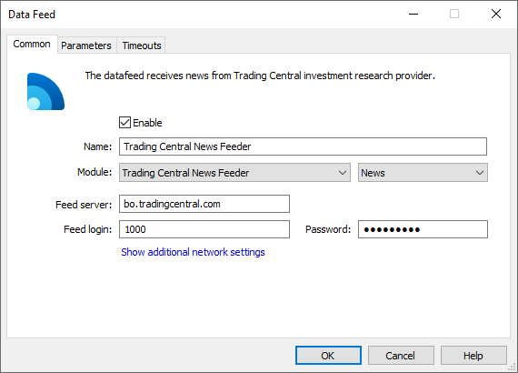
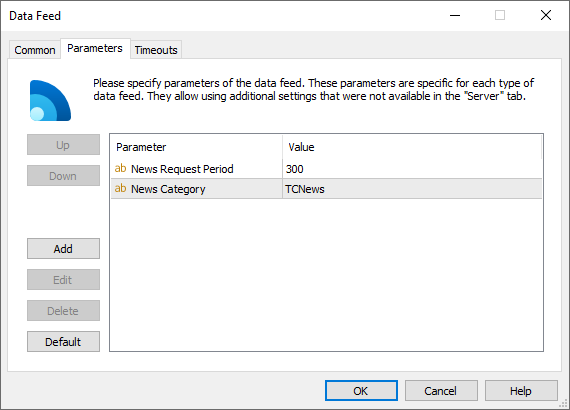

[🏠 Document Start](../../../README.md) / [MetaTrader 5 Trading Platform](../../../MetaTrader-5-Trading-Platform.md) / [Platform Components](../../Platform-Components.md) / [Data Feeds](../Data-Feeds.md) / Trading Central News Feeder

[Previous](MetaTrader-5-Feeder.md) | [Next](MetaTrader-5-UniFeeder.md)

# Trading Central News Feeder

Trading Central News Feeder is a data feed that enables receiving of analytical information on financial instruments from Trading Central ([www.tradingcentral.com](https://www.tradingcentral.com "Trading Central")). The basic activity of this company is the technical analysis trading recommendations sent by this company are based on.

Trading Central uses a FTP server to store data. In order to get access to these data, you should contact this company. To know the contact information, please visit the company's official website mentioned above. After you conclude an agreement, you are provided with the IP address of the FTP server, as well with the login and password for accessing it. Besides you will need to provide the IP address of your server (access server) in order for them to add it to the list of allowed addresses.

After that the data feed needs to be correctly set up via the administrator terminal:

The following parameters should be specified on the ["Common" (#common)](../../Platform-Setup/Data-Feeds/Configuration-of.md#common) tab of the data feed:

  * Module — TCNewsFeeder;
  * Feed server — address of the FTP server of Trading Central an a port to connect to it (separated by a colon). The data feed also supports connection via secure SFTP protocol. If you wish to use it, specify the protocol in the address, for example: sftp://sftp.tradingcentral.com. The connection address and the used protocol are determined by agreement with Trading Central.
  * Feed login — login to authorize on the server;
  * Password — password for the authorization.

> For the data feed to work, one should allow ports 20 and 21 on the computer where it is installed. They are necessary to work with FTP server.

After you connect to the FTP server, the data feed starts downloading all available data. After the data re received, it removes them from the FTP server. Further connections to the server are established once in five minutes for checking and downloading new data.

Analytical information that comes from the data feed consists of several elements: the news body with a chart, signals on indicators and signals on Japanese candlesticks. The latter two elements are released not so often as news, so they are inserted only if necessary.

If the data feed operation is terminated, news can be received without the signals for some time, because the earlier signals have been deleted upon receipt already, while new haven't been received yet. While the data feed is operating, it keeps the last four signals in its memory, and inserts them to corresponding news on currency pairs.

The data feed features the following additional [parameters (#parameters)](../../Platform-Setup/Data-Feeds/Configuration-of.md#parameters):

  * News Category — the name of the category of news received from this data feed. Further this category name can be used to specify news to be received by separate [groups](../../Platform-Setup/Groups.md).
  * News Request Period — the period of checking and downloading new information in seconds.

