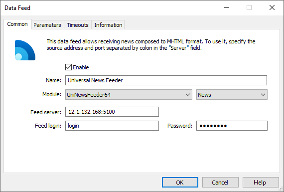
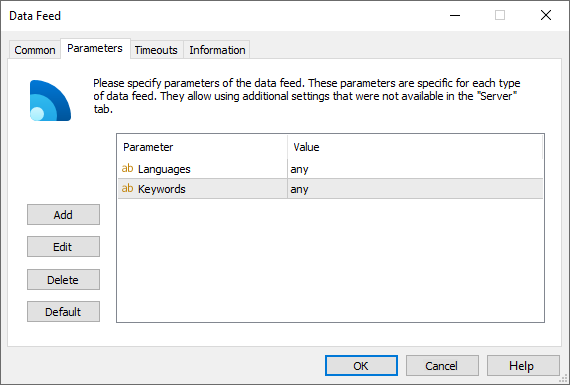

[🏠 Document Start](../../../README.md) / [MetaTrader 5 Trading Platform](../../../MetaTrader-5-Trading-Platform.md) / [Platform Components](../../Platform-Components.md) / [Data Feeds](../Data-Feeds.md) / UniNewsFeeder

[Previous](Claws-&-Horns-Feeder.md) | [Next](Alliance-News-Feeder.md)

# UniNewsFeeder

UinNewsFeeder is a universal news feed applying the new UniNews protocol.

MetaQuotes Software Corp. has developed its own binary news transfer protocol allowing for high speed of broadcasting news to the MetaTrader 4/5 platforms. Further on, it will allow using news in algorithmic trading by accessing them via MQL5 and the strategy tester.

The new protocol will be of interest to news providers since the integration is completely ready on the side of all MetaTrader 4/5 brokers. The free UinNewsFeeder data feed is able to receive news from any source supporting the new protocol.

## Operation principles

UniNewsFeeder connects to the news provider server and requests news using keywords in multiple languages. First, the data feed receives news missed during its inactivity. After that, the news arrive in real time.

## Setup

Add the new UniNewsFeeder data feed configuration via [the corresponding section of](../../Platform-Setup/Data-Feeds.md) the MetaTrader 5 Administrator:

The following parameters should be specified on the [Common (#common)](../../Platform-Setup/Data-Feeds/Configuration-of.md#common) tab of the data feed:

  * Module — UniNewsFeeder64.
  * Feed server — news provider server address.
  * Login — login for connecting to the news provider's server.
  * Password — password for connecting to the news provider's server.

> Connection data is provided by a news provider.

Set the news language and keywords for sorting the news on the [Parameters (#parameters)](../../Platform-Setup/Data-Feeds/Configuration-of.md#parameters) tab.

Set the incoming news language in the Languages parameter. The list of languages, in which you want to receive news, is comma-separated. For example, "russian,english,italian". The default value is "any". In this case, the data feed receives news in all languages in the MetaTrader 5 platform. Ask your news provider for the list of available languages.

In the Keywords parameter, set the keywords to be used by the data feed to request news. The default value is "any" (no filtration). Each news provider can sort out news using keywords. Ask your news provider for the list of keywords.

On the ["Parameters" (#parameters)](../../Platform-Setup/Data-Feeds/Configuration-of.md#parameters) tab, you can also use an additional parameter "News Category" — the name of the category of news received from this data feed. Further this category name can be used to specify news to be received by separate [groups](../../Platform-Setup/Groups.md).

The client terminals will start receiving news right after enabling the data feed. The data feed [journal](../../Platform-Setup/Data-Feeds/Journal-of.md) can be requested to check its operation.
