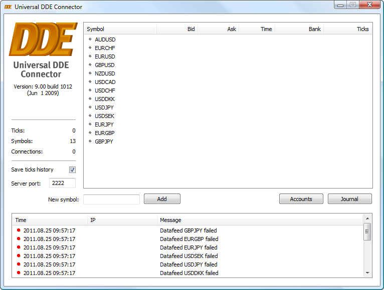
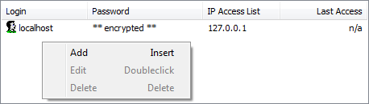

[🏠 Document Start](../../../../README.md) / [MetaTrader 5 Trading Platform](../../../../MetaTrader-5-Trading-Platform.md) / [Platform Components](../../../Platform-Components.md) / [Data Feeds](../../Data-Feeds.md) / [Universal DDE Connector](../Universal-DDE-Connector.md) / Installation and Setup

[Previous](../Universal-DDE-Connector.md) | [Next](Setting-Up-Symbols.md)

# Installing and Setting Up (#installing-and-setting-up)

In order to start installing the Universal DDE Connector, download it from the [technical support website](https://support.metaquotes.net/spfiles/datafeeds/uniddesetup9.exe "Download UniDDE") of MetaQuotes Software Corp. After that start the executable file and perform the simple installation procedure. As soon as the installation is over, start UniDDE.

To prepare UniDDE for connecting MetaTrader5UniFeeder to it, a some configurations are required.

> After you set up UniDDE, you'll need to [set up symbols](Setting-Up-Symbols.md) for translating quotes.

## Account Setup (#account)

During the program installation, one account for accessing from a local computer is created. To enable connection of MetaTrader5UniFeeder to UniDDE an account must be opened - execute the "Add" command in the context menu of the accounts block:

After you press it, a new line will appear, where you should enter the following data:

  * Login — login for access;
  * Password — password for access;
  * IP Access List — list of allowed IP addresses, separated by commas. Connection using the above specified login and password will be possible only from the specified IP addresses.

Date and time of the last access to UniDDE from a specified account is displayed in column "Last Access".

> To provide higher security, besides accounts with the allowed IP addresses, UniDDE provides the permanent control of all connections with automatic blocking to prevent DoS attacks. In real-time mode, all network connections are analyzed, and if a non-standard activity is detected. the IP address is automatically closed for 5 minites.

## Setup of Connection Port (#port)

Port specification is also required for connecting MetaTrader5UniFeeder. By default port 2222 is used, but you can change it in field "Server port".

> The specified port must be open on the server where UniDDE is installed.

## Setup of Tick Storage (#setup-of-tick-storage)

Universal DDE Connector allows storing tick data received from data sources. To do it, tick off field "Save Ticks History". Tick data are saved in file universalddeconnector.ticks, which is located in the UniDDE installation directory.

> When selecting the option of saving of tick data, you should watch the file size they are stored in. If ticks are saved for a long time period and for a great number of symbols, the file size can reach tens of gigabytes.

## Journal (#journal)

Results of connecting to a quotes feeder or of the connection of MetaTrader5UniFeeder, as well as other important messages about the operation of UniDDE are reflected in the journal. To open it, press "Journal". All messages are displayed as a table with the following fields:

  * Time — date and time of message creation;
  * IP — IP address the message is connected with. For example, the IP address of MetaTrader5UniFeeder when it is connected to UniDDE;
  * Message — text of the message.

