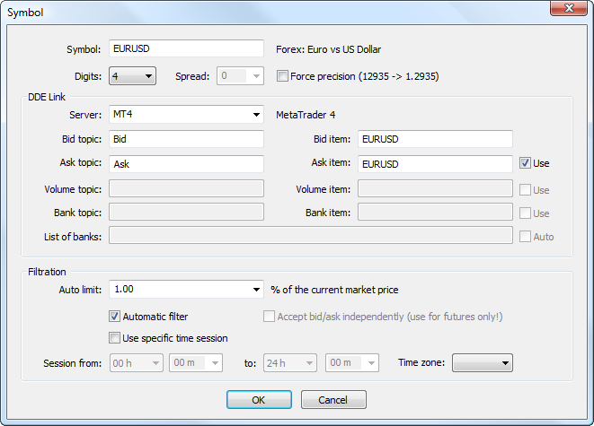
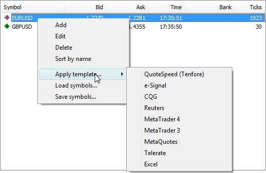

[🏠 Document Start](../../../../README.md) / [MetaTrader 5 Trading Platform](../../../../MetaTrader-5-Trading-Platform.md) / [Platform Components](../../../Platform-Components.md) / [Data Feeds](../../Data-Feeds.md) / [Universal DDE Connector](../Universal-DDE-Connector.md) / Setting Up Symbols

[Previous](Installation-and-Setup.md) | [Next](Filtration-of-Quotes.md)

# Setting Up Symbols

Universal DDE Connector uses the standard DDE protocol (Dynamic Data Exchange) for accepting quotes from any data source that supports this protocol. During installation of UniDDE, a set of symbols is created, which are configured for receiving quotes from the MetaTrader 4 client terminal. In order to start translating quotes from a client terminal, start it and enable option "Allow DDE Server".

  * Adding a symbol  
In order to add a new symbol, enter its name in field "New Symbol", and then press "Add".
  * Editing a symbol  
In order to change symbol settings, click twice on it in the list or execute the "Edit" command of the context menu.
  * Deleting a symbol  
In order to delete a symbol, select it in the list and press "Delete" or execute the same command of the context menu.

> After adding a symbol, restart UniDDE. Close it using the command of its context menu called by a right click on the icon in the area of notifications. Closing of the UniDDE window does not stop its running, and only minimizes it to the area of notifications.

## Symbol Setup

When adding or editing a symbol, a window of its setting appears:

Settings in this window are divided into several blocks:

### Common parameters

  * Symbol — name of the symbol in Latin letters up to 15 symbols long. A [symbol](../../../Platform-Setup/Symbols.md) of the same name must be created on the MetaTrader 5 server. The symbol name should not necessarily be the same as the symbol name on the data source;
  * Digits — the number of decimal places. The parameter value must be the same as the [analogous symbol parameter (#digits)](../../../Platform-Setup/Symbols/Symbol-Settings/Common.md#digits) on the MetaTrader 5 server;
  * Spread — automatically set spread. Setup of this option is possible only if one price Bid or Ask is received;
  * Force Precision — force transformation of prices like 12345 to 1.2345 if data are received without a separator.

> [A symbol](../../../Platform-Setup/Symbols.md) with exactly the same name must be created on the MetaTrader 5 server.

### DDE Link

In this block parameters of quote receiving from a supplier are configured.

  * Server — name of the source server in the DDE protocol. The most popular data sources can be selected from the list here. Other symbol settings corresponding to it will be set up automatically.
  * Bid topic, Bid item — settings for receiving Bid prices;
  * Ask topic, Ask item, Use — settings for receiving Ask prices. In the "Use" field you can enable/disable direct collection of these data. In this case the Ask price will be calculated automatically based on the value specified in field "Spread";
  * Volume topic, Volume item, Use — parameters for receiving the Ask price. In the "Use" field you can enable/disable direct collection of these data;
  * Bank topic, Bank item, Use — parameters for receiving information about the bank that issued the prices. In the "Use" field you can enable/disable direct collection of these data;
  * List of banks — the list of banks, from which quotes are allowed (separated by commas). Tick off "Auto" to enable the automatic bank selection mode. The auto-selection of banks is described in the section about [filtration](Filtration-of-Quotes.md).

  * Data receiving parameters are set up automatically is you select a server of one of suppliers in the "Server" filed.
  * Contact the supplier for parameters of data receipt.
  * Often, for futures instruments the Last price (price of the last executed deal) is translated. In this case symbols in UniDDE are configured manually so that the Last price is translated as Bid, and Ask is calculated based on tis price and spread settings.

  
---  
  
### Filtration

Filtration parameters for received quotes is set up here.

  * Auto limit — value of the [maximally allowed deviation (#auto-limit)](Filtration-of-Quotes.md#auto-limit) of a new price from the previous one in percents. If the difference between the new price and the previous one exceeds the specified limit, the new price is filtered away (is not passed to the server). This allows to prevent the accidental price substitution for different symbols (for example : USDJPY instead of USDCHF);
  * Automatic filter — enable/disable the automatically adjustable quote filtration. This mode is described in the section devoted to [filtration (#white-noise)](Filtration-of-Quotes.md#white-noise).
  * Accept bid/ask independently — by default, quotes are sent to clients (MetaTrader5UniFeeder) only if Bid has changed. The change of Ask is preserved in such a case, but quotes are not sent to client connection until Bid is updated. This tick allows to disable this behavior and translate new prices when Ask is updated.
  * Use specific time session — use separate time periods. If this option is enabled, fields "Session from" and "To" become active. There you can set time limits for translating symbol quotes.

> Option "Accept bid/ask independently" cannot be enabled for Forex symbols. Quotes where only Ask has changed are considered incorrect and are filtered out by the server. This can create additional load.

## Applying Profiles

A number of ready parameters for receiving quotes from different data feeders are available in UniDDE. To quickly switch between providers, you can use the special command "Apply template..." in the context menu of the symbols list.

Select here a necessary quote provider. To save the current set of symbols and their parameters, press "Save symbols...".

  * When you change the provider, parameters of all symbols in the list are changed. So be careful using this procedure. In some systems, parameters of symbols may differ, and some of them can stop working when you change the provider.
  * Each time you change provider, a backup copy of the previous state (file with SYM extension) is created in the "backup" folder located in the UniDDE installation directory. To restore the list of symbols, only use command "Load symbols..." and specify a required file.

  
---
