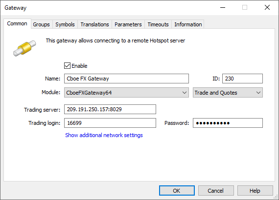
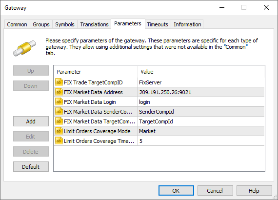
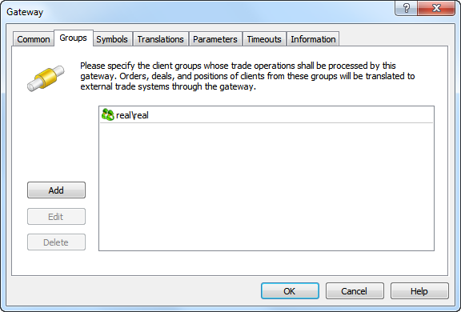
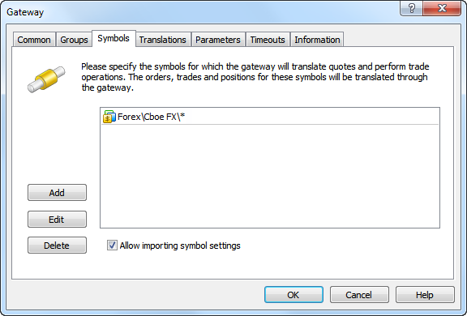
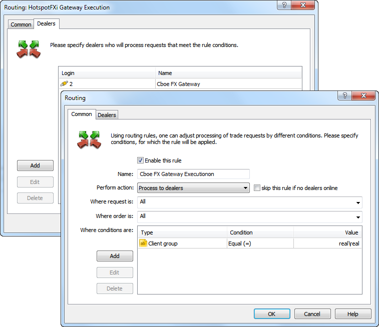
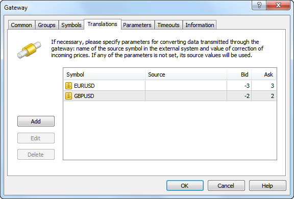

[🏠 Document Start](../../../README.md) / [MetaTrader 5 Trading Platform](../../../MetaTrader-5-Trading-Platform.md) / [Platform Components](../../Platform-Components.md) / [Gateways](../Gateways.md) / Cboe FX

[Previous](Euronext-FX.md) | [Next](LMAX-Global.md)

# MetaTrader 5 Cboe FX Gateway (#metatrader-5-cboe-fx-gateway)

[Cboe FX](https://fx.cboe.com) is one of the largest ECNs for the institutional FX market. The key advantages of Cboe FX are:

  * independence and transparency
  * complete Market Depth
  * centralized price setting system (defining the best price of all providers)
  * direct and anonymous market access
  * high trade execution speed
  * real-time quotes stream

The following financial assets can be traded via Cboe FX:

  * Currency pairs: 53 basic currency pairs and 13 additional ones.
  * Precious metals: XAGUSD, XAUUSD, LPDUSD, LPTUSD, XPDUSD, XPTUSD.

The MetaTrader 5 Gateway to Cboe FX enables brokers to transmit trading operations from the MetaTrader 5 platform to a ECN system. This will attract many customers who trade via Cboe FX. In addition, the gateway provides the ability for brokerage companies to earn additional income by automatically rearing the prices (spread increase) transmitted from ECN to the platform.

## Getting started with Cboe FX (#getting-started-with-cboe-fx)

First of all a broker should contact Cboe FX using the specified contact details, and to sign an agreement with them.

For sales inquiries: | Technical support:  
---|---  
Americas: +1 212 209 1420 Europe: +44 (0)20 7131 3450 Asia: +65 6911 6688 fxtradedesk@cboe.com | +1 212 378 8558 fxtradedesk@cboe.com  
  
When this stage is completed, authorization data for connection to ECN will be provided to the brokerage company. Additional information is available on the official Cboe FX website at <https://fx.cboe.com>.

> [Order the MetaTrader 5 Gateway to Cboe FX](https://support.metaquotes.net/en/market/product/262)

## How the Gateway Works (#how-the-gateway-works)

MetaTrader 5 Gateway to Cboe FX is a separate module that uses the MetaTrader 5 Gateway API for operation. It streams quotes and the Market depth, as well as it transmits clients' trade requests to the Cboe FX ECN system and back.

All orders entered in ECN are transferred to the unified requests database. The system selects appropriate orders automatically executing opposite orders with matching parameters (symbol, price etc.)

The broker's servers are configured in such a way that the clients' market requests are sent to MetaTrader 5 Cboe FX Gateway. The gateway verifies correctness of the client requests. In case validation is successful, the relevant trade request is directed to Cboe FX ECN server via a standard protocol for exchanging financial information - FIX. After receiving a response from the Cboe FX server, the gateway saves the trade request processing result in the platform, which in its turn reports this result to the trader.

Orders will be sent to MetaTrader 5 Cboe FX Gateway for processing in accordance with the configured [routing rules (#routing)](Cboe-FX.md#routing). Processing of requests depends on the type of the order, as well as in the gateway configuration.

Order type | Execution  
---|---  
Market Order | Delivered directly to Cboe FX as a market order.  
Take Profit Buy Limit Sell Limit | Depends on [LimitOrdersCoverage (#parameters)](Cboe-FX.md#parameters): LimitOrdersCoverage=Gateway (default) Limit orders are processed on the side of Cboe FX. Once a limit order has been placed by a client, an appropriate order is sent to Cboe FX. Take Profit orders are processed the same way as in the Limit mode. The Cboe FX system checks the availability of the required amount of funds to cover any type of order placed via the gateway. However, the check is performed on the broker's general account, on behalf of which the operation is carried out. Margin reservation of the clients should be configured for the appropriate order types in case Limit orders are directly delivered to an external system. By default, the margin is charged on the side of MetaTrader 5 only when market orders are placed. When placing pending orders in an external system, the client's available funds should be controlled on the side of MetaTrader 5 before the orders are transferred to avoid using all broker's funds by the client. LimitOrdersCoverage=Limit Limit Orders and Take Profit orders are processed on the side of the MetaTrader 5. Once a limit order is triggered, an equivalent limit order is sent to Cboe FX. That order has a short action time specified in LimitOrdersCoverageTimeout parameter. Since the price specified in the order is already present in the market, the order will be executed with that price — a market deal will be performed. If the necessary volume of the financial instrument is not available in the market at the specified price, the order will be executed partially. Thanks to a short expiration time, a limit order with a residual volume will be removed from Cboe FX. Thus, a client will have a market position as well as a limit order with a residual volume, which will be further processed in a similar way on the side of MetaTrader 5. A limit order with the price equal to a Take Profit level is sent to Cboe FX at the moment a Take Profit order has been activated. Since the price specified in the order is already present in the market, the order will be executed with that price — a market deal will be performed. If the necessary volume of the financial instrument is not available in the market at the specified price, the order will be executed partially. Thanks to a short expiration time, a limit order with a residual volume will be removed from Cboe FX. Therefore, a client's position will be closed partially. Control over the Take Profit position level with the remaining volume will then be carried out on MetaTrader 5 side.   
Limit mode allows to protect against slippage, as a limit order is sent to Cboe FX system with a specified price rather than a market order for execution by the current price. LimitOrdersCoverage=Market Limit orders and Take Profit orders are processed on the MetaTrader 5 platform side. Once they trigger, an appropriate market order us sent to Cboe FX.  
Buy Stop Sell Stop Stop Loss Stop Out | Processed on the MetaTrader 5 platform side until their stop price is reached. After a stop order is activated, an appropriate market order will be sent to Cboe FX system.  
Buy Stop Limit Sell Stop Limit | Processed on the MetaTrader 5 side. Upon order order activation, an appropriate limit order is created in MetaTrader 5, and this order is then processed in accordance with the value of the LimitOrdersCoverage parameter.  
  
  * Slippages are possible when transmitting market orders to ECN as a result of pending orders activation. The price on the Cboe FX server may change at the moment when the price has reached an order activation level but the market transaction has not yet been performed.
  * Due to the fact that pending orders are not transmitted to ECN, they will not be visible in the Depth of Market.

  
---  
  

## Gateway Setup (#gateway-setup)

To start working, add [the new gateway configuration](../../Platform-Setup/Gateways.md):

Set the following parameters on the "Common" tab:

  * Module — Cboe FXGateway64. Agree to set the default settings after selecting the module.
  * ID — unique dealer identifier, on whose behalf the trade requests will be processed. Requests are routed to the gateway according to this identifier.
  * Trade server — Cboe FX server IP-address and port, where trade requests are processed. They are designated as "ip" and "port" parameters in "Orders" section in the connection data provided by Cboe FX.
  * Trading login — a login for connection to the Cboe FX server. Designated as "username" parameter in "Orders" section in the connection data provided by Cboe FX.
  * Trading password — a password for connection to the Cboe FX server. Designated as "password" parameter in "Orders" section in the connection data provided by Cboe FX.

  * ID value must be unique in the field of manager logins and gateway identifiers.
  * The data for connection to the Cboe FX server, where trade requests are processed, is provided with the agreement.

  
---  
  
Other parameters are set similarly to other gateways. Default values are used in most cases.

Now, go to the "Parameters" tab.

Specify the following parameters values here:

  * FIX Trade TargetCompID — standard parameter of FIX messages header used for trading messages recipient identification. This is Cboe FX company identifier in the trade flow.
  * FIX Market Data Address — address and port of the Cboe FX server that streams quotes. They are provided as "ip" and "port" parameters in "Market Data" section in the connection data provided by Cboe FX.
  * FIX Market Data Login — login for connection to the quoting server. Provided as "username" parameter in "Market Data" section in the connection data provided by Cboe FX.
  * FIX Market Data SenderCompID — standard parameter of FIX message header used for the identification of the quote message sender. This is your company identifier in the quote stream.
  * FIX Market Data TargetCompID — standard parameter of FIX message header used for the identification of the quote message recipient. This is the Cboe FX identifier in the quote stream.
  * Limit Orders Coverage Mode — the mode of processing of Limit and Take Profit orders by the gateway. This parameter simplifies configuration of trade requests routing to the gateway, since there is no need to create a separate rule for routing the appropriate order types. Three processing modes are available:
    * Market — limit and Take Profit orders are processed on the MetaTrader 5 platform side. Once the order triggers, an appropriate market order is sent to Cboe FX.
    * Limit — limit and Take Profit orders are processed on the MetaTrader 5 side.  
  
Once a limit order is triggered, an equivalent limit order is sent to Cboe FX. That order has a short action time specified in Limit Orders Coverage ModeTimeout parameter. Since the price specified in the order is already present in the market, the order will be executed with that price — a market deal will be performed. If the necessary volume of the financial instrument is not available in the market at the specified price, the order will be executed partially. Thanks to a short expiration time, a limit order with a residual volume will be removed from Cboe FX. Thus, a client will have a market position as well as a limit order with a residual volume, which will be further processed in a similar way on the side of MetaTrader 5.  
  
A limit order with the price equal to a Take Profit level is sent to Cboe FX at the moment a Take Profit order has been activated. Since the price specified in the order is already present in the market, the order will be executed with that price — a market deal will be performed. If the necessary volume of the financial instrument is not available in the market at the specified price, the order will be executed partially. Thanks to a short expiration time, a limit order with a residual volume will be removed from Cboe FX. Therefore, a client's position will be closed partially. Control over the Take Profit position level with the remaining volume will then be carried out on the MetaTrader 5 side.  
  
The Limit mode allows to protect against slippage, as a limit order is sent to the Cboe FX system with a specified price rather than a market order for execution by the current price. In addition, this mode allows you not to reserve margin on a client's account before sending an order to Cboe FX.
    * Gateway — limit orders are processed on the Cboe FX side. Once a limit order has been placed by a client, an appropriate order is sent to Cboe FX. Take Profit orders are processed the same way as in the Limit mode.
  * Limit Orders Coverage Timeout — expiry of Limit Orders that are sent to Cboe FX in the Limit mode. Specified in seconds. The default value is 5.
  * Quotes Delay — delay of transmitted quotes in seconds. The maximum duration of quotes delay is 20 minutes (1200 seconds). The flow of delayed quotes is neither thinned out, nor changed. A quote is passed to MetaTrader 5 History Server only after the expiration of delay period since the quote has arrived to Gateway API. If the temporary delay parameter is not defined, the quote delay is not used. Changes in depth of market and price statistics are delayed together with the quotes flow.
  * Quotes Tickstats Sample — the minimum frequency of sending price statistics in milliseconds. This parameter allows thinning out updates of price statistics reducing the traffic.
  * Quotes Ticks Sample — the minimum frequency of sending quotes in milliseconds. This parameter allows thinning out updates of quotes reducing the traffic. It is recommended for use on demo servers only.
  * Quotes Books Sample — the minimum frequency of depth of market updates in milliseconds. This parameter allows thinning out updates of the depth of market reducing the traffic. It is recommended for use on demo servers only.

  * The data for connection to the Cboe FX quote server, as well as identifiers for trading and quoting connection are provided by Cboe FX with the agreement.
  * After editing the market depth settings the main trading server must be restarted to let the changes take effect.
  * The maximum market depth provided by Cboe FX is equal to 11.

  
---  
  
The next stage is to specify the groups of the clients, whose requests will be processed via the MetaTrader 5 Cboe FX Gateway.

Then configure the list of symbols, according to which the gateway will process trade operations and feed quotes.

Make sure to enable the option "Allow importing symbol settings", as the gateway adds necessary symbols and changes their settings by itself.

  * The symbols imported by the gateway are put to the "\Preliminary\CboeFX" symbols subgroup. All symbols have trading ability disabled. System administrator must relocate imported symbols to the proper subgroup and allow trading for them.
  * After symbols are transferred and trading is enabled, the main trading server must be restarted.
  * In case the gateway transmits configuration for the symbol that is already present in the platform, the configuration is updated. In this case the symbol is not transferred and its trading ability is not turned off.
  * The gateway supports conversion of symbols and quotes. For details, please view the [Symbol and Price Translation](../../Platform-Setup/Gateways/Symbol-and-Price-Translation.md) section.

  
---  
  

## Configuring trade requests routing (#routing)

Configure the routing to let the clients requests to be transmitted to the Cboe FX gateway. To do this, add a routing rule to the relevant [MetaTrader 5 Administrator](../../Platform-Setup/Routing.md) section.

Select "Process to dealers" as an action in common settings. Assign this routing rule for all requests and orders. In additional conditions, indicate groups of clients, whose requests will be passed to the gateway. Add the previously created gateway at the Dealers tab.

After the correct execution of the steps described above, Cboe FX gateway will be ready for use.

## Getting Started (#getting-started)

After it has been launched, the gateway will connect to the liquidity provider:

  * to receive symbols and the price stream
  * to transmit trade requests and to receive notifications about executed trades

Connection to the liquidity provider is performed via FIX protocol. All incoming and outgoing FIX messages are stored on the disk at the \gateway\Cboe FX\fix\ directory of the history server. The gateway follows the Cboe FX ECN schedule — it will close connection with the ECN after the end of the working session, and will establish the new connection after the beginning of the next session.

The result of the gateway operation is reflected in its [journal](../../Platform-Setup/Gateways/Journal-of.md).

## Getting Profit from Agency Work (#getting-profit-from-agency-work)

The gateway streams prices from the external trading system and [controls symbol settings (#symbols)](Cboe-FX.md#symbols). The standard feature of gateways is the ability to change the quotes and market depth transmitted to the clients from an external system.

The gateway received prices from Cboe FX ECN and transmits them to clients taking into account transformation settings. Clients perform trading operations using converted prices. However, while processing trading operations on the gateway and their transmission to ECN, initial, not converted prices are automatically used.

Thus, by increasing the selling price and reducing the purchase price ("price spreading") a brokerage company receives its profit share from each deal performed at Cboe FX. The correction value is set separately for each symbol on the "Translations" tab:

Here you can configure matching of symbol names used in Cboe FX with the names used in your MetaTrader 5 platform. For example, if the symbol name in Cboe FX is EURUSDHS, and it is called EURUSD in the MetaTrader 5, enter EURUSD in the "Symbol" field and EURUSDHS in the "Source" field.

The above screenshot shows price conversion: at every tick, the Bid price will be reduced by 3 points, and the Ask price will be increased by 2 points. For GBPUSD Bid, price is decreased by 2 points, and Ask is increased by 2 points.

## Prices Round Off (#prices-round-off)

During the gateway's operation, accuracy of quotes (decimal places) passed for some symbol may change in the external trading system. Decrease in price accuracy at the external trading system's side does not affect the gateway's operation. It still transmits prices with less accuracy. However, if the number of decimal places at the external system's side increases, the gateway starts rounding off the passed prices.

Suppose that the accuracy of quotes has changed from 4 to 5 digits. Obtained five-digit quotes are rounded up by the gateway and used for creating the Market Depth. The round off is always performed in broker's favor. Thus, buy requests of 1.23447, 1.23441 are rounded up to 1.2345, while sell ones of 1.23447, 1.23441 are rounded down to 1.23440.

Changes in symbol price accuracy are recorded in the gateway journal.
