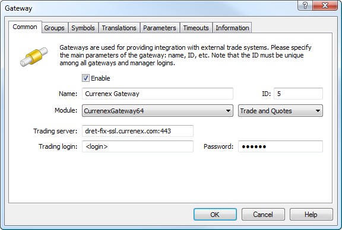
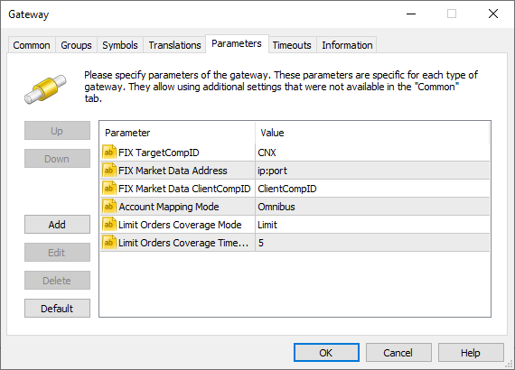
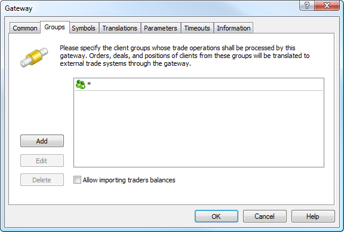
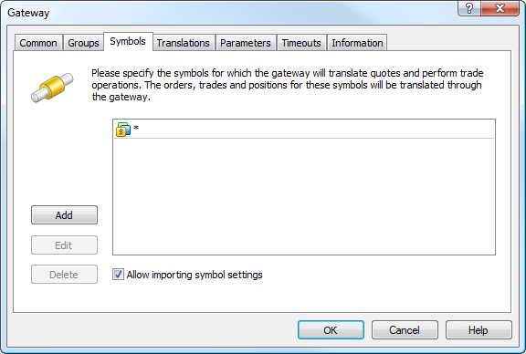
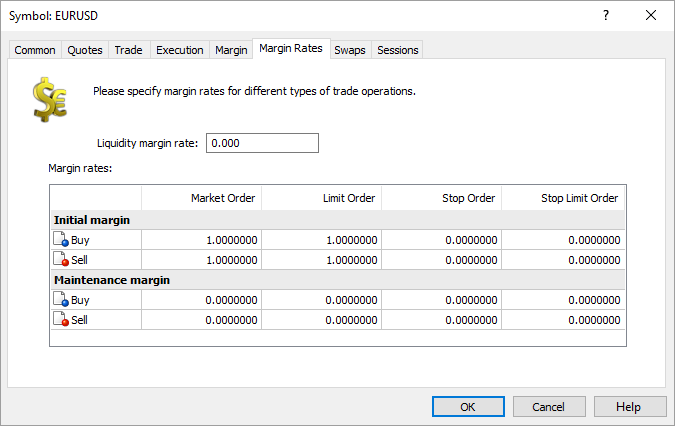
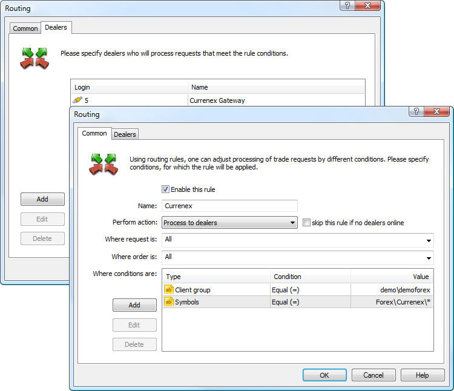
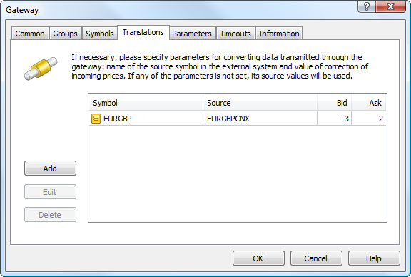
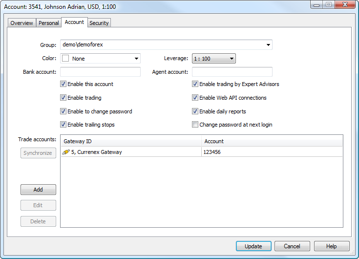

[🏠 Document Start](../../../README.md) / [MetaTrader 5 Trading Platform](../../../MetaTrader-5-Trading-Platform.md) / [Platform Components](../../Platform-Components.md) / [Gateways](../Gateways.md) / Currenex

[Previous](Integral.md) | [Next](Euronext-FX.md)

# MetaTrader 5 Gateway to Currenex (#metatrader-5-gateway-to-currenex)

MetaTrader 5 Gateway to Currenex is a simple, fast and secure integration solution for brokers. The gateway provides liquidity when working in MetaTrader 5. [Currenex](https://www.currenex.com/) forex means the best quotations, sound liquidity and the most efficient orders execution with use of hi-tech solutions which were applied in the platform development and which allow to create the quickest electronic trading system.

## About the company (#about-the-company)

Founded in 1999, [Currenex](https://www.currenex.com/), offers corporate and institutional buyers and sellers in the FX and money markets reliable, low-cost and secure electronic access to the $1+ trillion a day global FX market.

Currenex platform represents one of the largest ECN–systems operating with forex instruments and getting feed from more than seventy largest financial organizations. Direct quotations provide users with the ability of complete independent, transparent and reliable control over the prices which precisely reflect the market situation in every point of time.

What Currenex offers:

  * 28 currency pairs available for trading
  * instant orders execution
  * an access to level2 and to real market volumes
  * narrow spreads
  * no re-quotation
  * Non Dealing Desk (NDD) technology
  * expanded list of orders (Standard, Conditional)
  * all transactions information is protected, absolute confidentiality

## Getting started with Currenex (#getting-started-with-currenex)

In order to be able to provide trading services using Currenex, a brokerage company must first contact Currenex Sales Department for concluding the agreement: Contact details are given in the table below:

| Sales department | Friendly support  
New York | +1 212 340 1780 | +1 212 340 1780  
London | +44 (0) 20 3395 7930 | +44 (0) 20 3395 7930  
Tokyo | +81 3 4530 7555 | +81 3 4530 7555  
Singapore | +65 6826 7476 | +65 6826 7476  
Australia | +612 8429 1204 | +612 8429 1204  
| [sales@currenex.com](mailto:sales@currenex.com) | [support@currenex.com](mailto:support@currenex.com)  
| [www.currenex.com](https://www.currenex.com/) | [www.currenex.com](https://www.currenex.com/)  
  
After conclusion of an agreement, all necessary data for connection to the Currenex server will be provided to the brokerage company. Additional information is available on the official website [www.currenex.com](https://www.currenex.com/).

> [Order MetaTrader 5 Currenex Gateway](https://support.metaquotes.net/en/market/product/261)

## How the Gateway Works (#how-the-gateway-works)

MetaTrader 5 Gateway to Currenex is a separate CurrenexGateway64.exe module that uses the MetaTrader 5 Gateway API for operation. The gateway operates as a mediator between two systems connecting Currenex and MetaTrader 5 platform. All data between Currenex and the gateway is transmitted using FIX protocol over the encrypted connection. The gateway sends encrypted FIX messages and returns them to the MetaTrader 5 platform using MetaTrader 5 Gateway API.

### Market Data (#market-data)

MetaTrader 5 Gateway to Currenex automatically imports all the necessary symbols and processes their properties. An administrator only needs to perform primary setup as described bellow. Price data is transmitted in real time. The gateway allows to transmit the initial price data provided by Currenex or transform them. In the latter case quotes, reports and orders prices, that are directed to the client terminals, will be transformed according to the applied settings. Detailed information on prices conversion is available below.

### Trading Operations (#trading-operations)

Orders will be sent to MetaTrader 5 Currenex Gateway for processing in accordance with the configured routing rules. Processing of requests depends on the type of the order, as well as in the gateway configuration.

Order type | Execution  
---|---  
Market Order | Delivered directly to Currenex as a market order.  
Take Profit Buy Limit Sell Limit | Depends on LimitOrdersCoverage: LimitOrdersCoverage=Gateway (default) Limit orders are processed on the side of Currenex. Once a limit order has been placed by a client, an appropriate order is sent to Currenex. Take Profit orders are processed the same way as in the Limit mode. The Currenex system checks the availability of the required amount of funds to cover any type of order placed via the gateway. However, the check is performed on the broker's general account, on behalf of which the operation is carried out. Margin reservation of the clients should be configured for the appropriate order types in case Limit orders are directly delivered to an external system. By default, the margin is charged on the side of MetaTrader 5 only when market orders are placed. When placing pending orders in an external system, the client's available funds should be controlled on the side of MetaTrader 5 before the orders are transferred to avoid using all broker's funds by the client. LimitOrdersCoverage=Limit Limit Orders and Take Profit orders are processed on the side of the MetaTrader 5. Once a limit order is triggered, an equivalent limit order is sent to Currenex. That order has a short action time specified in LimitOrdersCoverageTimeout parameter. Since the price specified in the order is already present in the market, the order will be executed with that price — a market deal will be performed. If the necessary volume of the financial instrument is not available in the market at the specified price, the order will be executed partially. Thanks to a short expiration time, a limit order with a residual volume will be removed from Currenex. Thus, a client will have a market position as well as a limit order with a residual volume, which will be further processed in a similar way on the side of MetaTrader 5. A limit order with the price equal to a Take Profit level is sent to Currenex at the moment a Take Profit order has been activated. Since the price specified in the order is already present in the market, the order will be executed with that price — a market deal will be performed. If the necessary volume of the financial instrument is not available in the market at the specified price, the order will be executed partially. Thanks to a short expiration time, a limit order with a residual volume will be removed from Currenex. Therefore, a client's position will be closed partially. Control over the Take Profit position level with the remaining volume will then be carried out on MetaTrader 5 side.   
Limit mode allows to protect against slippage, as a limit order is sent to Currenex system with a specified price rather than a market order for execution by the current price. LimitOrdersCoverage=Market Limit orders and Take Profit orders are processed on the MetaTrader 5 platform side. Once they trigger, an appropriate market order us sent to Currenex.  
Buy Stop Sell Stop Stop Loss Stop Out | Processed on the MetaTrader 5 platform side until their stop price is reached. After a stop order is activated, an appropriate market order will be sent to Currenex system.  
Buy Stop Limit Sell Stop Limit | Processed on the MetaTrader 5 side. Upon order order activation, an appropriate limit order is created in MetaTrader 5, and this order is then processed in accordance with the value of the LimitOrdersCoverage parameter.  
  
  * In case connection to Currenex server is lost, the application will try to restore it repeatedly. In case pending orders have been executed at that, they will be updated in the MetaTrader 5 platform after connection is restored.
  * The Currenex system allows a broker to cancel orders in case of connection loss. The Currenex system does not cancel orders by default in that case but, nevertheless, you should notify the Currenex technical support about the necessity to disable that option for your account (pending orders should not be deleted in case of connection loss).
  * The gateway supports multiple modes of trade operation delivery to Currenex: on behalf of the broker's general account and on behalf of the individual accounts used for trading in MetaTrader 5 platform.

  
---  
  

## Gateway Setup (#gateway-setup)

To start working, add [the new gateway configuration](../../Platform-Setup/Gateways.md):

Set the following parameters on the "Common" tab:

  * ID — unique dealer identifier, on whose behalf the trade requests will be processed. Requests are routed to the gateway according to this identifier.
  * Module — specify CurrenexGateway64 and accept the default settings after the module selection.
  * Trading server — Currenex server IP-address and the port, where trade requests are processed. This information is provided by Currenex. An encrypted SSL connection to a server is established by default. If you need to establish an unencryprted connection, additionally specify the /nossl key in the address bar. For example: 10.123.100.17:10219/nossl.
  * Trading login — a login for connection to the Currenex server. It is provided by Currenex as the 'trading comp id' parameter.
  * Password — a password for connection to the Currenex server. It is also provided by Currenex.

  * ID value must be unique in the field of manager logins and gateway identifiers.
  * The data for connection to the Currenex server, where trade requests are processed, is submitted during the agreement conclusion.

  
---  
  
Other parameters are set similarly to other gateways. Default values are used in most cases.

Now, go to the "Parameters" tab.

Specify the following parameters values here:

  * FIX TargetCompID — a standard parameter of the FIX messages heading used for trading messages recipient identification. This parameter is provided by Currenex and is usually equal to CNX.
  * FIX Market Data ClientCompID — a standard parameter of the FIX messages heading used for a data sender identification. It is provided by Currenex as the 'market data comp id' parameter.

  * FIX Market Data Log Enabled — if "YES" is set, the gateway will save to disk the full quoting connection log. This can be useful in operation debugging. The log is not saved by default (value "No").
  * FIX Market Data Password — password for connecting to the market data stream. If the parameter is not specified or has an empty value, the trading connection password is used. The parameter is empty by default.

  * Account Mapping Mode — the gateway supports multiple modes of trade operation delivery to Currenex: on behalf of the broker's general account and on behalf of the individual accounts used for trading in MetaTrader 5 platform. Three modes of trades operations transfer are available:
    * omnibus — all orders will be transferred to Currenex on behalf of the broker's main account, specified in the "Trading login" parameter;
    * one-to-one — all orders will be transferred to Currenex on behalf of the individual accounts, at which they are set in MetaTrader 5 (account in the external system is displayed in each account's settings);
    * conversion — combination of the previous two modes: orders of the accounts that have specified external system account will be transferred on their own behalf, while all other orders will be transferred on behalf of the broker's general account.
  * Limit Orders Coverage Mode — the mode of processing of Limit and Take Profit orders by the gateway. This parameter simplifies configuration of trade requests routing to the gateway, since there is no need to create a separate rule for routing the appropriate order types. Three processing modes are available:
    * Market — limit and Take Profit orders are processed on the MetaTrader 5 platform side. Once the order triggers, an appropriate market order is sent to Currenex.
    * Limit — limit and Take Profit orders are processed on the MetaTrader 5 side.  
  
Once a limit order is triggered, an equivalent limit order is sent to Currenex. That order has a short action time specified in Limit Orders Coverage ModeTimeout parameter. Since the price specified in the order is already present in the market, the order will be executed with that price — a market deal will be performed. If the necessary volume of the financial instrument is not available in the market at the specified price, the order will be executed partially. Thanks to a short expiration time, a limit order with a residual volume will be removed from Currenex. Thus, a client will have a market position as well as a limit order with a residual volume, which will be further processed in a similar way on the side of MetaTrader 5.  
  
A limit order with the price equal to a Take Profit level is sent to Currenex at the moment a Take Profit order has been activated. Since the price specified in the order is already present in the market, the order will be executed with that price — a market deal will be performed. If the necessary volume of the financial instrument is not available in the market at the specified price, the order will be executed partially. Thanks to a short expiration time, a limit order with a residual volume will be removed from Currenex. Therefore, a client's position will be closed partially. Control over the Take Profit position level with the remaining volume will then be carried out on the MetaTrader 5 side.  
  
The Limit mode allows to protect against slippage, as a limit order is sent to the Currenex system with a specified price rather than a market order for execution by the current price. In addition, this mode allows you not to reserve margin on a client's account before sending an order to Currenex.
    * Gateway — limit orders are processed on the Currenex side. Once a limit order has been placed by a client, an appropriate order is sent to Currenex. Take Profit orders are processed the same way as in the Limit mode.
  * Limit Orders Coverage Timeout — expiry of Limit Orders that are sent to Currenex in the Limit mode. Specified in seconds. The default value is 5. The minimal value is 2.
  * FIX Market Data Address — the IP address and port of the Currenex server, from which market data are transmitted. This information is provided by Currenex. An encrypted SSL connection to a server is established by default. If you need to establish an unencryprted connection, additionally specify the /nossl key in the address bar. For example: 10.123.100.17:10219/nossl.

  * Weekend Trading Enabled — allow the gateway to process trading operations on weekends. The parameter can be set to Yes or No (default). If the parameter is absent or is set to No, trading on weekends is prohibited. For further details please see [Operation on Weekend](../../Platform-Setup/Gateways/Operation-on-Weekend.md).

  * Quotes Delay — delay of transmitted quotes in seconds. The maximum duration of quotes delay is 20 minutes (1200 seconds). The flow of delayed quotes is neither thinned out, nor changed. A quote is passed to MetaTrader 5 History Server only after the expiration of delay period since the quote has arrived to Gateway API. If the temporary delay parameter is not defined, the quote delay is not used. Changes in depth of market and price statistics are delayed together with the quotes flow.
  * Quotes Tickstats Sample — the minimum frequency of sending price statistics in milliseconds. This parameter allows thinning out updates of price statistics reducing the traffic.
  * Quotes Ticks Sample — the minimum frequency of sending quotes in milliseconds. This parameter allows thinning out updates of quotes reducing the traffic. It is recommended for use on demo servers only.
  * Quotes Books Sample — the minimum frequency of depth of market updates in milliseconds. This parameter allows thinning out updates of the depth of market reducing the traffic. It is recommended for use on demo servers only.

For connection to the system, Currenex requires authentication with a certificate. To obtain the certificate, use the [dedicated Currenex service](https://dret-dl.currenex.com/selfservice/selfservice.html), and then configure the corresponding settings in your gateway:

  * FIX Trade Certificate Path — the path to the client certificate store for FIX trading connections. If this parameter is missing or empty, the client certificate for trading connections will not be used. Therefore, this update will not affect brokers already using the gateway.  
  
If set to Local Machine (the default), the gateway will use the certificate from the Local Machine personal store of the operating system where it is installed. For proper operation, the certificate must be imported into this store.  
  
If a path is specified, the certificate will be loaded from a file in PFX (P12) format.  
  
After adding the parameter, the gateway will retrieve the certificate from the specified store (system or file). The search is conducted using the CN (Common Name) field, which must match the trading connection login (ClientCompID) specified in the Trade Login parameter.  

  * FIX Trade Certificate Password — password to open the PFX certificate file for the trade connection.
  * FIX Market Data Certificate Path — works similarly to FIX Trade Certificate Path but is used for the quote connection. The certificate search in the specified store is performed by the CN (Common Name) field, which must match the quoting connection login (ClientCompID) specified in the 'FIX Market Data ClientCompID' parameter.
  * FIX Market Data Certificate Password — password to open the PFX certificate file for the quoting connection.

  * In no circumstances it is allowed to change operations transfer mode while in operation. Changing the mode is allowed only after all client positions are closed.
  * When Limit orders are directly delivered to an external system, margin reservation of the clients should be configured for the appropriate order type.

  
---  
  
The next stage is to specify the groups of the clients, whose requests will be processed via the gateway. All groups are configured on the screenshot below, but you can configure groups according to your business logic.

Then configure the list of symbols, according to which the gateway will process trade operations and feed quotes.

Make sure to enable "Allow importing symbol settings" option. The symbols available to Currenex will be imported to Symbols/Preliminary/Currenex directory of the MetaTrader 5 platform. Besides, that will allow the gateway to manage the settings of the symbols used in trading via Currenex.

  * The symbols imported by the gateway are put to the "\Preliminary" symbols subgroup. All symbols have trading ability disabled. System administrator must relocate imported symbols to the proper subgroup and allow trading for them.
  * After symbols are relocated and trading abilities are enabled, the main trading server must be restarted.
  * In case the gateway transmits configuration for the symbol that is already present in the platform, the configuration is updated. In this case the symbol is not transferred and its trading ability is not turned off.
  * In case some changes are implemented to the Depth of Market parameter of the symbol settings, Currenex gateway and a history server must be restarted to let the changes take effect. In fact, restart is required after any change in the symbol settings.
  * The gateway supports conversion of symbols and quotes. For details, please view the [Symbol and Price Translation](../../Platform-Setup/Gateways/Symbol-and-Price-Translation.md) section.

  
---  
  

## Margin Setup (#margin)

When Limit orders are directly delivered to an external system, margin reservation of the clients should be configured for the appropriate order type.

The external system checks sufficiency of the funds that are necessary to provide any type of order placed via the gateway. However, the check is performed on the broker's general account, on behalf of which the operation is carried out.

By default, the margin is charged on the side of MetaTrader 5 only when market orders are placed. When placing pending orders in an external system, the client's available funds should be controlled on the side of MetaTrader 5 before the orders are transferred to avoid using all broker's funds by the client.

After an order has been transferred to the external system, MetaTrader 5 platform is not able to check the client's margin sufficiency any more. After the order has been executed in the external system, the gateway cannot ignore that fact. Therefore, the appropriate trading operation is performed in the platform.

Set non-zero coefficients for the orders directly transferred to the external trading system in symbol settings for the appropriate symbols to configure margin collection:

## Configuring trade requests routing (#routing)

Configure the routing to let the clients requests to be transmitted to the Currenex gateway. To do this, add a routing rule to the relevant [MetaTrader 5 Administrator](../../Platform-Setup/Routing.md) section.

Select "Process to dealers" as an action in common settings. Assign this routing rule for all requests and orders. In additional conditions, indicate groups of clients, whose requests will be passed to the gateway.

In the figure below all client orders created by users in the demo\demoforex group having symbols from Forex\Currenex group will be sent to the gateway for processing.

After the correct execution of the steps described above, the gateway will be ready for work.

## Changing symbols names and prices correction (#markup)

The gateway the price flow from the Currenex system to the MetaTrader 5 platform and controls settings of appropriate symbols. In addition, the gateway allows you to edit quotes and Market Depth data transmitted to clients from an external system.

The gateway receives prices from Currenex and delivers them to clients taking into account conversion settings. Clients perform trading operations using converted prices. However, while processing trading operations on the gateway and their transmission to Currenex , initial, not converted prices are automatically used.

Thus, by increasing the selling price and reducing the purchase price ("price spreading") a brokerage company receives its profit share from each deal performed at Currenex . The correction value is set separately for each symbol on the "Translations" tab:

Here you can configure matching of symbol names used in Currenex with the names used in your MetaTrader 5 platform. For example, if the symbol name in Currenex is EURGBPCNX, and it is called EURGBP in the MetaTrader 5, enter EURGBP in the "Symbol" field and EURGBPCNX in the "Source" field.

The above screenshot shows price conversion: at every tick, the Bid price will be reduced by 3 points, and the Ask price will be increased by 2 points. Below is a schematic example of the conversion:

Currenex | >>> | ask price | EURGBP 0.83004 | >>> | MetaTrader 5 server  
---|---|---|---|---|---  
MetaTrader 5 server | >>> | ask price | EURGBP 0.83006 | >>> | Client terminal  
Client terminal | >>> | buy limit | EURGBP 0.83006 | >>> | MetaTrader 5 server  
MetaTrader 5 server | >>> | buy limit | EURGBP 0.83004 | >>> | Currenex  
Currenex | >>> | buy limit execution | EURGBP 0.83004 | >>> | MetaTrader 5 server  
MetaTrader 5 server | >>> | buy limit execution | EURGBP 0.83006 | >>> | Client terminal  
  
A broker gains 2 pips of profit in this example. The price is sent to the client terminal only after the correction, so the clients work only with the corrected prices. If no correction is set for a symbol, the client will work with the original prices submitted by Currenex.

## Prices Round Off (#prices-round-off)

During the gateway's operation, accuracy of quotes (decimal places) passed for some symbol may change in the external trading system. Decrease in price accuracy at the external trading system's side does not affect the gateway's operation. It still transmits prices with less accuracy. However, if the number of decimal places at the external system's side increases, the gateway starts rounding off the passed prices.

Suppose that the accuracy of quotes has changed from 4 to 5 digits. Obtained five-digit quotes are rounded up by the gateway and used for creating the Market Depth. The round off is always performed in broker's favor. Thus, buy requests of 1.23447, 1.23441 are rounded up to 1.2345, while sell ones of 1.23447, 1.23441 are rounded down to 1.23440.

Changes in symbol price accuracy are recorded in the gateway journal.

## Trade Operations Transfer Modes (#multiaccount)

The MetaTrader 5 Gateway to Currenex allows to send trade operations to Currenex using different modes. Trading orders placed by clients in the MetaTrader 5 platform can be sent to on behalf of the broker's general account (specified in the "Trading login" parameter of the gateway settings) or on behalf of the clients' individual accounts. In the latter case, gateway connection to Currenex is performed via broker's general account. However, clients' trade operations are executed on Currenex on individual accounts.

  * Order sending mode is controlled by the Account Mapping Mode parameter in the gateway configuration.
  * Trade operations transfer conditions are determined while concluding an agreement between a brokerage company and Currenex.
  * In no circumstances it is allowed to change operations transfer mode while in operation. Changing the mode is allowed only after all client positions are closed.

If you send trading operations using individual client accounts, the appropriate Currenex account number must be specified in each account's settings. This can be done in the [Administrator (#trade-accounts)](../../Platform-Setup/Accounts/Editing-Account.md#trade-accounts) or [Manager](https://support.metaquotes.net/en/docs/mt5/manager/management/management_accounts/account_view/account_view_account) terminal:

In "Trade accounts" section, select Currenex gateway configuration and specify the client's account in the external system. That is the account, from which client trade operations will be transferred to Currenex.

Clients' account numbers are submitted by Currenex.
