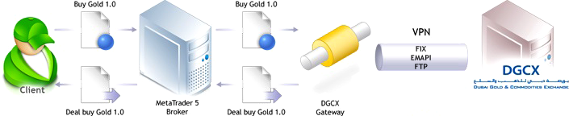
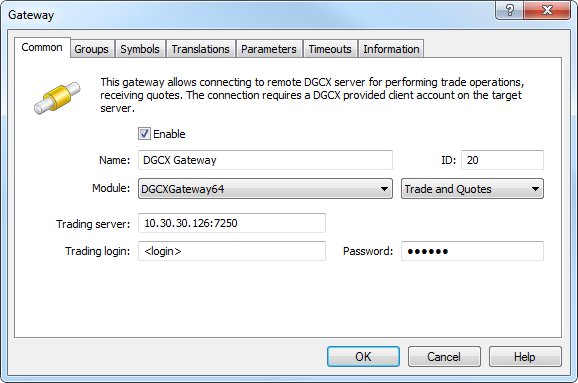
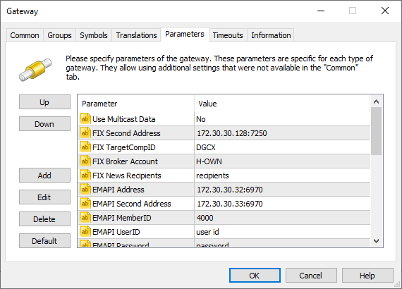
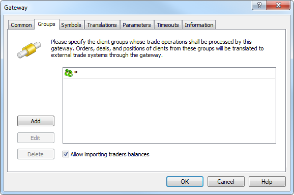
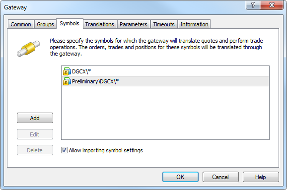
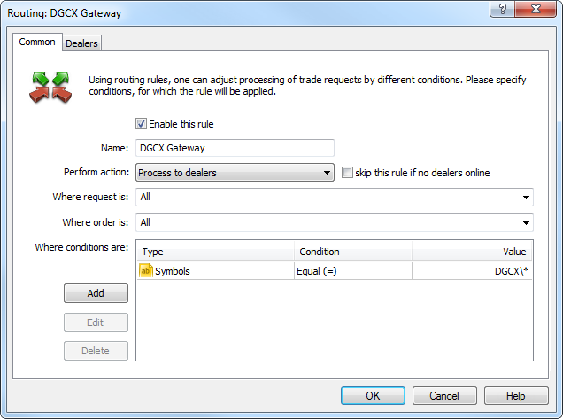
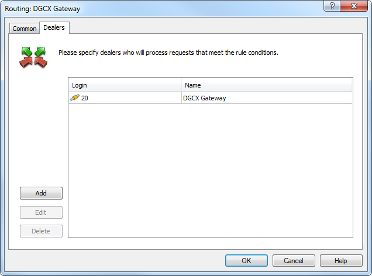
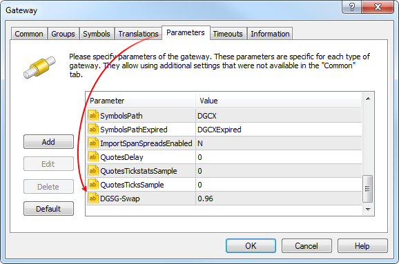

[🏠 Document Start](../../../README.md) / [MetaTrader 5 Trading Platform](../../../MetaTrader-5-Trading-Platform.md) / [Platform Components](../../Platform-Components.md) / [Gateways](../Gateways.md) / DGCX

[Previous](MOEX-Derivatives.md) | [Next](MetaTrader-5.md)

# MetaTrader 5 Gateway to DGCX (#metatrader-5-gateway-to-dgcx)

MetaTrader 5 Gateway to DGCX allows trading on [the Dubai Gold and Commodities Exchange](https://www.dgcx.ae/).

## About Dubai Gold and Commodities Exchange (#about-dubai-gold-and-commodities-exchange)

Dubai has historically been an international hub for the physical trade of not only gold, but also many other commodities. So the establishment of the [Dubai Gold & Commodities Exchange (DGCX)](https://www.dgcx.ae/dgcx/about-dgcx) was the next logical step for the region and the local economy. DGCX commenced trading in November 2005 as the region's first commodity derivatives exchange. Today it is the leading derivatives exchange in the Middle East.

## Benefits of Trading on DGCX (#benefits-of-trading-on-dgcx)

DGCX range of futures contracts offers participants of the physical commodities markets, such as producers, manufacturers and end users, a sophisticated means of hedging their price risk exposure. Such price risk management has previously been unavailable to producers in the Middle East. In addition, DGCX offers trading opportunities to financial communities and investment houses in both the Middle East and around the globe that wish to access the growing asset class of commodity and currency derivatives.

  * Guaranteed settlement and reduced counterparty risk provided by Dubai Commodities Clearing Corporation (DCCC), a subsidiary 100% owned by DGCX
  * The advantage of transacting and clearing business within the UAE and thus the local taxation and regulatory regimes
  * A simple fee structure - one fee for all participants. All participants also pay the same margin, whether commercial or non-commercial entities
  * Access to both regional and international liquidity pools
  * Robust risk management and surveillance systems
  * Uninterrupted trading hours from 7:00 to 23:30 (GMT +04:00)
  * Regulated by the Emirates Securities & Commodities Authority (ESCA)

## Product Portfolio (#product-portfolio)

The UAE enjoys an ideal location between the time zones of Europe and the Far East and DGCX offers a range of products from the precious metal, base metal, energy and currency sectors.

Futures | Options  
---|---  
Precious metals | Currencies | Energy resources | Base metals |   
Gold Silver | Australian Dollar/US Dollar British Sterling/US Dollar Canadian Dollar/US Dollar Euro/US Dollar Indian Rupee/US Dollar Japanese Yen/US Dollar Swiss Franc/US Dollar | WTI Light Sweet Crude Oil Brent Crude Oil Fuajairah 380 CSR Fuel Oil | Steel Rebar | Options on Gold Futures Options on INR Futures  
  

## How to become a broker at DGCX (#how-to-become-a-broker-at-dgcx)

All rules of the Dubai exchange can be found in [Regulatory section of the official web site](https://www.dgcx.ae/regulatory/overview). The information on how to become a member and start providing brokerage services on the exchange can also be found at [Membership](https://www.dgcx.ae/membership/overview) section of the official web site. Additionally, you can contact DGCX via e-mail [support@dgcx.ae](mailto:support@dgcx.ae). After obtaining the necessary information and registering as a market member, it is time to configure the gateway.

> [Order MetaTrader 5 DGCX Gateway](https://support.metaquotes.net/en/market/product/276)

## Preparing for the Gateway Launch, Configuring VPN (#preparing-for-the-gateway-launch-configuring-vpn)

Before setting a brokerage company gateway, configure the virtual network channel to be able to connect to DGCX servers.

Configuration of a virtual network channel is performed together with DGCX technical specialists. To create a virtual channel to DGCX, a broker must request technical requirements and recommendations for connection to the DGCX virtual private network (VPN) from the exchange technical support team. After obtaining the necessary information a brokerage company should purchase a recommended router.

At the next stage the mercantile exchange technical support team will submit to the brokerage company description of the equipment settings on DGCX side: tunnel type, data encryption method, data encryption keys etc. The router must be configured according to the obtained data.

In addition, the brokerage company must specify its own equipment parameters and send this information to the mercantile exchange technical support team in the form received from DGCX. When all agreed equipment settings are configured at both a brokerage company and the exchange sides, the virtual channel for connection to DGCX will be ready for operation.

You can skip procedures related to establishing connection and to setting up secure access channels, by safely locating the gateway on a ready-made server provided by the exchange (collocation). It can be used in [remote mode](../../Platform-Setup/Gateways/Setup-as-Service.md) through a regular connection. For further collocation details please [contact Service Desk](https://support.metaquotes.net/en/support).

## How the Gateway Works (#how-the-gateway-works)

Gateway operates mainly as a mediator between two systems connecting DGCX and MetaTrader 5 platform. The gateway establishes several connections to DGCX server for the data exchange via the created virtual channel:

  * The first connection is used for performing trading operations and working according to FIX (Financial Information eXchange) protocol.
  * The second one is used to obtain quotation data and utilizes a broadcast data transfer binary protocol (EMAPI). Data can be transferred both via TCP and UDP multicast protocol.
  * In addition, the gateway can establish the third connection to DGCX FTP server to get special risk parameters files used for calculating margin requirements and files containing data on opened client positions.

The broker's servers are configured in such a way that the clients' trade requests are sent to MetaTrader 5 DGCX Gateway. The gateway checks correctness of the client requests. In case validation is successful, the relevant trade request is directed to DGCX server via a standard protocol for exchanging financial information - FIX. After receiving a response from the DGCX server, the gateway saves the trade request processing result in the platform, which in its turn reports this result to the trader.

Orders are sent to MetaTrader 5 DGCX Gateway for processing in accordance with the set routing rules. Depending on the order type, each request is handled differently:

  * Market orders are transferred to DGCX system directly. In case there is no liquidity for a requested financial instrument, the market order is rejected.
  * Limit orders are processed at DGCX. Once a limit order has been placed, it is sent to DGCX server. There it is placed to the general requests queue awaiting for an opposite request with the same price to appear. Thus, clients can see their requests in the Depth of Market in the client terminal in real time.
  * Stop orders are sent to DGCX immediately after being placed. When the specified stop price is reached, stop order is activated on a stock exchange and an appropriate market order is sent to MetaTrader 5 platform.
  * Stop-limit orders are handled and stored on DGCX server until their stop price is reached. Once a stop-limit order has been triggered, the corresponding limit order with a specified price will be sent to MetaTrader 5 platform.
  * Take Profit and Stop Loss levels for the current open positions are controlled by MetaTrader 5 platform. In case of Stop Loss activation, a market order to close a client's position is sent to the exchange. In case of Take Profit activation, a limit order at the Take Profit price is sent to the exchange.
  * Stop out of positions and orders is controlled by the trading platform. In case a limit order must be removed after a Stop out level has been reached, an appropriate request for its removal is sent to DGCX server. In case a position must be closed because of Stop out, a market request to close a client's position is sent to the exchange.

## MetaTrader 5 DGCX Gateway Setup (#metatrader-5-dgcx-gateway-setup)

MetaTrader 5 DGCX Gateway is a separate "DGCXGateway64.exe" file that uses Gateway API for its operation. The gateway module is included in the platform delivery set and available for use in test mode. In this mode the number of trade operations is limited - after the limit is reached they will not be processed. To switch to the full version, [order the MetaTrader 5 Gateway to DGCX Gateway](https://support.metaquotes.net/en/market).

To start working, add [the new gateway configuration](../../Platform-Setup/Gateways.md):

The following parameters on the "Common" tab must be set:

  * Module — DGCXGateway64. After that the gateway default parameters installation must be allowed in the dialog request.
  * ID — unique dealer identifier, on whose behalf the trade requests will be processed. Requests are routed to the gateway according to this identifier.
  * Trading server — DGCX FIX server address must be entered in this field in the "address:port" format. The demo server address "10.30.30.126:7250" is shown in the provided example.
  * Trading login — user ID for FIX connection to DGCX (User id). The value 20041 is shown in the provided example.
  * Trading password — user password for FIX connection to DGCX.

  * ID value must be unique in the field of manager logins and gateway identifiers.
  * The data for connection to the DGCX server, where trade requests are processed, is submitted during the agreement conclusion.

  
---  
  
Additional configuration parameters should be set on the Parameters tab:

Additional options should be provided by DGCX in the brokerage company connection specification. 

  * Use Multicast Data — parameter defining the necessity of receiving quotes via UDP multicast connection. To do this, the value of the parameter should be set to "Yes" or "Y". Otherwise, TCP connection will be used to receive the quotes.
  * Bind Address — address of the network interface the gateway will interact with. The address is used in case there are several network interfaces on the computer, at which the gateway is operating.
  * FIX Second Address — address of the backup DGCX FIX server in "address:port" format. This server is automatically used in case it has been impossible to connect to the main FIX server after several attempts. The demo server address "10.30.30.127:7250" is shown in the provided example.
  * FIX TargetCompID — FIX messages heading standard parameter. This parameter is used to identify a recipient of trading messages. The parameter value is provided by DGCX.
  * FIX Broker Account — broker's trading account ID. It is used when all clients trade using a single general account.
  * FIX News Recipients — list of logins of MetaTrader clients separated by ";". These clients will receive e-mails containing news sent by DGCX.
  * EMAPI Address — main address for connecting to the DGCX "prelogon" channel in the "address:port" format. In the provided example, this is the address of the demo server "10.30.30.126:6970". The "prelogon" channel is used for a preliminary connection to the exchange. The gateway receives the exchange main working address from it (the "logon" channel). After that, the gateway connects to it for further operation.
  * EMAPI Second Address — backup address for connecting to the DGCX "prelogon" channel in the "address:port" format. The system automatically switches to the server in case the main EMAPI server remains unavailable after several connection attempts. In the provided example, this is the address of the demo server "10.30.30.128:6970".
  * EMAPI Logon Address — "logon" address of the DGCX channel in the "address:port" format. This parameter allows redefining the address of the exchange main working server. If the parameter is set, connection is performed to the specified address rather than to the address obtained via the "prelogon" channel.
  * EMAPI MemberID — EMAPI member ID. The parameter value is provided by DGCX.
  * EMAPI UserID — EMAPI user ID. The parameter value is provided by DGCX.
  * EMAPI Password — EMAPI user password. The parameter value is provided by DGCX.
  * FTP Span Url — full path to the folder on the exchange's FTP server where the risk parameters files (SPAN risk parameter file) are stored. These files are used to calculate margin requirements. This connection is also used for receiving files containing data on opened client positions. The ftp or sftp protocols are supported. If the protocol is not specified explicitly in the address, ftp is used. The default value is sftp://eosftp.dgcx.ae:6022/Common/Parameter.
  * FTP Login — login for connection to the FTP server. The parameter is provided by DGCX.
  * FTP Password — password for connection to the FTP server. The parameter is provided by DGCX.
  * Import Span Spreads — if you set this parameter to "Yes", the gateway will import [spreads](../../Platform-Setup/Spreads.md). The default value is "No".
  * FTP Market Stats Url — an address of the folder on an FTP server, from which the gateway takes the market statistics files. The login and password used to receive span files are used for connection (the FTP Login and FTP Password parameters). The ftp or sftp protocols are supported. If the protocol is not specified explicitly in the address, ftp is used. The default value is sftp://eosftp.dgcx.ae:6022/Common/MarketStatistics.
  * TP Orders Coverage Timeout — Take Profit order expiration time in seconds. Take Profit orders execution is tracked on the MetaTrader 5 platform side. When triggered, an appropriate limit order for closing a position at the price of an activated Take Profit is sent to the market. The order lifetime is 20 seconds by default. If the exchange does not execute the order within this time, the order will be canceled. In this case, the Take Profit activation attribute is removed on the platform side. If the Take Profit is activated again on the next tick, another limit order is sent to the exchange.  
This behavior is implemented so that an order does not wait for its execution at an exchange for an indefinite period of time.   
The TP Orders Coverage Timeout parameter allows re-defining the lifetime of limit orders sent to an exchange when Take Profit is triggered. Set the necessary value in seconds. If there is no parameter, the value of 20 seconds is used.
  * Symbols Path — path to which trading symbols from the exchange will be imported. The parameter is absent by default and the gateway imports trading instruments to the \Preliminary\DGCX subgroup, with the disabled trading option. The system administrator should manually move the symbols to the proper group and enable trading for them. If the parameter is present, the gateway will import trading instruments to the specified path. In this case, the trading option will be immediately enabled. Thus, there is no need for the administrator need to configure the symbols. For example, if "DGCX-Real" is specified in the parameter, the symbols will be automatically added to the DGCX-Real\* group, while expired contracts will be moved to DGCX-Real\Expired\*.
  * Symbols Path Expired — path to move expired symbols. The parameter is not specified by default, and the gateway moves all expired contracts to the \Expired subdirectory of the directory specified in "Symbols Path". In the above example, it is DGCX-Real\Expired\*. By creating this parameter, you can override the path.
  * Quotes Delay — delay of transmitted quotes in seconds. The maximum duration of quotes delay is 20 minutes (1200 seconds). The flow of delayed quotes is neither thinned out, nor changed. A quote is passed to MetaTrader 5 History Server only after the expiration of delay period since the quote has arrived to Gateway API. If the temporary delay parameter is not defined, the quote delay is not used. Changes in depth of market and price statistics are delayed together with the quotes flow.
  * Quotes Tickstats Sample — the minimum frequency of sending price statistics in milliseconds. This parameter allows thinning out updates of price statistics reducing the traffic.
  * Quotes Ticks Sample — the minimum frequency of sending quotes in milliseconds. This parameter allows thinning out updates of quotes reducing the traffic. It is recommended for use on demo servers only.
  * Quotes Books Sample — the minimum frequency of depth of market updates in milliseconds. This parameter allows thinning out updates of the depth of market reducing the traffic. It is recommended for use on demo servers only.

The groups of the clients, whose requests will be processed via MetaTrader 5 DGCX Gateway, should be specified at the "Groups" tab.

The "Symbols" tab allows configuring the list of symbols, according to which the gateway will process trade operations and transmit the quotes.

Make sure to enable "Allow importing symbol settings" option. The gateway imports symbols from the DGCX to the MetaTrader 5 platform in accordance with the Symbols Path parameter. Then, in the future, the gateway will control the parameters of these symbols. In addition to various trading settings, trading and quotation sessions are also imported by symbols considering the time zones MetaTrader 5 platform and DGCX work in (GMT +04:00).

> The gateway supports conversion of symbols and quotes. For details, please view the [Symbol and Price Translation](../../Platform-Setup/Gateways/Symbol-and-Price-Translation.md) section.

## Configuring Trade Requests Routing (#routing)

The next step is configuring the routing to let the clients requests to be transmitted to the DGCX gateway. To do this, add a [routing rule](../../Platform-Setup/Routing.md).

Select "Process to dealers" as an action in common settings. Assign this routing rule for all requests and orders. In additional conditions you may indicate the groups of clients, whose requests will be passed to the gateway, and the symbols, trading operations with which will be also passed to the gateway.

In the figure below all client orders by symbols from the DGCX\* group will be sent to the gateway for processing.

Only DGCX gateway should be added at the "Dealers" tab:

## Swap Setup (#swap-setup)

Swap size can be adjusted for specific symbols via the gateway parameters in the format <Symbol_name>-Swap = <Swap value>. The screenshot shows configuration of the DGSG symbol as an example:

## Gateway Launch (#passwords)

After the application of all settings described above, your gateway is almost ready to go. It will connect to DGCX server.

2013.04.01 11:06:22 Gateway 'DGCX Gateway' starting  
2013.04.01 11:06:23 Gateway license check succeeded  
2013.04.01 11:06:23 Gateway emapi: establishing prelogon connection to DGCX EMAPI server (10.30.30.126:6970)  
2013.04.01 11:06:24 Gateway emapi: prelogon completed  
2013.04.01 11:06:24 Gateway emapi: establishing logon connection to DGCX EMAPI server (10.30.30.128:6970)  
2013.04.01 11:06:24 Gateway emapi: logon completed  
2013.04.01 11:06:26 Gateway emapi: reference data synchronized  
2013.04.01 11:06:28 Gateway emapi: subscription groups data synchronized  
2013.04.01 11:06:28 Gateway connecting to DGCX FIX server (10.30.30.126:7250)  
2013.04.01 11:06:29 Gateway fix: logged on  
2013.04.01 11:06:29 Gateway synchronized with DGCX exchange  
---  
  
The last entry means that the gateway has successfully connected to DGCX and is now ready for operation. In case of connection failure, the entries concerning the failure reasons appear in the gateway journal.

New symbols are imported after the first connection. As noted above, the newly added symbols must be relocated from "Preliminary" group and trading for them must be allowed. After that the MetaTrader 5 platform main trade server must be restarted. These actions should be performed only during the gateway first launch.

After the main trading server is restarted, the gateway installation and configuration is complete. Traders can perform transactions on DGCX using their MetaTrader 5 client terminal.

## Gateway Operation (#gateway-operation)

This section describes the standard procedures performed by the gateway during its operation.

### Updating the Symbols Settings (#updating-the-symbols-settings)

The gateway automatically updates the symbols settings during its operation, if necessary. Appropriate entries appear in the journal in that case:

2013.04.01 11:06:30 SymbolsBase symbol 'DS-20130906' config updated  
---  
  

### Multi-leg Instruments (#multi-leg-instruments)

DGCX provides possibility to trade multi-leg instruments. These are the instruments consisting of several subinstruments allowing to implement definite hedging strategies in trading. Such symbols are not supported by MetaTrader 5 platform and it is impossible to import them.

### Risk Parameters (#risk)

During a trading day and at the end of it DGCX publishes special span files on its FTP servers. These span files contain risk management parameters. The gateway downloads the files to \Gateway\DGCXGateway\DGCX Gateway\ftp\ directory on the history server and uses the obtained data for recalculation of margin requirements and accrual of the variation margin at the end of the trading session.

  * The files having dgcxrpf-20130320-0600-01-i.spn format contain intraday risk management parameters.
  * The files having dgcxrpf-20130321-2345-01-e.spn contain risk management parameters for the end of a trading session.

The following entries are shown in the gateway journal when downloading and processing risk parameters files:

10:51:22 Gateway span: downloaded file dgcxrpf-20130326-1500-02-i.spn (267 Kb)  
10:51:22 Gateway span: data processing completed, 95 span data records found  
---
