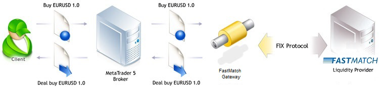
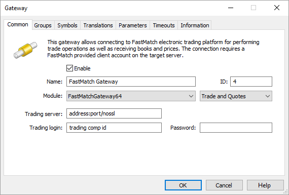
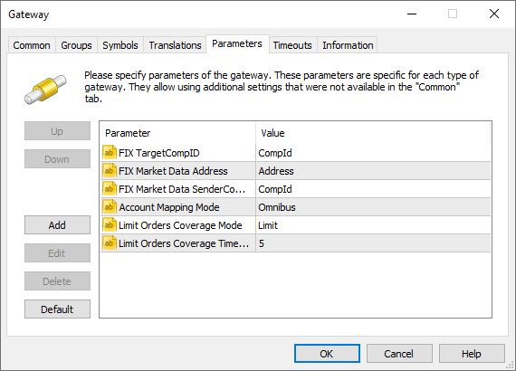
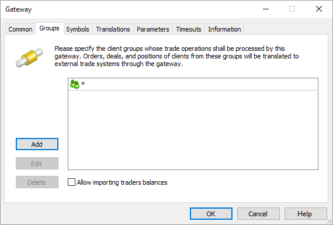
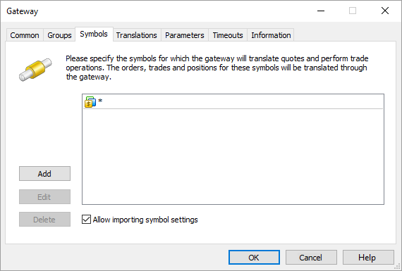
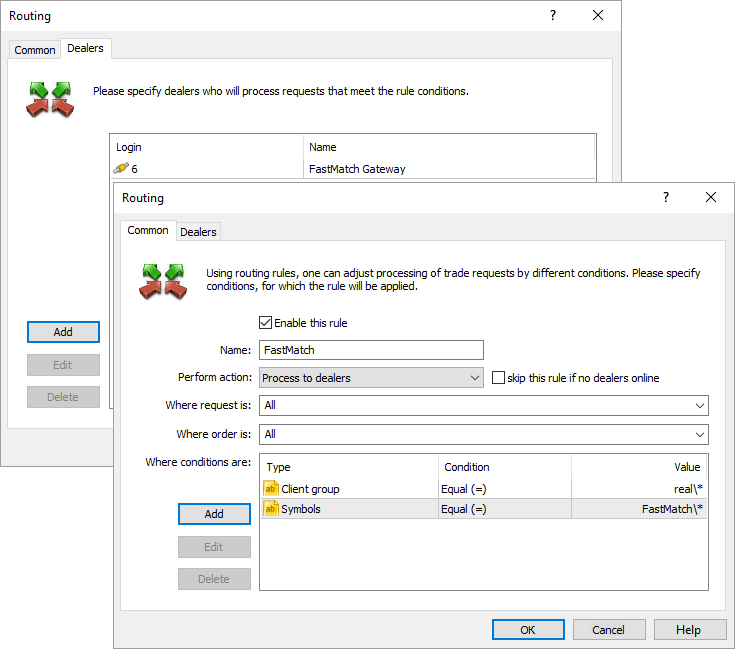
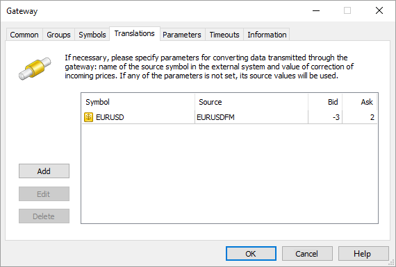
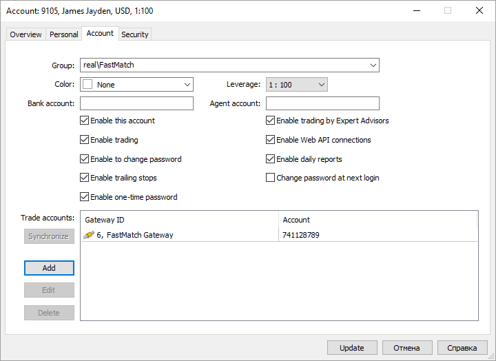

[🏠 Document Start](../../../README.md) / [MetaTrader 5 Trading Platform](../../../MetaTrader-5-Trading-Platform.md) / [Platform Components](../../Platform-Components.md) / [Gateways](../Gateways.md) / Euronext FX

[Previous](Currenex.md) | [Next](Cboe-FX.md)

# MetaTrader 5 Euronext FX Gateway (#metatrader-5-euronext-fx-gateway)

Euronext FX is a heavy-duty matching system of foreign exchange, Euronext FX offers its customers access to a large pool of diversified liquidity at unparalleled speed, complete transparency, and excellent customer service. MetaTrader 5 Euronext FX Gateway is a simple, fast and secure integration solution for brokers.

Integration provides:

  * Liquidity. Euronext FX provides services to various clients including brokerage companies, banks, hedge funds and other organizations. Together they form a unique pool of liquidity.
  * Speed. Euronext FX offers a trading environment with ultra-low latency. The Euronext FX system's average delay of the full data sending and receiving cycle equals to 200 microseconds with a standard deviation of 50 microseconds. The delay in the full cycle is measured as the time required to deliver a client's message to Euronext FX, to process it and to send it back to the client.
  * Transparency. Customers can see quotes and trades with corresponding prices and volumes without delays in real time. The execution price is selected in accordance with a strict priority order: Price/Volume/Placing time. As soon as a better price appears, it is immediately sent to the liquidity recipient.

## Getting started with Euronext FX (#actions)

In order to be able to provide trading services using Euronext FX, you should first contact the sales department for concluding the agreement:

Sales department | Friendly support  
---|---  
+442079033826 | +16464322940  
[sales@fastmatchfx.com](mailto:sales@fastmatchfx.com) | [support@fastmatchfx.com](mailto:support@fastmatchfx.com)  
[www.euronextfx.com](https://www.euronextfx.com/) |   
  
Once you have an agreement with Euronext FX, you will be provided with further instructions on how to connect to the Euronext FX server. For more details please visit the official Euronext FX site at [www.euronextfx.com](https://www.euronextfx.com/).

> [Order the MetaTrader 5 Euronext FX Gateway](https://support.metaquotes.net/en/market/product/265)

## How the Gateway Works (#how-the-gateway-works)

MetaTrader 5 Euronext FX Gateway is a separate module that uses the MetaTrader 5 Gateway API for operation. The gateway operates as a mediator between two systems: Euronext FX and MetaTrader 5 platform. Data is transmitted using FIX protocol over the encrypted connection. The gateway translates FIX messages and communicates them back to MetaTrader 5 platform using MetaTrader 5 Gateway API.

There are two main types of data that flow through the gateway:

  * market data (quotes, reports);
  * trading messages.

### Market Data (#market-data)

MetaTrader 5 Euronext FX Gateway automatically imports all the necessary symbols and processes their properties. An administrator only needs to perform primary [setup (#symbols)](Euronext-FX.md#symbols) described below. Price data is transmitted in real time. The gateway allows to transmit original price data provided by Euronext FX, as well as to convert them. In the latter case quotes, reports and orders prices, that are directed to the client terminals, will be transformed according to the applied settings. Detailed information on [prices conversion (#markup)](Euronext-FX.md#markup) is available below.

### Trading Operations (#trading-operations)

Orders will be sent to MetaTrader 5 Euronext FX Gateway for processing in accordance with the configured [routing rules (#routing)](Euronext-FX.md#routing). Processing of requests depends on the type of the order, as well as in the gateway configuration.

Order type | Execution  
---|---  
Market Order | Delivered directly to Currenex as a market order.  
Take Profit Buy Limit Sell Limit | Depends on [Limit Orders Coverage Mode (#parameters)](Euronext-FX.md#parameters): Limit Orders Coverage Mode=Gateway (default) Limit orders are processed on the side of Euronext FX. Once a limit order has been placed by a client, an appropriate order is sent to Euronext FX. There it is placed in the aggregate Depth of Market awaiting for an opposite request with the same price to appear. Thus, clients can see their requests in the Depth of Market in the client terminal in real time. Take Profit orders are processed the same way as in the Limit mode. The Euronext FX system checks the availability of the required amount of funds to cover any type of order placed via the gateway. However, the check is performed on the broker's general account, on behalf of which the operation is carried out. [Margin reservation (#margin)](Euronext-FX.md#margin) of the clients should be configured for the appropriate order types in case Limit orders are directly delivered to an external system. By default, the margin is charged on the side of MetaTrader 5 only when market orders are placed. When placing pending orders in an external system, the client's available funds should be controlled on the side of MetaTrader 5 before the orders are transferred to avoid using all broker's funds by the client. Limit Orders Coverage Mode=Limit Limit Orders and Take Profit orders are processed on the side of the MetaTrader 5. Once a limit order is triggered, an equivalent limit order is sent to Euronext FX. That order has a short validity time specified in Limit Orders Coverage Timeout parameter. Since the price specified in the order is already present in the market, the order will be executed with that price — a market deal will be performed. If the necessary volume of the financial instrument is not available in the market at the specified price, the order will be executed partially. Thanks to a short expiration time, a limit order with a residual volume will be removed from Euronext FX. Thus, a client will have a market position as well as a limit order with a residual volume, which will be further processed in a similar way on the side of MetaTrader 5. A limit order with the price equal to a Take Profit level is sent to Integral at the moment a Take Profit order has been activated. Since the price specified in the order is already present in the market, the order will be executed with that price — a market deal will be performed. If the necessary volume of the financial instrument is not available in the market at the specified price, the order will be executed partially. Thanks to a short expiration time, a limit order with a residual volume will be removed from Euronext FX. Therefore, a client's position will be closed partially. Control over the Take Profit position level with the remaining volume will then be carried out on MetaTrader 5 side.   
The Limit mode allows to protect against slippage, as a limit order is sent to the Euronext FX system with a specified price rather than a market order for execution by the current price. Limit Orders Coverage Mode=Market Limit orders and Take Profit orders are processed on the MetaTrader 5 platform side. Once they trigger, an appropriate market order us sent to Euronext FX.  
Buy Stop Sell Stop Stop Loss Stop Out | Processed on the MetaTrader 5 platform side until their stop price is reached. After a stop order is activated, an appropriate market order will be sent to the Euronext FX system.  
Buy Stop Limit Sell Stop Limit | Processed on the MetaTrader 5 side. Upon order order activation, an appropriate limit order is created in MetaTrader 5, and this order is then processed in accordance with the value of the Limit Orders Coverage Mode parameter.  
  

## Gateway Setup (#setup)

To start working, add [the new gateway configuration](../../Platform-Setup/Gateways.md):

Set the following parameters on the "Common" tab:

  * ID — unique dealer identifier, on whose behalf the trade requests will be processed. Requests are routed to the gateway according to this identifier.
  * Module — specify EuronextFXGateway64 and accept the default settings after the module selection.
  * Trading server — Euronext FX server IP-address and the port, where trade requests are processed. This information is provided by Euronext FX. An encrypted SSL connection to a server is established by default. If you need to establish an unencryprted connection, additionally specify the /nossl key in the address bar. For example: 10.123.100.17:10219/nossl.
  * Trading login — a login for connection to the Euronext FX server. It is provided by Euronext FX as the "trading comp id" parameter.
  * Password — password for connection to the Euronext FX server. It is also provided by Euronext FX.

  * ID value must be unique in the field of manager logins and gateway identifiers.
  * The details for connection to the Euronext FX server, where trade requests are processed, will be provided with the agreement.

  
---  
  
Other parameters are set similarly to other gateways. Default values are used in most cases.

Now, go to the "Parameters" tab.

Specify the following parameters values here:

  * FIX TargetCompID — a standard parameter of the FIX messages heading used for trading messages recipient identification. Provided by Euronext FX.
  * FIX Market Data SenderCompID — a standard parameter of the FIX messages heading used for a data sender identification. Provided by Euronext FX.
  * Account Mapping Mode — the gateway supports multiple [modes of trade operation delivery (#multiaccount)](Euronext-FX.md#multiaccount) to Euronext FX: on behalf of the broker's general account and on behalf of the individual accounts used for trading in MetaTrader 5 platform. Three modes of trades operations transfer are available:
    * omnibus — all orders will be transferred to Euronext FX on behalf of the broker's main account, specified in the "Trading login" parameter.
    * one-to-one — all orders will be transferred to Euronext FX on behalf of the individual accounts, at which they are set in MetaTrader 5 (account in the external system is displayed in each account's settings).
    * conversion — combination of the previous two modes: orders of the accounts that have specified external system account will be transferred on their own behalf, while all other orders will be transferred on behalf of the broker's general account.
  * Limit Orders Coverage Mode — the mode of processing of Limit and Take Profit orders by the gateway. This parameter simplifies configuration of trade requests routing to the gateway, since there is no need to create a separate rule for routing the appropriate order types. Three processing modes are available:
    * Market — limit and Take Profit orders are processed on the MetaTrader 5 platform side. Once a limit order triggers, an appropriate market order is sent to Euronext FX.
    * Limit — limit and Take Profit orders are processed on the MetaTrader 5 side.  
  
Once a limit order is activated, an appropriate limit order is sent to Euronext FX. The order has a short lifetime specified in the Limit Orders Coverage Timeout parameter. Since the price specified in the order is already present in the market, the order will be executed with that price — a market deal will be performed.  
  
If the necessary volume of the financial instrument is not available in the market at the specified price, the order will be executed partially. Thanks to a short expiration time, a limit order with a residual volume will be removed from Euronext FX. Thus, a client will have a market position as well as a limit order with a residual volume, which will be further processed in a similar way on the side of MetaTrader 5.  
  
A limit order with the price equal to a Take Profit level is sent to Euronext FX at the moment a Take Profit order has been activated. Since the price specified in the order is already present in the market, the order will be executed with that price — a market deal will be performed. If the necessary volume of the financial instrument is not available in the market at the specified price, the order will be executed partially. Thanks to a short expiration time, a limit order with a residual volume will be removed from Euronext FX. Therefore, a client's position will be closed partially. Control over the Take Profit position level with the remaining volume will then be carried out on the MetaTrader 5 side.  
  
Limit mode allows to protect against slippage, as a limit order is sent to the Euronext FX system with a specified price rather than a market order for execution by the current price. In addition, this mode allows you not to reserve margin on a client's account before sending an order to Euronext FX.
    * Gateway — limit orders are processed on the Euronext FX side. Once a limit order has been placed by a client, an appropriate order is sent to Euronext FX. Take Profit orders are processed the same way as in the Limit mode.
  * Limit Orders Coverage Timeout — expiry of Limit Orders that are sent to Euronext FX in the Limit mode. Specified in seconds. The default value is 5.
  * FIX Market Data Address — the address of the server with market data in the format of ip:port. Provided by Euronext FX. An encrypted SSL connection to a server is established by default. If you need to establish an unencryprted connection, additionally specify the /nossl key in the address bar. For example, 10.123.100.18:10219/nossl.
  * FIX Market Data Log Enabled — if "YES" is set, the gateway will save to disk the full quoting connection log. This can be useful in operation debugging. The log is not saved by default (value "No").
  * Quotes Delay — delay of transmitted quotes in seconds. The maximum duration of quotes delay is 20 minutes (1200 seconds). The flow of delayed quotes is neither thinned out, nor changed. A quote is passed to MetaTrader 5 History Server only after the expiration of delay period since the quote has arrived to Gateway API. If the temporary delay parameter is not defined, the quote delay is not used. Changes in depth of market and price statistics are delayed together with the quotes flow.
  * Quotes Tickstats Sample — the minimum frequency of sending price statistics in milliseconds. This parameter allows thinning out updates of price statistics reducing the traffic.
  * Quotes Ticks Sample — the minimum frequency of sending quotes in milliseconds. This parameter allows thinning out updates of quotes reducing the traffic. It is recommended for use on demo servers only.
  * Quotes Books Sample — the minimum frequency of depth of market updates in milliseconds. This parameter allows thinning out updates of the depth of market reducing the traffic. It is recommended for use on demo servers only.

  * It is not allowed to change operations transfer mode while in operation. Changing the mode is allowed only after all client positions are closed.
  * When Limit orders are directly delivered to an external system, [margin reservation (#margin)](Euronext-FX.md#margin) of the clients should be configured for the appropriate order type.

  * For correct operation, the gateway needs to receive messages regarding the trading session states. Request from the data provider 'Trading Session Status (35=h)' events which should be sent in your quoting connection.

  
---  
  
The next stage is to specify the groups of the clients, whose requests will be processed via the MetaTrader 5 Euronext FX Gateway. All groups are configured on the screenshot below, but you can configure groups according to your business logic.

Then configure the list of symbols, according to which the gateway will process trade operations and feed quotes.

Make sure to enable "Allow importing symbol settings" option. Symbols available to Euronext FX will be imported to the folder 'Symbols\Preliminary\EuronextFX' of the MetaTrader 5 platform. Besides, that will allow the gateway to manage the settings of the symbols used in trading via Euronext FXl.

  * The symbols imported by the gateway are put to the "\Preliminary" symbols subgroup. All symbols have trading ability disabled. System administrator must relocate imported symbols to the proper subgroup and allow trading for them.
  * After symbols are relocated and trading abilities are enabled, the main trading server must be restarted.
  * In case the gateway transmits configuration for the symbol that is already present in the platform, the configuration is updated. In this case the symbol is not transferred and its trading ability is not turned off.
  * In case some changes are implemented to the Depth of Market parameter of the symbol settings, the Euronext FX gateway and a history server must be restarted to let the changes take effect. Restart is required after any change in symbol settings.
  * The gateway supports conversion of symbols and quotes. For details, please view the [Symbol and Price Translation](../../Platform-Setup/Gateways/Symbol-and-Price-Translation.md) section.

  
---  
  

## Margin Setup (#margin)

When Limit orders are directly delivered to an external system, margin reservation of the clients should be configured for the appropriate order type. The external system checks sufficiency of the funds that are necessary to provide any type of order placed via the gateway. However, the check is performed on the broker's general account, on behalf of which the operation is carried out.

By default, the margin is charged on the side of MetaTrader 5 only when market orders are placed. When placing pending orders in an external system, the client's available funds should be controlled on the side of MetaTrader 5 before the orders are transferred to avoid using all broker's funds by the client.

After an order has been transferred to the external system, MetaTrader 5 platform is not able to check the client's margin sufficiency any more. After the order has been executed in the external system, the gateway cannot ignore that fact. Therefore, the appropriate trading operation is performed in the platform.

Set non-zero coefficients for the orders directly transferred to the external trading system in order to configure margin collection:

## Configuring trade requests routing (#routing)

Configure the routing to let the clients requests to be transmitted to the Euronext FX gateway. To do this, add a routing rule to the relevant [MetaTrader 5 Administrator](../../Platform-Setup/Routing.md) section.

Select "Process to dealers" as an action in common settings. Assign this routing rule for all requests and orders. In additional conditions, indicate groups of clients, whose requests will be passed to the gateway. In the picture below all orders for symbols from the "Euronext FX" group will be routed to the gateway for processing.

asd

After the correct execution of the steps described above, Euronext FX Gateway will be ready for use.

## Changing symbols names and prices correction (#markup)

The gateway the price flow from the Euronext FX system to the MetaTrader 5 platform and [controls settings of appropriate symbols (#symbols)](Currenex.md#symbols). The standard feature of gateways is the ability to change the quotes and market depth transmitted to the clients from an external system.

The gateway receives prices from Euronext FX and delivers them to clients taking into account conversion settings. Clients perform trading operations using converted prices. However, while processing trading operations on the gateway and their transmission to Euronext FX, initial, not converted prices are automatically used.

Thus, by increasing the selling price and reducing the purchase price ("price spreading") a brokerage company receives its profit share from each deal performed at Euronext FX. The correction value is set separately for each symbol on the "Translations" tab:

Here you can configure matching of symbol names used in Euronext FX with the names used in your MetaTrader 5 platform. For example, if the symbol name in Euronext FX is EURUSDFM, and it is called EURUSD in the MetaTrader 5, enter EURUSD in the "Symbol" field and EURUSDFM in the "Source" field.

The above screenshot shows price conversion: at every tick, the Bid price will be reduced by 3 points, and the Ask price will be increased by 2 points. Below is a schematic example of the conversion:

Euronext FX | >>> | ask price | EURUSD 0.83004 | >>> | MetaTrader 5 server  
---|---|---|---|---|---  
MetaTrader 5 server | >>> | ask price | EURUSD 0.83006 | >>> | Client terminal  
Client terminal | >>> | buy limit | EURUSD 0.83006 | >>> | MetaTrader 5 server  
MetaTrader 5 server | >>> | buy limit | EURUSD 0.83004 | >>> | Euronext FX  
Euronext FX | >>> | buy limit execution | EURUSD 0.83004 | >>> | MetaTrader 5 server  
MetaTrader 5 server | >>> | buy limit execution | EURUSD 0.83006 | >>> | Client terminal  
  
A broker gains 2 pips of profit in the provided example. The price is sent to the client terminal only after the correction, so the clients work only with the corrected prices. If no correction is set for a symbol, the client will work with the original prices submitted by Euronext FX.

## Prices Round Off (#prices-round-off)

During the gateway's operation, accuracy of quotes (decimal places) passed for some symbol may change in the external trading system. Decrease in price accuracy at the external trading system's side does not affect the gateway's operation. It still transmits prices with less accuracy. However, if the number of decimal places at the external system's side increases, the gateway starts rounding off the passed prices.

Suppose that the accuracy of quotes has changed from 4 to 5 digits. Obtained five-digit quotes are rounded up by the gateway and used for creating the Market Depth. The round off is always performed in broker's favor. Thus, buy requests of 1.23447, 1.23441 are rounded up to 1.2345, while sell ones of 1.23447, 1.23441 are rounded down to 1.23440.

Changes in symbol price accuracy are recorded in the gateway journal.

## Trade Operations Transfer Modes (#multiaccount)

The MetaTrader 5 Euronext FX Gateway allows to send trade operations to Euronext FX using different modes. Client trading orders that are set in MetaTrader 5 platform can be sent to Euronext FX on behalf of the broker's general account (specified in the "Trading login" parameter of the gateway settings) or on behalf of the clients' individual accounts. In the latter case gateway connection to Euronext FX is performed via broker's general account. However, clients' trade operations are transferred to Euronext FX using individual accounts.

  * Order sending mode is controlled by the [Account Mapping Mode (#common)](Euronext-FX.md#common) parameter in the gateway configuration.
  * Trade operations transfer conditions are determined while concluding an agreement between a brokerage company and Euronext FX.
  * In no circumstances it is allowed to change operations transfer mode while in operation. Changing the mode is allowed only after all client positions are closed.

If you send trading operations using individual client accounts, the appropriate Euronext FX account number must be specified in each account's settings. This can be done via the [administrator (#trade-accounts)](../../Platform-Setup/Accounts/Editing-Account.md#trade-accounts) or [manager](https://support.metaquotes.net/en/docs/mt5/manager/management/management_accounts/account_view/account_view_account) terminal:

In "Trade accounts" section, select Euronext FX gateway configuration and specify the client's account in the external system. That is the account, on which client's trade operations will be processed in Euronext FX.

Client account numbers are provided by Euronext FX.
