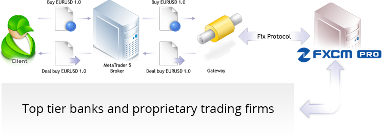
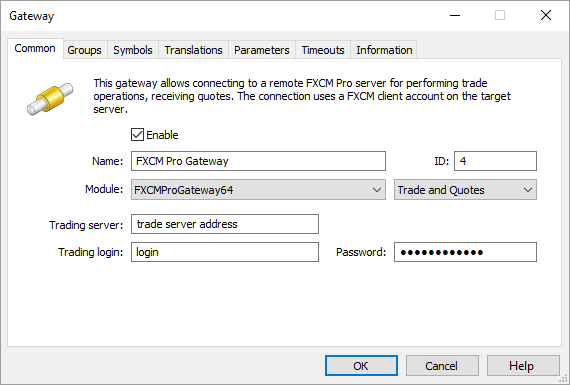
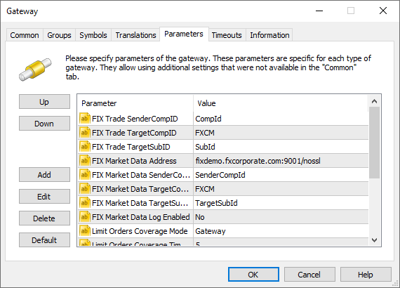
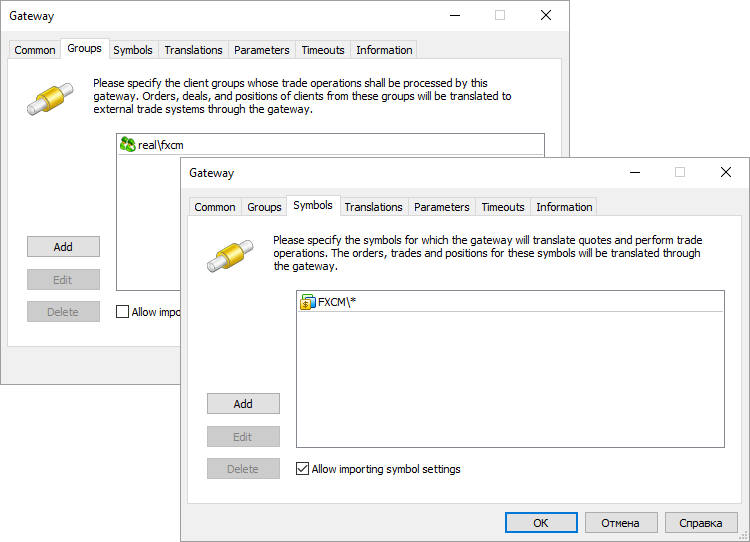
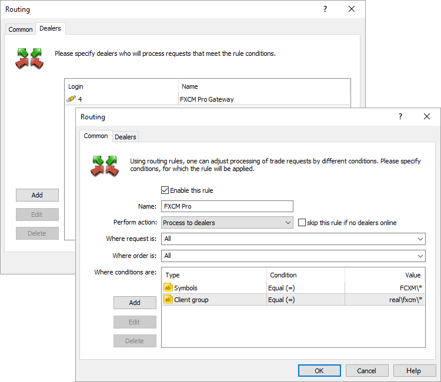
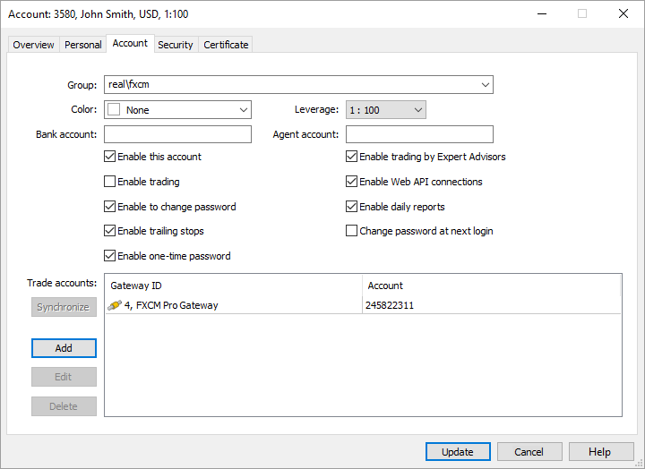
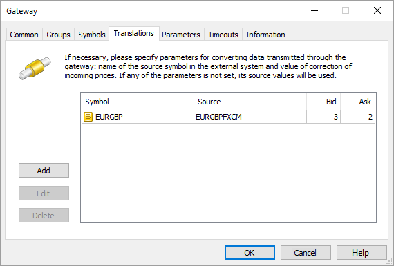

[🏠 Document Start](../../../README.md) / [MetaTrader 5 Trading Platform](../../../MetaTrader-5-Trading-Platform.md) / [Platform Components](../../Platform-Components.md) / [Gateways](../Gateways.md) / FXCM PRO

[Previous](LMAX-Global.md) | [Next](Borsa-Istanbul.md)

# MetaTrader 5 Gateway to FXCM PRO (#metatrader-5-gateway-to-fxcm-pro)

[FXCM PRO](https://www.fxcmpro.com/) is the institutional arm of FXCM, the largest broker in the United States. FXCM Pro trading system serves 200 000 traders all over the world conducting over 500 000 trades per day with the average daily volume of $14 billion.

FXCM Pro offers brokers the transparent service system based on agency commission with fully anonymous trading. The system provides access to [40 trading symbols](https://www.fxcm.com/uk/markets/) including currency pairs, indices, metals, energy and Treasury bonds. FXCM Pro offers customized pricing for each instrument and account. Based on customer mandate, FXCM’s liquidity management team can source the most efficient liquidity providers and partnering venues to match your needs, be it single tickets on large orders, stickier pricing intraday on metals, and much more.

FXCM Pro trading systems (matching engine) are located in New York (Equinix NY7 data center) and Tokyo (Equinix TY3 data center). The system can be accessed both via the Internet and cross connect in FXCM data center.

## Two Operation Modes: Wholesale and Liquidity Solutions (#two-operation-modes-wholesale-and-liquidity-solutions)

You can select one of the two operation modes depending on your needs.

Wholesale | Liquidity Solutions  
---|---  
Wholesale is optimal for retail brokers looking to leverage FXCM’s scale. Brokers are able to trade in FXCM Pro using large volumes, thus increasing the acceptable volume of non-hedged positions of their traders. Cross Collateralization of FX and CFD Trading All customer positions are netted into one account, allowing for more efficient use of corporate cash. Credit line Through a formal review process FXCM can extend credit in the form of NOP (Net Open Position) in a traditional bank Prime Brokerage manner with flexible settlement terms. No fees on small tickets FXCM provides all currency pairs on offer at 1K ticket sizes with no additional fees. Execution suitable for automated trading FXCM’s FX NDD model, and enhanced index and commodity CFD model is ideal for automated traders seeking a better execution experience. | Liquidity Solutions mode provides liquidity for your traders and ability to send their trading operations to FXCM Pro. There are two distinctly different liquidity solutions — trading via a single account in FXCM Core system and trading in FXCM Pro ECN where an individual account is allocated to each trader. FXCM Core This technology suite supports nearly 200 000 traders globally, with over 500 000 trades done daily as well as over $14 billion in daily volumes.

  * NDD execution model is agency based and truly anonymous. Banks and financial institutions comprising FXCM’s matching engine have no information about their counterparty. Pending orders are stored on FCXM servers and sent to the matching system only if their execution conditions are fulfilled.
  * Small ticket advantage — FXCM provides all currency pairs on offer at 1K ticket sizes with no additional fees.
  * Multi asset clearing — all assets are traded on one trading account via a single API.

FXCM Pro ECN — institutional API service This technology offers professional and institutional users the ability to tailor pricing on a per instrument, per account basis. Based on customer mandate, FXCM’s liquidity management team can source the most efficient liquidity providers and partnering venues to match your needs, be it single tickets on large orders, stickier pricing intraday on metals, and much more. FXCM also provides cross collateralization capabilities for all trading accounts.  
  

## Getting Started with FXCM Pro (#getting-started-with-fxcm-pro)

First, connect FXCM Pro to find out the details and conclude an agreement.

Brandon Mulvihill — Global Head, FXCM Pro Direct: +1 646 432 2521 Mobile: +1 917 587 1339 Email: bmulvihill@fxcmpro.com | Chris Hossain — Head of EMEA, FXCM Pro Direct: +44 207 903 6261 Mobile: +44 7 540 789 656 Email: chossain@fxcmpro.com | Siju Daniel — CEO, FXCM Asia Email: sdaniel@fxcm.com | Claudio Flores — VP, API & Systems Trading Email: cflores@fxcm.com  
---|---|---|---  
  
After concluding an agreement, you will receive all necessary data for connecting to FXCM Pro trading system.

> [Order MetaTrader 5 Gateway to FXCM Pro](https://support.metaquotes.net/en/market/product/269)

## How the Gateway Works (#how-the-gateway-works)

MetaTrader 5 Gateway to FXCM Pro is a separate FXCMProGateway64.exe module that uses the MetaTrader 5 Gateway API for operation. The gateway works via two FIX channels: the first one is for trading, while the second one is for market data.

All orders entered in FCXM Pro are transferred to the unified requests database. The system selects appropriate orders automatically executing opposite orders with matching parameters (symbol, price etc.)

### Market Data (#market-data)

MetaTrader 5 Gateway to FXCM Pro automatically imports all the necessary symbols and processes their properties. The administrator only needs to perform a primary [setup (#symbols)](FXCM-PRO.md#symbols).

Price data is transmitted in real time. The gateway is capable of narrowing or expanding prices on the go: quotes can be converted according to the settings when passing them to the platform and then re-converted back to their original state when passing trade operations to FXCM Pro. Detailed information on [prices conversion (#markup)](FXCM-PRO.md#markup) is available below.

### Trading Operations (#trading-operations)

Orders are sent to MetaTrader 5 Gateway to FXCM Pro for processing in accordance with the set [routing rules (#routing)](FXCM-PRO.md#routing). Processing of requests depends on the type of the order, as well as the gateway configuration.

Order type | Execution  
---|---  
Market order | Delivered directly to FXCM Pro as a market order.  
Take Profit Buy Limit Sell Limit | Depends on [Limit Orders Coverage Mode (#parameters)](FXCM-PRO.md#parameters): Limit Orders Coverage Mode=Gateway (default) Limit orders are processed on FXCM Pro side. Once a limit order has been placed by a client, an appropriate order is sent to FXCM Pro. There it is placed to the general queue awaiting for an opposite request with the same price to appear. Take Profit orders are processed the same way as in the Limit mode. The FXCM Pro system checks the availability of the required amount of funds to cover any type of order placed via the gateway. However, the check is performed on the broker's general account, on behalf of which the work is carried out. [Margin reservation (#margin)](FXCM-PRO.md#margin) of the clients should be configured for the appropriate order types in case Limit orders are directly delivered to an external system. By default, the margin is charged on the side of MetaTrader 5 only when market orders are placed. When placing pending orders in an external system, the client's available funds should be controlled on the side of MetaTrader 5 before the orders are transferred to avoid using all broker's funds by the client. Limit Orders Coverage Mode=Limit Limit Orders and Take Profit orders are processed on the side of the MetaTrader 5. Once a limit order is triggered, an equivalent limit order is sent to FXCM Pro. That order has a short action time specified in Limit Orders Coverage Timeout parameter. Since the price specified in the order is already present in the market, the order will be executed with that price — a market deal will be performed. If the necessary volume of the financial instrument is not available in the market at the specified price, the order will be executed partially. Thanks to a short expiration time, a limit order with a residual volume will be removed from FXCM Pro. Thus, a client will have a market position as well as a limit order with a residual volume, which will be further processed in a similar way on the side of MetaTrader 5. A limit order with the price equal to a Take Profit level is sent to FXCM Pro at the moment a Take Profit order has been activated. Since the price specified in the order is already present in the market, the order will be executed with that price — a market deal will be performed. If the necessary volume of the financial instrument is not available in the market at the specified price, the order will be executed partially. Thanks to a short expiration time, a limit order with a residual volume will be removed from FXCM Pro. Therefore, a client's position will be closed partially. Control over the Take Profit position level with the remaining volume will then be carried out on MetaTrader 5 side.   
Limit mode allows to protect against slippage, as a limit order is sent to FXCM Pro system with a specified price rather than a market order for execution by the current price. Limit Orders Coverage Mode=Market Limit orders and Take Profit orders are processed on the MetaTrader 5 platform side. Once they trigger, an appropriate market order is sent to FXCM Pro.  
Buy Stop Sell Stop | Depends on [Stop Orders Coverage (#parameters)](FXCM-PRO.md#parameters): Stop Orders Coverage=Y Delivered directly to FXCM Pro. Similarly to limit orders, margin reservation of the clients should be configured for the appropriate order types on MetaTrader 5 side in case of direct delivery of stop orders to FXCM Pro. Stop Orders Coverage=N Processed on the MetaTrader 5 platform side until their stop price is reached. After a stop order is activated, an appropriate market order will be sent to the FXCM Pro system.  
Buy Stop Limit Sell Stop Limit | Depends on Stop Orders Coverage: Stop Orders Coverage=Y Delivered directly to FXCM Pro. Similarly to limit orders, margin reservation of the clients should be configured for the appropriate order types on MetaTrader 5 side in case of direct delivery of stop limit orders to FXCM Pro. Stop Orders Coverage=N Processed on the MetaTrader 5 side. Upon order activation, an appropriate limit order is created in MetaTrader 5, and this order is then processed in accordance with the value of the Limit Orders Coverage Mode parameter.  
Stop Loss Stop Out | Processed on the MetaTrader 5 side. Once they trigger, an appropriate market order is sent to FXCM Pro.  
  
> In case connection to  server is lost, the application will try to restore it repeatedly. If pending orders were executed during the disconnection period, they will be updated in the MetaTrader 5 platform after successful reconnection.

## Gateway Setup (#settings)

To start working, add [the new gateway configuration](../../Platform-Setup/Gateways.md):

Set the following parameters on the "Common" tab:

  * ID — unique dealer identifier, on whose behalf the trade requests will be processed. Requests are routed to the gateway according to this identifier.
  * Module — specify FXCMProGateway64 and accept the default settings after the module selection.
  * Trading server — FXCM Pro server IP-address and the port, where trade requests are processed. This information is provided by FXCM Pro as the SocketConnectHost and SocketConnectPort parameters. An encrypted SSL connection to a server is established by default. If you need to establish an unencryprted connection, additionally specify the /nossl key in the address bar. For example: 10.123.100.17:10219/nossl.
  * Trading login — login for connecting the trade flow corresponding to UserName tag (553) in FIX protocol. Provided by FXCM Pro.
  * Password — password for connecting the trade and quote flow corresponding to Password tag (554) in FIX protocol. Provided by FXCM Pro.

  * ID value must be unique in the field of manager logins and gateway identifiers.
  * The details for connection to the FXCM Pro server where trade requests are processed will be provided during the agreement conclusion.

  
---  
  
Now, go to the "Parameters" tab.

Specify the following parameters values here:

  * FIX Trade SenderCompID — standard parameter of the FIX messages heading used for a data sender identification. This parameter is provided by FXCM Pro as the value of SenderCompID (49).
  * FIX Trade TargetCompID — standard parameter of the FIX messages heading used for trading messages recipient identification. This parameter is provided by FXCM Pro as the value of TargetCompID (56).
  * FIX Trade TargetSubID — standard parameter of the FIX messages heading used for trading messages recipient identification. This parameter is provided by FXCM Pro as the value of TargetSubID (57).
  * FIX Market Data Address — IP address and port of the FXCM Pro server, from which market (price) data is transmitted. This information is provided by FXCM Pro as the SocketConnectHost and SocketConnectPort parameters. An encrypted SSL connection to a server is established by default. If you need to establish an unencryprted connection, additionally specify the /nossl key in the address bar. For example: 10.123.100.17:10219/nossl.
  * FIX Market Data SenderCompID — standard parameter of the FIX messages heading used for a market data sender identification. This parameter is provided by FXCM Pro as the value of SenderCompID (49).
  * FIX Market Data TargetCompID — standard parameter of the FIX messages heading used for market messages recipient identification. This parameter is provided by FXCM Pro as the value of TargetCompID (56).
  * FIX Market Data TargetSubID — standard parameter of the FIX messages heading used for market messages recipient identification. This parameter is provided by FXCM Pro as the value of TargetSubID (57).
  * FIX Market Data Log Enabled — if Yes, the gateway saves FIX connection (market flow) logs. Enable the parameter only in case of the gateway operation issues. The default value is No.
  * Limit Orders Coverage Mode — mode of processing Limit and Take Profit orders by the gateway. This parameter simplifies configuration of trade requests routing to the gateway, since there is no need to create a separate rule for routing the appropriate order types. Three processing modes are available:

  *     * Market — Limit and Take Profit orders are processed on the MetaTrader 5 platform side. If an order is activated, an appropriate market order is sent to FXCM Pro.
    * Limit — Limit and Take Profit orders are processed on the MetaTrader 5 side.  
Once a Limit order is triggered, an equivalent Limit order is sent to FXCM Pro. That order has a short action time specified in Limit Orders Coverage Timeout parameter. Since the price specified in the order is already present in the market, the order will be executed with that price — a market deal will be performed. If the necessary volume of the financial instrument is not available in the market at the specified price, the order will be executed partially. Thanks to a short expiration time, a Limit order with a residual volume will be removed from FXCM Pro. Thus, a client will have a market position as well as a Limit order with a residual volume, which will be further processed in a similar way on the side of MetaTrader 5.  
A Limit order with the price equal to a Take Profit level is sent to FXCM Pro at the moment a Take Profit order has been activated. Since the price specified in the order is already present in the market, the order will be executed with that price — a market deal will be performed. If the necessary volume of the financial instrument is not available in the market at the specified price, the order will be executed partially. Thanks to a short expiration time, a Limit order with a residual volume will be removed from FXCM Pro. Therefore, a client's position will be closed partially. Control over the Take Profit position level with the remaining volume will then be carried out on the MetaTrader 5 side.   
Limit mode allows to protect against slippage, as a Limit order is sent to FXCM Pro system with a specified price rather than a market order for execution by the current price. In addition, this mode allows you not to reserve margin on a client's account before sending an order to FXCM Pro.
    * Gateway — Limit orders are processed on FXCM Pro side. Once a Limit order has been placed by a client, an appropriate order is sent to FXCM Pro. Take Profit orders are processed the same way as in the Limit mode.
  * Limit Orders Coverage Timeout — duration of Limit orders sent to FXCM Pro in Limit mode. Specified in seconds. The default value is 5.
  * Stop Orders Coverage — mode of handling Stop and Stop Limit orders. In case of 'Y' value, these order types will be transferred to FXCM Pro directly. In case of 'N' value, the orders will be processed inside MetaTrader 5 platform until their stop price is reached. After a Stop order is activated, an appropriate market order will be sent to the FXCM Pro system. After a Stop Limit order has been activated, a Limit order is created, which will be processed according to Limit Orders Coverage Mode parameter value.
  * Account Mapping Mode — the gateway supports several [modes of trade operation transferring (#multiaccount)](FXCM-PRO.md#multiaccount) to FXCM PRO: on behalf of the broker's general account and on behalf of the individual accounts used for trading in the MetaTrader 5 platform. Three modes of trades operations transfer are available:
    * omnibus — all orders will be sent to FXCM PRO on behalf of the broker's main account specified in the "Account Mapping" parameter.
    * one-to-one — all orders will be sent to FXCM PRO on behalf of individual accounts on which the orders are placed in MetaTrader 5 (an external system account is specified in the settings of each account).
    * conversion — combination of the previous two modes: orders of the accounts that have specified external system account will be sent on their own behalf, while all other orders will be transferred on behalf of the broker's general account.
  * Account Mapping — the number of the single account in the FXCM PRO system, on behalf of which clients' orders will be sent if the "Account Mapping Mode" parameter is set to "omnibus" or "conversion".
  * Quotes Delay — delay of transmitted quotes in seconds. The maximum duration of quotes delay is 20 minutes (1200 seconds). The flow of delayed quotes is neither thinned out, nor changed. A quote is passed to MetaTrader 5 History Server only after the expiration of delay period since the quote has arrived to Gateway API. If the temporary delay parameter is not defined, the quote delay is not used. Changes in depth of market and price statistics are delayed together with the quotes flow.
  * Quotes Tickstats Sample — the minimum frequency of sending price statistics in milliseconds. This parameter allows thinning out updates of price statistics reducing the traffic.
  * Quotes Ticks Sample — the minimum frequency of sending quotes in milliseconds. This parameter allows thinning out updates of quotes reducing the traffic. It is recommended for use on demo servers only.
  * Quotes Books Sample — the minimum frequency of depth of market updates in milliseconds. This parameter allows thinning out updates of the depth of market reducing the traffic. It is recommended for use on demo servers only.

  * In no circumstances it is allowed to change operations transfer mode while in operation. Changing the mode is allowed only after all client positions are closed.
  * Margin reservation of the clients should be configured for the appropriate order types [in case Limit, Stop and/or Stop Limit orders (#margin)](FXCM-PRO.md#margin) are directly transferred to an external system.

  
---  
  
The next stage is to specify the groups of the clients, whose requests will be processed via the MetaTrader 5 Gateway to FXCM Pro, as well as symbols, by which the gateway processes trading operations and broadcasts quotes.

Make sure to enable "Allow importing symbol settings" option. The gateway imports symbols from FXCM Pro to Symbols/Preliminary/FXCM directory of the MetaTrader 5 and manages their parameters.

  * Initially, all imported symbols have trading ability disabled. System administrator must relocate imported symbols to the proper subgroup and allow trading for them.
  * After symbols are relocated and trading abilities are enabled, the main trading server must be restarted.
  * In case the gateway transmits configuration for the symbol that is already present in the platform, the configuration is updated. In this case, the symbol is not transferred and its trading ability is not turned off.
  * The gateway supports conversion of symbols and quotes. For details, please view the [Symbol and Price Translation](../../Platform-Setup/Gateways/Symbol-and-Price-Translation.md) section.

  
---  
  

## Margin Setup (#margin)

Margin reservation of the clients should be configured for the appropriate order types in case Limit, Stop and/or Stop Limit orders are directly transferred to an external system.

The external system checks the funds that are necessary to provide any type of order placed via the gateway. However, the check is performed on the broker's general account, on behalf of which the work is carried out.

By default, the margin is charged on the side of MetaTrader 5 only when market orders are placed. When placing pending orders in an external system, the client's available funds should be controlled on the side of MetaTrader 5 before the orders are transferred to avoid using all broker's funds by the client.

After an order has been transferred to the external system, MetaTrader 5 platform is not able to check the client's margin sufficiency any more. After the order has been executed in the external system, the gateway cannot ignore that fact. Therefore, the appropriate trading operation is performed in the platform.

Set non-zero coefficients for the orders directly transferred to the external trading system in symbol settings for the appropriate symbols:

## Configuring Trade Requests Routing (#routing)

Configure the routing to let the clients requests to be transmitted to the FXCM Pro gateway. To do this, add a routing rule to the relevant [MetaTrader 5 Administrator](../../Platform-Setup/Routing.md) section.

Select "Process to dealers" as an action in common settings. Assign this routing rule for all requests and orders. In additional conditions, indicate groups of clients, whose requests will be passed to the gateway.

In the screenshots below all orders created by users in the real\fxcm\* groups by symbols from the FXCM\* section will be sent to the gateway for processing.

After the correct execution of the steps described above, the gateway will be ready for work.

## Configuring Trading Accounts (#multiaccount)

MetaTrader 5 GateWay to FXCM PRO allows transferring trading operations to an external system in different modes. The trading orders that are placed by clients in the MetaTrader 5 platform, can be sent to FXCM PRO on behalf of the broker's general account (specified in the [Account Mapping" (#account-mapping)](FXCM-PRO.md#account-mapping) parameter of the gateway settings) or on behalf of the clients' individual accounts. In the latter case, the gateway connects to FXCM PRO via the broker's general account, but clients' trading operations are sent to FXCM PRO using individual accounts.

  * Order transferring mode is controlled by the [Account Mapping Mode (#account-mapping)](FXCM-PRO.md#account-mapping) parameter in the gateway configuration.
  * Trading operations transfer conditions are determined when concluding an agreement between a brokerage company and FXCM PRO.
  * In no case should you change the operation transfer mode during operation. Changing the mode is allowed only when all client positions have been closed.

If you send trading operations using individual client accounts, the appropriate FXCM PRO account number must be specified in each account's settings. This can be done via the [administrator (#trade-accounts)](../../Platform-Setup/Accounts/Editing-Account.md#trade-accounts) or [manager](https://support.metaquotes.net/en/docs/mt5/manager/management/management_accounts/account_view/account_view_account) terminal:

In "Trade accounts" section, select FXCM PRO gateway configuration and specify the client's account in the external system. That is the account, from which client trade operations will be transferred to FXCM PRO.

Client account numbers are provided by FXCM PRO.

## Changing Symbols Names and Markups (#markup)

The gateway receives the prices from FXCM PRO and transmits them to clients considering markups. Thus, a brokerage company receives its profit share from each deal performed at FXCM Pro. Markup values are set separately for Bid and Ask prices by each symbol:

Besides, you can configure matching of symbol names used in FXCM Pro with the names used in your MetaTrader 5 platform. For example, if the symbol name in FXCM Pro is EURGBPFXCM, and it is called EURGBP in MetaTrader 5, enter EURGBP in the "Symbol" field and EURGBPFXCM in the "Source" field.

The above screenshot shows price conversion: at every tick, the Bid price will be reduced by 3 points, and the Ask price will be increased by 2 points. Below is a schematic example of the conversion:

FXCM Pro | >>> | ask price | EURGBP 0.83004 | >>> | MetaTrader 5 server  
---|---|---|---|---|---  
MetaTrader 5 server | >>> | ask price | EURGBP 0.83006 | >>> | Client terminal  
Client terminal | >>> | buy limit | EURGBP 0.83006 | >>> | MetaTrader 5 server  
MetaTrader 5 server | >>> | buy limit | EURGBP 0.83004 | >>> | FXCM Pro  
FXCM Pro | >>> | buy limit execution | EURGBP 0.83004 | >>> | MetaTrader 5 server  
MetaTrader 5 server | >>> | buy limit execution | EURGBP 0.83006 | >>> | Client terminal  
  
A broker gains 2 pips of profit in this example. The price is sent to the client terminal only after the correction, so the clients work only with the corrected prices. If no correction is set for a symbol, the client will work with the original prices submitted by FXCM Pro.

## Prices Round Off (#prices-round-off)

During the gateway's operation, accuracy of quotes (decimal places) passed for some symbol may change in the external trading system. Decrease in price accuracy at the external trading system's side does not affect the gateway's operation. It still transmits prices with less accuracy. However, if the number of decimal places at the external system's side increases, the gateway starts rounding off the passed prices.

Suppose that the accuracy of quotes has changed from 4 to 5 digits. Obtained five-digit quotes are rounded up in a broker's favor. Thus, buy requests of 1.23447, 1.23441 are rounded up to 1.2345, while sell ones of 1.23447, 1.23441 are rounded down to 1.23440.

Changes in symbol price accuracy are recorded in the gateway journal.

## Fill Policy and Order Expiration (#fill-policy-and-order-expiration)

When sending an order from the MetaTrader 5 client terminal, traders can set the order [execution policy (#fill-policy)](../../Platform-Setup/Symbols/Symbol-Settings/Trade.md#fill-policy) (FOK, IOC or Return) and [expiration time (#expiration)](../../Platform-Setup/Symbols/Symbol-Settings/Trade.md#expiration) (Good Till Canceled, Today, Date and Time, Date). In FXCM Pro trading system, the fill policy and expiration are set in a single parameter - Time in Force. Therefore, the gateway performs the following changes when passing the orders:

  * If FOK or IOC fill policy is set for an order, the same policy is applied in FXCM Pro system.
  * If a market order with Return fill policy is placed, it will be passed to FXCM Pro system in Good Till Canceled (GTC) mode.
  * If a limit order with Return fill policy is placed, expiration time from MetaTrader 5 (Good Till Canceled, Today, Specified, Specified Day) is inserted into the appropriate order parameter in FXCM Pro system.
  * If a limit order is activated in MetaTrader 5 platform and the gateway works in the mode of passing limit orders (Limit Orders Coverage Mode = Limit), a limit order with Good Till Date fill time policy is passed to FXCM Pro system. Limit Orders Coverage Timeout parameter also affects the order's lifetime. The gateway removes the placed order upon expiration of the specified time.
  * If a take profit position is activated in MetaTrader 5 platform and the gateway works in the mode of passing limit orders (Limit Orders Coverage Mode = Limit or Limit Orders Coverage Mode = Gateway), a limit order with Good Till Date fill time policy is passed to FXCM Pro system. Limit Orders Coverage Timeout parameter also affects the order's lifetime. The gateway removes the placed order upon expiration of the specified time.

