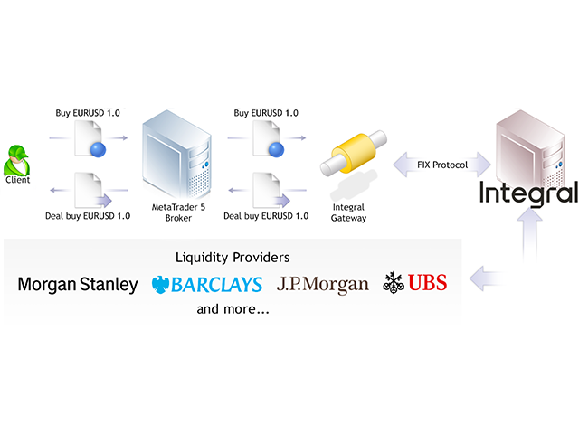
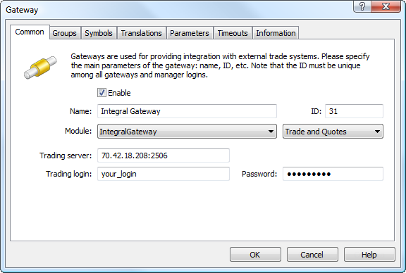
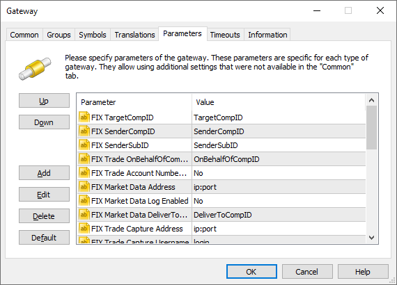
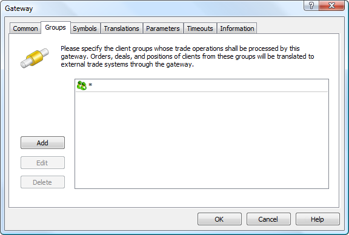
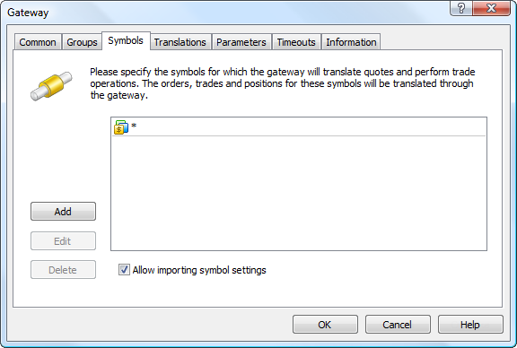
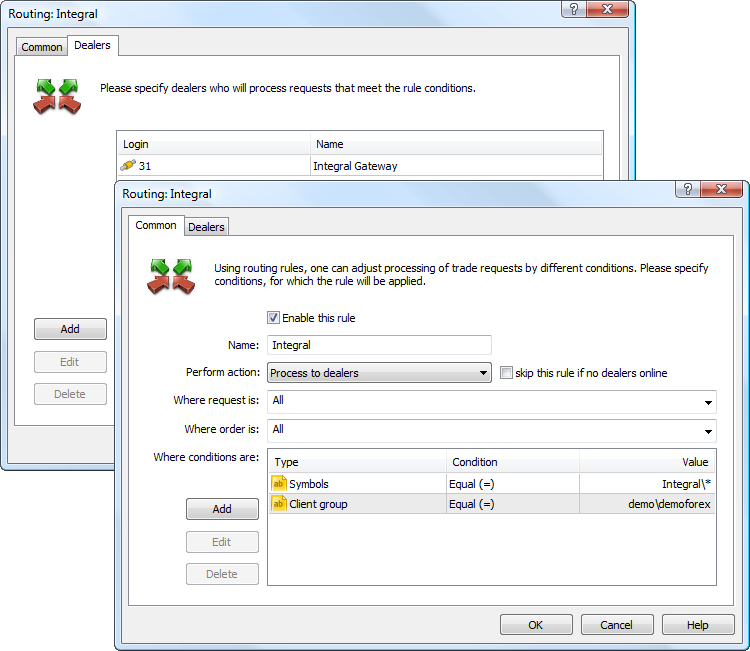
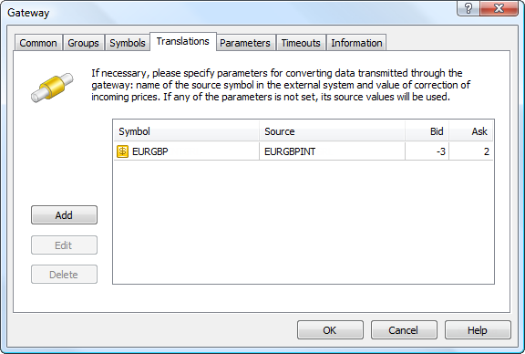

[🏠 Document Start](../../../README.md) / [MetaTrader 5 Trading Platform](../../../MetaTrader-5-Trading-Platform.md) / [Platform Components](../../Platform-Components.md) / [Gateways](../Gateways.md) / Integral

[Previous](MetaTrader-4.md) | [Next](Currenex.md)

# MetaTrader 5 Gateway to Integral (#metatrader-5-gateway-to-integral)

MetaTrader 5 Gateway to Integral is a simple, fast and secure integration solution for brokers. The gateway provides liquidity when working in MetaTrader 5. [Integral](https://www.integral.com/) ECN of Integral Development Corp. is one of the largest Electronic Communication Networks allowing to trade commodities. All orders entered in ECN are transferred to the unified requests database. The system selects appropriate orders automatically executing opposite orders with matching parameters (symbol, price etc.)

About Integral

Founded in 1993, [Integral Development Corp.](https://www.integral.com/) offers Integral multi-sided trading network (ECN, Electronic Communication Network) for foreign exchange. Integral technology unites various Forex market participants into the single trading network. Direct access to interbank liquidity via STP (Straight Through Processing) technology allows to maximize the speed of the participants orders execution. ECN Integral combines the liquidity of such financial institutions, as Citibank, Deutsche Bank, Bank of America, UBS, HSBC, NOMURA, RBS, BNP Paribas and many others.

Integral allows to trade more than 100 financial instruments including major currency pairs, cross rates, exotic currencies and precious metals.

## Necessary Actions for Working with Integral (#necessary-actions-for-working-with-integral)

To be able to provide trading services using Integral, a brokerage company must first contact Integral Development Corp. for concluding the agreement. Select the closest Integral office:

  * +1 (212) 252-2243 (North America),
  * +44 203 514-2439 (UK, the EMEA region),
  * +65 3158 0800 (Asia, Singapore)
  * +852 80 903 855 (Hong Kong),
  * +813 3242 6170 (Japan)

Or send an email to [support@integral.com](mailto:support@integral.com).

Further information can be requested on the official Integral website via a [special form](https://www.integral.com/contact/). After conclusion of an agreement, you will receive all necessary data for connection to the Integral server.

> [Order MetaTrader 5 Gateway to Integral](https://support.metaquotes.net/en/market/product/264)

## How the Gateway Works (#how-the-gateway-works)

MetaTrader 5 Gateway to Integral is a separate IntegralGateway64.exe module that uses the MetaTrader 5 Gateway API for operation.

The foundation of Integral's FX solutions is the FX Grid, a global inter-institutional connectivity and trading network, linking market making banks to Forex market participants. To connect to that network, the gateway uses FX Inside API, which is a special set of interfaces provided by Integral for direct access to FX Grid. The gateway operates as a mediator between two systems connecting Integral and MetaTrader 5 platform. All data between the Integral system and the gateway is transmitted using FIX protocol over the encrypted connection. The gateway sends encrypted FIX messages and returns them to the MetaTrader 5 platform using the MetaTrader 5 Gateway API.

### Market Data (#market-data)

MetaTrader 5 Integral Gateway automatically imports all the necessary symbols and processes their properties. An administrator only needs to perform primary setup.

Price data is transmitted in real time. The gateway can narrow or widen prices: convert quotes in accordance according with the settings when sending them to the platform, and then perform the inverse conversion to the original state when sending trading operations to Integral. Detailed information on prices correction is available below.

### Trading Operations (#trading-operations)

Orders are sent the the MetaTrader 5 Gateway to Integral in accordance with the configured routing rules. Processing of requests depends on the type of the order, as well as in the gateway configuration.

Order type | Execution  
---|---  
Market Order | Delivered directly to Integral as a market order.  
Take Profit Buy Limit Sell Limit | Depends on Limit Orders Coverage: Limit Orders Coverage Mode=Gateway (default) Limit orders are processed on the side of Integral. Once a limit order has been placed by a client, an appropriate order is sent to Integral. Take Profit orders are processed the same way as in the Limit mode. The Integral system checks the availability of the required amount of funds to cover any type of order placed via the gateway. However, the check is performed on the broker's general account, on behalf of which the operation is carried out. Margin reservation of the clients should be configured for the appropriate order types in case Limit orders are directly delivered to an external system. By default, the margin is charged on the side of MetaTrader 5 only when market orders are placed. When placing pending orders in an external system, the client's available funds should be controlled on the side of MetaTrader 5 before the orders are transferred to avoid using all broker's funds by the client. Limit Orders Coverage Mode=Limit Limit Orders and Take Profit orders are processed on the side of the MetaTrader 5. Once a limit order is triggered, an equivalent limit order is sent to Integral. That order has a short action time specified in Limit Orders Coverage Timeout parameter. Since the price specified in the order is already present in the market, the order will be executed with that price — a market deal will be performed. If the necessary volume of the financial instrument is not available in the market at the specified price, the order will be executed partially. Thanks to a short expiration time, a limit order with a residual volume will be removed from Integral. Thus, a client will have a market position as well as a limit order with a residual volume, which will be further processed in a similar way on the side of MetaTrader 5. A limit order with the price equal to a Take Profit level is sent to Integral at the moment a Take Profit order has been activated. Since the price specified in the order is already present in the market, the order will be executed with that price — a market deal will be performed. If the necessary volume of the financial instrument is not available in the market at the specified price, the order will be executed partially. Thanks to a short expiration time, a limit order with a residual volume will be removed from Integral. Therefore, a client's position will be closed partially. Control over the Take Profit position level with the remaining volume will then be carried out on MetaTrader 5 side.   
Limit mode allows to protect against slippage, as a limit order is sent to Integral system with a specified price rather than a market order for execution by the current price. Limit Orders Coverage Mode=Market Limit orders and Take Profit orders are processed on the MetaTrader 5 platform side. Once they trigger, an appropriate market order us sent to Integral.  
Buy Stop Sell Stop | Depends on Stop Orders Coverage: Stop Orders Coverage=Y Delivered directly to Integral. Like with limit orders, margin reservation of the clients should also be configured for the appropriate order types on the MetaTrader 5 side in case Stop orders are directly delivered to Integral. Stop Orders Coverage=N Processed on the MetaTrader 5 platform side until their stop price is reached. After a stop order is activated, an appropriate market order will be sent to Integral system.  
Buy Stop Limit Sell Stop Limit | Depends on Stop Orders Coverage: Stop Orders Coverage=Y Delivered directly to Integral. Like with limit orders, margin reservation of the clients should also be configured for the appropriate order types on the MetaTrader 5 side in case Stop-Limit orders are directly delivered to Integral. Stop Orders Coverage=N Processed on the MetaTrader 5 side. Upon order order activation, an appropriate limit order is created in MetaTrader 5, and this order is then processed in accordance with the value of the Limit Orders Coverage Mode parameter.  
Stop Loss Stop Out | Processed on the MetaTrader 5 side. Once they trigger, an appropriate market order us sent to Integral.  
  
  * In case connection to Integral server is lost, the application will try to restore it repeatedly. In case pending orders have been executed at that, they will be updated in the MetaTrader 5 platform after connection is restored.
  * The Integral system allows a broker to cancel orders in case of connection loss. Integral system does not cancel orders by default in that case but, nevertheless, you should notify the Integral technical support about the necessity to disable that option for your account (pending orders should not be deleted in case of connection loss).

  
---  
  

## Gateway Setup (#settings)

To start working, add [the new gateway configuration](../../Platform-Setup/Gateways.md):

Set the following parameters on the "Common" tab:

  * ID — unique dealer identifier, on whose behalf the trade requests will be processed. Requests are routed to the gateway according to this identifier.
  * Module — specify IntegralGateway64 and accept the default settings after the module selection.
  * Trading server — Integral server IP-address and the port, where trade requests are processed. This information is provided by Integral.
  * Trading login — Integral server connection login (equal to SenderCompID).
  * Password — password for connection to the Integral server (equal to SenderCompPasswd).

  * ID value must be unique in the field of manager logins and gateway identifiers.
  * The details for connection to the Integral server, where trade requests are processed, are provided during the agreement conclusion.

  
---  
  
Other parameters are set similarly to other gateways. Default values are used in most cases.

Now, go to the "Parameters" tab.

Specify the following parameters values here:

  * FIX TargetCompID — a standard parameter of the FIX messages heading used for trading messages recipient identification. This parameter is provided by Integral as the value of TargetCompID.
  * FIX SenderSubID — a standard parameter of the FIX messages heading used for a trading participant (a legal entity) identification. Provided by Integral as the value of FIX_SenderSubID.
  * FIX SenderCompID — a standard parameter of the FIX messages heading used for a data sender identification. Provided by Integral as the value of senderCompID without the 'quote' or 'trader' prefixes. For example, if Integral has submitted to you sendercompID = quote.9898AKD.10, the value 9898AKD.10 should be used for FIX SenderCompID parameter.
  * FIX Trade OnBehalfOfCompID — is a standard parameter of the FIX messages heading used for a trade participant identification. Provided by Integral as the value of OnBehalfOfCompID. If the parameter value is specified, the getaway will additionally fill the OnBehalfOfCompID (115) tag in outgoing messages of the trading channel. An optional parameter.
  * FIX Trade Account Number Set — if you set "Yes" for this parameter, the gateway will additionally fill the OnBehalfOfSubID (116) tag in all outgoing FIX messages. The MetaTrader 5 login of the client who performed this operation is written in this tag. When default No is used, the tag is not filled.
  * FIX Trade Capture Address — IP address and port of the Trade Capture server, provided by Integral. The gateway uses a separate FIX connection to the Trade Capture (Drop Copy) Exchange service. This connection is used by the gateway to receive the stream of deals performed through other terminals (not MetaTrader 5). If this parameter is not filled, the gateway will not connect to Trade Capture and will only work with the trading/quoting server of the exchange.
  * FIX Trade Capture Username — login for connection to the Trade Capture server.
  * FIX Trade Capture Password — password for connection to the Trade Capture server.
  * FIX Trade Capture TargetCompID — FIX messages heading standard parameter used for trading messages recipient identification. The parameter is provided by Integral as the TargetCompID value.
  * FIX Trade Capture SenderCompID — FIX messages heading standard parameter used for a data sender identification. Provided by Integral as the value of senderCompID without 'quote' or 'trader' prefixes.
  * FIX Trade Capture SenderSubID — FIX messages header standard parameter used for a trading participant (a legal entity) identification. Provided by Integral as the value of FIX_SenderSubID.
  * FIX Trade Capture Login MT — account number on the MetaTrader 5 platform side, to which all deals from Trade Capture will be transmitted.
  * FIX Trade Capture Stop Out Enabled — allow closing of positions upon reaching [Stop Out (#stopout)](../../Platform-Setup/Groups/Group-Settings.md#stopout). If set to "No" (default), positions opened via the gateway will not be closed automatically, if Stop Out is reached on the trading platform side. If a position is opened with FIX Trade Capture Stop Out Enabled = Yes, then closing by Stop Out can occur even if you change the parameter value to "No". It is only guaranteed that the ban to close will be effective for positions opened after changing the parameter value to "No".
  * FIX Trade Spread Set — transmit information about [the spread difference values in the trader group](../../Platform-Setup/Groups/Group-Symbol-Settings/Common.md) to Integral. Such information can be required by the exchange. If set to "No" (default), this data is not transmitted. If set to "Yes", the gateway will transmit the current spread value in tag 7547 for each request. For market orders, the current symbol price will be additionally provided in tag 44.
  * FIX Market Data Address — IP address and port of the Integral server, from which the quotes are provided. By default, the gateways receives information about trading requests and price data from one server, which is specified in the "Trade server" field. By using the FIX Market Data Address parameter, you can configure the gateway to receive quotes in a separate stream. To connect to the quoting server you should use the same login and password, which are used for the trade request processing server.
  * FIX Market Data Log Enabled — if "YES" is set, the gateway will save to disk the full quoting connection log. This can be useful in operation debugging. The log is not saved by default (value "No").
  * FIX Market Data DeliverToCompID — indicates liquidity provider from which quotes should be requested. If the parameter is set, the specified value will be added to the DeliverToCompID (128) tag of FIX messages of the quoting session subscription. If the parameter is not set, "All" will be used for the DeliverToCompID tag, which means subscription to quotes from all available liquidity providers.
  * Limit Orders Coverage Mode — the mode of processing of Limit and Take Profit orders by the gateway. This parameter simplifies configuration of trade requests routing to the gateway, since there is no need to create a separate rule for routing the appropriate order types. Three processing modes are available:
    * Market — limit and Take Profit orders are processed on the MetaTrader 5 platform side. An appropriate market order is sent to Integral after an order has been triggered.
    * Limit — limit and Take Profit orders are processed on the MetaTrader 5 side.  
Once a limit order is triggered, an equivalent limit order is sent to Integral. That order has a short action time specified in Limit Orders Coverage ModeTimeout parameter. Since the price specified in the order is already present in the market, the order will be executed with that price — a market deal will be performed. If the necessary volume of the financial instrument is not available in the market at the specified price, the order will be executed partially. Thanks to a short expiration time, a limit order with a residual volume will be removed from Integral. Thus, a client will have a market position as well as a limit order with a residual volume, which will be further processed in a similar way on the side of MetaTrader 5.  
A limit order with the price equal to a Take Profit level is sent to Integral at the moment a Take Profit order has been activated. Since the price specified in the order is already present in the market, the order will be executed with that price — a market deal will be performed. If the necessary volume of the financial instrument is not available in the market at the specified price, the order will be executed partially. Thanks to a short expiration time, a limit order with a residual volume will be removed from Integral. Therefore, a client's position will be closed partially. Control over the Take Profit position level with the remaining volume will then be carried out on the MetaTrader 5 side.  
Limit mode allows to protect against slippage, as a limit order is sent to Integral system with a specified price rather than a market order for execution by the current price. In addition, this mode allows you not to reserve margin on a client's account before sending an order to Integral.
    * Gateway — limit orders are processed on the Integral side. Once a limit order has been placed by a client, an appropriate order is sent to Integral. Take Profit orders are processed the same way as in the Limit mode.
  * Stop Orders Coverage — Stop and Stop Limit order processing mode. In case of 'Y' value these order types will be delivered to Integral directly. In case of 'N' value the orders will be processed inside MetaTrader 5 platform until their stop price is reached. After a stop order is activated, an appropriate market order will be sent to Integral system. After a stop limit order has been activated, a limit order is created, which will be processed according to Limit Orders Coverage Mode parameter value.
  * Limit Orders Coverage Timeout — expiry of Limit Orders that are sent to Integral in the Limit mode. Specified in seconds. The default value is 5.
  * Week Time Begin — gateway operation start time on Sunday. The value is specified in HH:MM format for Eastern Standard Time (EST). For example, 2:00.
  * Week Time End — gateway operation end time in Friday. The value is specified in HH:MM format for Eastern Standard Time (EST). For example, 23:00.

  * Weekend Trading Enabled — allow the gateway to trade on weekends. The default value is "No", which means that trading begins on Sunday at "Week Time Begin" and ends on Friday at "Week Time End". If set to "Yes", the gateway will operate from "Week Time Begin" on Sunday until "Week Time End" on the next Sunday. To keep the gateway running 24/7, enable "Weekend Trading Enabled" and set "Week Time Begin" to a time earlier than "Week Time End".

  * Min Quantity Set — enables/disables [minimum volume (#volumes)](../../Platform-Setup/Symbols/Symbol-Settings/Trade.md#volumes) checks for symbols when executing orders in Integral. The default "No" value instructs Integral to execute orders using deals of any size. The "Yes" value informs Integral that orders can be filled using deals with the volume no less than the "Minimum volume" parameter in symbol settings on the trading platform side.
  * Slippage Allowable — maximum allowable slippage for market orders. The parameter corresponds to tag 211 in the FIX protocol. The default value is 0, i.e. no tag is passed.
  * Orders Full Fill Only — enables/disables the filling of tag 110 in the FIX protocol when forwarding all orders. The tag sets the minimum volume (equal to the requested volume) in which the order can be executed. The flag ensures the correct implementation of the Fill or Kill execution. Supported values are "Yes" and "No" (default).
  * Quotes Delay — delay of transmitted quotes in seconds. The maximum duration of quotes delay is 20 minutes (1200 seconds). The flow of delayed quotes is neither thinned out, nor changed. A quote is passed to MetaTrader 5 History Server only after the expiration of delay period since the quote has arrived to Gateway API. If the temporary delay parameter is not defined, the quote delay is not used. Changes in depth of market and price statistics are delayed together with the quotes flow.
  * Quotes Tickstats Sample — the minimum frequency of sending price statistics in milliseconds. This parameter allows thinning out updates of price statistics reducing the traffic.
  * Quotes Ticks Sample — the minimum frequency of sending quotes in milliseconds. This parameter allows thinning out updates of quotes reducing the traffic. It is recommended for use on demo servers only.
  * Quotes Books Sample — the minimum frequency of depth of market updates in milliseconds. This parameter allows thinning out updates of the depth of market reducing the traffic. It is recommended for use on demo servers only.

  * In no circumstances it is allowed to change operations transfer mode while in operation. Changing the mode is allowed only after all client positions are closed.
  * When Limit, Stop and/or Stop Limit orders are directly delivered to an external system, margin reservation of the clients should be configured for the appropriate order types.

  
---  
  
The next stage is to specify the groups of the clients, whose requests will be processed via the MetaTrader 5 Integral Gateway. All groups are configured on the screenshot below, but you can configure groups according to your business logic.

Then configure the list of symbols, according to which the gateway will process trade operations and feed quotes.

Make sure to enable "Allow importing symbol settings" option. The symbols available to Integral will be imported to Symbols/Preliminary/Integral directory of the MetaTrader 5 platform. Besides, that will allow the gateway to manage the settings of the symbols used in trading via Integral.

  * The symbols imported by the gateway are put to the "\Preliminary" symbols subgroup. All symbols have trading ability disabled. System administrator must relocate imported symbols to the proper subgroup and allow trading for them.
  * After symbols are relocated and trading abilities are enabled, the main trading server must be restarted.
  * In case the gateway transmits configuration for the symbol that is already present in the platform, the configuration is updated. In this case the symbol is not transferred and its trading ability is not turned off.
  * In case some changes are implemented to the Depth of Market parameter of the symbol settings, Integral gateway and a history server must be restarted to let the changes take effect. In fact, restart is required after any change in the symbol settings.
  * The gateway supports conversion of symbols and quotes. For details, please view the [Symbol and Price Translation](../../Platform-Setup/Gateways/Symbol-and-Price-Translation.md) section.

  
---  
  

## Margin Setup (#margin)

Margin reservation of the clients should be configured for the appropriate order types in case Limit, Stop and/or Stop Limit orders are directly transferred to an external system.

The external system checks sufficiency of the funds that are necessary to provide any type of order placed via the gateway. However, the check is performed on the broker's general account, on behalf of which the operation is carried out.

By default, the margin is charged on the side of MetaTrader 5 only when market orders are placed. When placing pending orders in an external system, the client's available funds should be controlled on the side of MetaTrader 5 before the orders are transferred to avoid using all broker's funds by the client.

After an order has been transferred to the external system, MetaTrader 5 platform is not able to check the client's margin sufficiency any more. After the order has been executed in the external system, the gateway cannot ignore that fact. Therefore, the appropriate trading operation is performed in the platform.

Set non-zero coefficients for the orders directly transferred to the external trading system in symbol settings for the appropriate symbols to configure margin collection:

## Configuring trade requests routing (#routing)

Configure the routing to let the clients requests to be transmitted to the Integral gateway. To do this, add a routing rule to the relevant [MetaTrader 5 Administrator](../../Platform-Setup/Routing.md) section.

Select "Process to dealers" as an action in common settings. Assign this routing rule for all requests and orders. In additional conditions, indicate groups of clients, whose requests will be passed to the gateway.

In the figure below all client orders created by users in the demo\demoforex group having symbols from Integral\ group will be sent to the gateway for processing.

After the correct execution of the steps described above, the gateway will be ready for work.

## Changing symbols names and prices correction (#markup)

MetaTrader 5 Gateway to Integral feeds the price flow from an external trading system to the MetaTrader 5 platform and controls settings of appropriate symbols. In addition, the gateway allows you to edit quotes and Market Depth data transmitted to clients from an external system.

The gateway receives prices from Integral and delivers them to clients taking into account conversion settings. Clients perform trading operations using converted prices. However, while processing trading operations on the gateway and their transmission to Integral, initial, not converted prices are automatically used.

Thus, by increasing the selling price and reducing the purchase price ("price spreading") a brokerage company receives its profit share from each deal performed at Integral. The correction value is set separately for each symbol on the "Translations" tab:

Here you can configure matching of symbol names used in Integral with the names used in your MetaTrader 5 platform. For example, if the symbol name in Integral is EURGBPINT, and it is called EURGBP in the MetaTrader 5, enter EURGBP in the "Symbol" field and EURGBPINT in the "Source" field.

The above screenshot shows price conversion: at every tick, the Bid price will be reduced by 3 points, and the Ask price will be increased by 2 points. Below is a schematic example of the conversion:

Integral | >>> | ask price | EURGBP 0.83004 | >>> | MetaTrader 5 server  
---|---|---|---|---|---  
MetaTrader 5 server | >>> | ask price | EURGBP 0.83006 | >>> | Client terminal  
Client terminal | >>> | buy limit | EURGBP 0.83006 | >>> | MetaTrader 5 server  
MetaTrader 5 server | >>> | buy limit | EURGBP 0.83004 | >>> | Integral  
Integral | >>> | buy limit execution | EURGBP 0.83004 | >>> | MetaTrader 5 server  
MetaTrader 5 server | >>> | buy limit execution | EURGBP 0.83006 | >>> | Client terminal  
  
A broker gains 2 pips of profit in this example. The price is sent to the client terminal only after the correction, so the clients work only with the corrected prices. If no correction is set for a symbol, the client will work with the original prices submitted by Integral.

## Prices Round Off (#prices-round-off)

During the gateway's operation, accuracy of quotes (decimal places) passed for some symbol may change in the external trading system. Decrease in price accuracy at the external trading system's side does not affect the gateway's operation. It still transmits prices with less accuracy. However, if the number of decimal places at the external system's side increases, the gateway starts rounding off the passed prices.

Suppose that the accuracy of quotes has changed from 4 to 5 digits. Obtained five-digit quotes are rounded up by the gateway and used for creating the Market Depth. The round off is always performed in broker's favor. Thus, buy requests of 1.23447, 1.23441 are rounded up to 1.2345, while sell ones of 1.23447, 1.23441 are rounded down to 1.23440.

Changes in symbol price accuracy are recorded in the gateway journal.

## Fill Policy and Order Expiration (#fill-policy-and-order-expiration)

While sending an order from the MetaTrader 5 client terminal, the trader can additionally specify the [Fill Policy (#fill-policy)](../../Platform-Setup/Symbols/Symbol-Settings/Trade.md#fill-policy) (FOK, IOC or Return) and [expiry (#expiration)](../../Platform-Setup/Symbols/Symbol-Settings/Trade.md#expiration) of the order (Good till canceled, Today, Date and time, Time). In the Integral trading system, the fill policy and expiration are set in a single parameter - Time in Force. The gateway performs the appropriate changes when sending orders:

  * If FOK or IOC fill policy is set for an order, the same policy is applied in Integral system.
  * If a market order with Return fill policy is placed, it will be passed to Integral system in Good Till Canceled (GTC) mode.
  * If a limit order with Return fill policy is placed, expiration time from MetaTrader 5 (Good Till Canceled, Today, Specified, Specified Day) is inserted into the appropriate order parameter in Integral system.
  * If a limit order is activated in MetaTrader 5 platform and the gateway works in the mode of passing limit orders (Limit Orders Coverage Mode = Limit), a limit order with Good Till Date fill time policy is passed to Integral system. Limit Orders Coverage Timeout parameter also affects the order's lifetime. The gateway removes the placed order upon expiration of the specified time.
  * If a take profit position is activated in MetaTrader 5 platform and the gateway works in the mode of passing limit orders (Limit Orders Coverage Mode = Limit or Limit Orders Coverage Mode = Gateway), a limit order with Good Till Date fill time policy is passed to Integral system. Limit Orders Coverage Timeout parameter also affects the order's lifetime. The gateway removes the placed order upon expiration of the specified time.

