[🏠 Document Start](../../../README.md) / [MetaTrader 5 Trading Platform](../../../MetaTrader-5-Trading-Platform.md) / [Platform Components](../../Platform-Components.md) / [Gateways](../Gateways.md) / Interactive Brokers

[Previous](Borsa-Istanbul.md) | [Next](../WebTerminal.md)

# MetaTrader 5 Gateway to Interactive Brokers (#metatrader-5-gateway-to-interactive-brokers)

[Interactive Brokers](https://www.interactivebrokers.com) provides trading access to the largest Exchanges in Americas, Europe, Africa and Asia-Pacific region. One account features access to 125 markets in 31 countries, including NASDAQ, NYSE, CHX, MSE and LSE, among others. With Interactive Brokers, you can offer multi-asset trading to your traders: stocks, options, futures, currencies, ETF and CFD.

Using the MetaTrader 5 Gateway to Interactive Brokers, the integration can be performed with the minimum investment of time and money. The gateway launch requires only a few steps:

  * [Open an account with Interactive Brokers (#open-account)](https://www.interactivebrokers.co.uk/inv/en/main.php#open-account)
  * [Purchase a gateway from the App Store](https://support.metaquotes.net/en/market/product/412) (temporarily not available for purchasing)
  * Perform a simple gateway configuration
  * Specify appropriate Interactive Brokers accounts in MetaTrader 5 trading accounts

After that, your traders will be able to trade on the largest global exchanges using the MetaTrader 5 desktop, mobile and web terminals. You do not need to set up trading for each market and each instrument separately. The gateway automatically controls settings of all symbols.

> [Request MetaTrader 5 Gateway to Interactive Brokers](https://support.metaquotes.net/en/market)

## How the Gateway operates (#how-the-gateway-operates)

MetaTrader 5 Gateway to Interactive Brokers is a separate InteractiveBrokersGateway64.exe module which operates using the MetaTrader 5 Gateway API. To connect to a trading system, the gateway uses an interlayer, which can be the IB Gateway or The Trader Workstation (TWS) application provided by Interactive Brokers. Please see below for details.

Trading operations are forwarded via the gateway in accordance with the routing rules. Request processing depends on the order type:

Order Type | Execution  
---|---  
Market Order | Forwarded directly to the Interactive Brokers system as a market order.  
Buy Limit Sell Limit | Forwarded directly to the Interactive Brokers system as a limit order.  
Buy Stop Sell Stop | Processed on the MetaTrader 5 platform side until their stop price is reached. After a stop order is activated, an appropriate market order is sent to the Interactive Brokers system.  
Buy Stop Limit Sell Stop Limit | Processed on the MetaTrader 5 side. Upon activation in MetaTrader 5, an appropriate limit order is sent to the Interactive Brokers system.  
Take Profit | Processed on the MetaTrader 5 side. Upon activation in MetaTrader 5, a limit order with the Take Profit activation price is sent to the Interactive Brokers system.  
Stop Loss | Processed on the MetaTrader 5 side. Upon activation, an appropriate market order is forwarded to the Interactive Brokers system.  
Stop Out | Processed on the MetaTrader 5 side. Upon activation, market orders to close all client's positions are sent to the Interactive Brokers system.  
  
The following parameters are supported by the gateway:

  * Trading server — address and port for connection to IB Gateway or TWS.
  * Login and Password — authorization data for logging into the Interactive Brokers system.
  * Trading Mode — account type at Interactive Brokers.
  * Start IBGateway — IB Gateway application launch mode when started by the gateway.
  * Command Port — port for managing IB Gateway.
  * Client ID — identifier of connection to IB Gateway.
  * Import Default Symbols — mode of operation with trading instruments.
  * Rate Limit — allowable frequency of requests, sent by the gateway.
  * Flex Request Token — token to request deals history.
  * Flex Request Query — report template to request deals history.

Detailed descriptions of each of the parameters are available at the links.

## Connection to Interactive Brokers (#connect)

Firstly, you need access to the Interactive Brokers trading system. Please contact the company through their official website <https://www.interactivebrokers.com>. If you already have the system login and password, this step can be skipped.

API Interactive Brokers runs as an interface to their trading applications [IB Gateway](https://www.interactivebrokers.com/en/index.php?f=5041) and [The Trader Workstation](https://www.interactivebrokers.com/en/index.php?f=5041) (TWS). These are two different applications: TWS is a full-fledged trading terminal with a graphical interface, while IB Gateway is a simplified windows application specifically designed for integration with other systems. 

The MetaTrader 5 gateway also operates through these applications. The gateway can either connect to installed applications or it can deploy IB Gateway on a local computer, if an appropriate application is not found.

IB Gateway and TWS have some differences in terms of interaction with the gateway. We strongly recommend using IB Gateway, because it supports all of the available Interactive Brokers API features.

### Connection with a local application launch (#connection-with-a-local-application-launch)

By default, the gateway searches for an installed IB Gateway of a compatible version on the local server and launches it in automatic mode, so there is no need to authenticate manually and to confirm warnings by the operator. If an appropriate IB Gateway installation is not found, the gateway will download and install it.

To launch the gateway in this mode, set up the following parameters in the gateway [configuration](../../Platform-Setup/Gateways/Configuration-of.md):

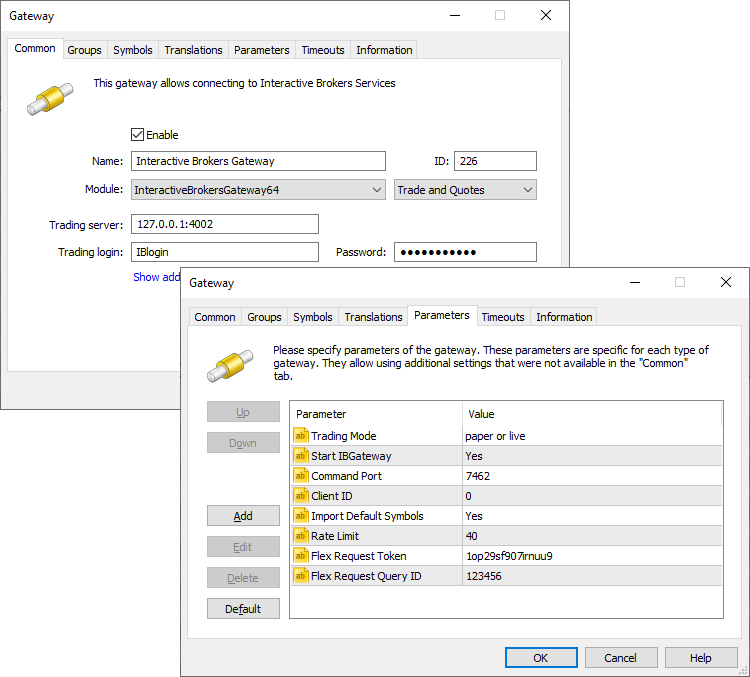

In the "Common" section:

  * Trading server — address 127.0.0.1 and port, which will be used by the gateway to establish an API-connection with IB Gateway. The gateway receives and sends data at this address. Address and port must be separated by a colon. Any free system port can be used. The default is 127.0.0.1:4002.
  * Trading login — user name for authorization in the Interactive Brokers system via IB Gateway.
  * Password — password for authorization.

In the "Parameters" section:

  * Trading Mode — your Interactive Brokers account type. Can be 'live' or ['paper'](https://www.interactivebrokers.com/en/software/omnibrokers/topics/papertrader.htm).
  * Start IBGateway — IB Gateway or TWS operation mode. To enable automatic IB Gateway launch by the gateway, set "Yes" (default). If the appropriate application is not found, the gateway will automatically deploy IB Gateway and will connect to it.
  * Command Port — command port via which connection to control IB Gateway will be established. Any free system port can be used. The default port is 7462.
  * Client ID — identifier of client API connection with which the gateway will connect to IB Gateway. You can use any value from 0 to 31. If several clients connect to one IB Gateway, you should ensure their Client IDs are unique. Value 0 is used by default.

To enable the gateway to connect IB Gateway to Interactive Brokers servers, please disable the two-factor authentication in your account settings. This can be done [in your personal account on the Interactive Brokers site](https://www.interactivebrokers.co.uk/sso/Login?RL=1). Navigate to Settings — User Settings — Secure Login System.

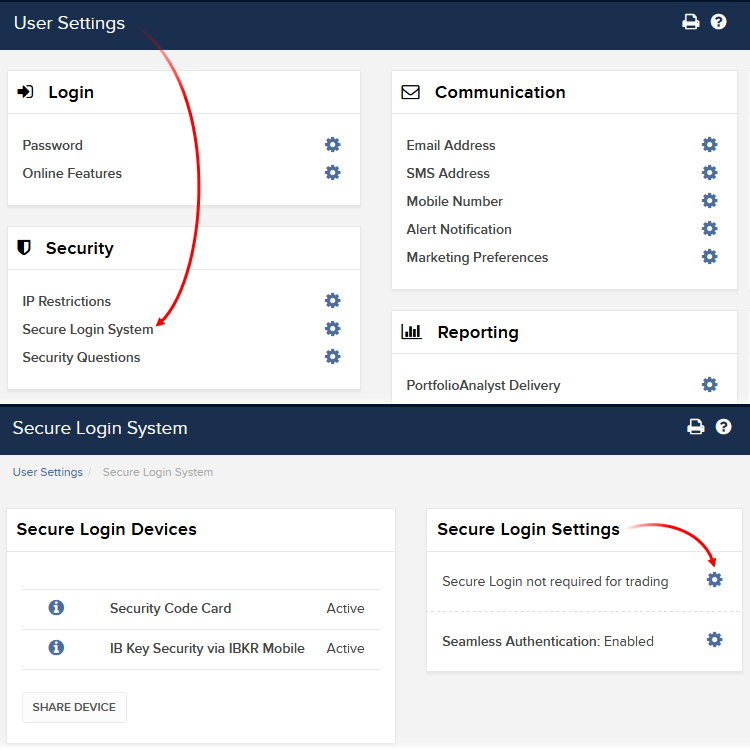

Click the gear icon next to "Secure Login required for trading". If this section is not available, please contact the Interactive Brokers technical support. Then select "I only want to use my Secure Login Device when logging into Account Management".

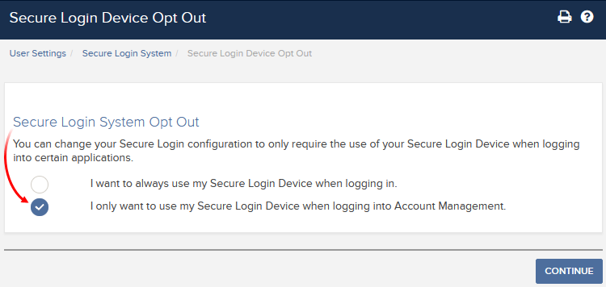

### Connection without local application launch (#connection-without-local-application-launch)

If for any reason you need to start IB Gateway (or TWS) manually, set the following parameters in the gateway configuration:

  * Trading server — address and port, which will be used by the gateway to establish an API-connection with IB Gateway, separated with a colon. The port must be previously specified in application settings.
  * Client ID — identifier of client API connection with which the gateway will connect to IB Gateway (or TWS). You can use any value from 0 to 31. If several clients connect to one IB Gateway, you should ensure their Client IDs are unique. Value 0 is used by default.
  * Start IBGateway — set "No", for the gateway to use connection to a remote IB Gateway (or TWS).

The port on which IB Gateway listens to incoming connections from the gateway should be configured under 'Configure' — 'Settings':

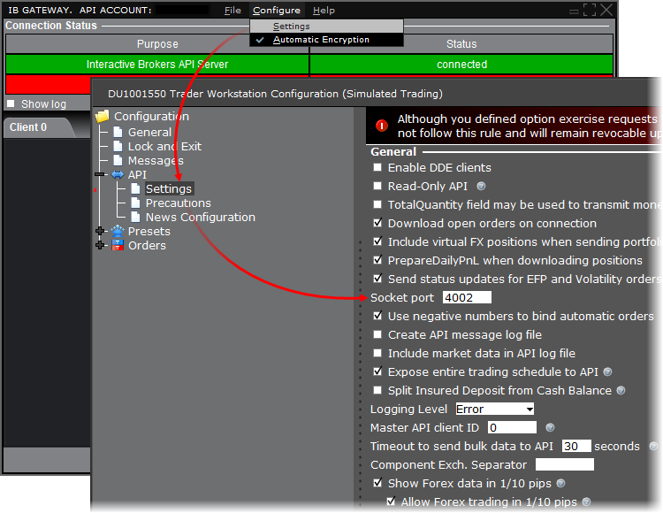

The port on which TWS listens to incoming connections from the gateway should be configured under 'Files' — 'Global Configuration':

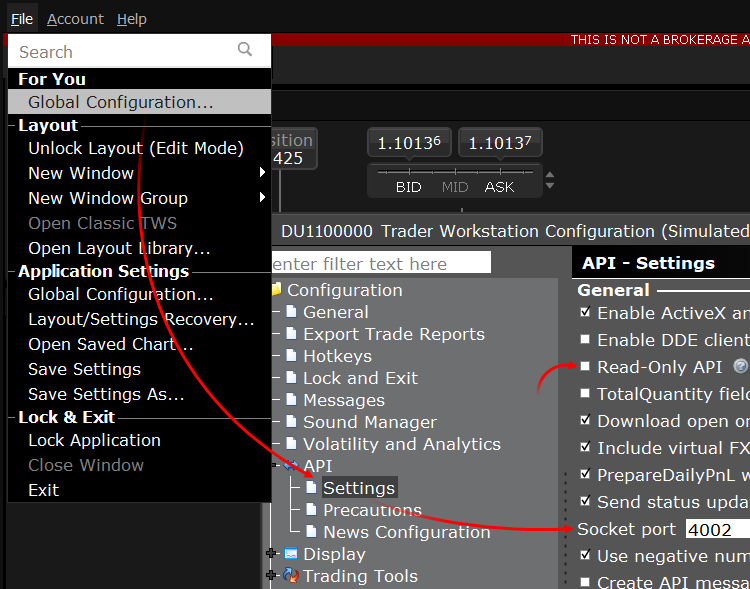

Any free system port can be used. Also it is necessary to disable the "Read-Only API" option in this section.

## Configuring financial instruments (#symbols)

Interactive Brokers provides access to a [variety of trading exchanges](https://www.interactivebrokers.co.uk/en/index.php?f=45165). Please visit the company's website for the [full list of trading symbols](https://www.interactivebrokers.co.uk/en/index.php?f=45167). API Interactive Brokers does not provide the ability to automatically download all available trading instruments, therefore, work with symbols can be organized in two ways:

### Built-in list of symbols (#built-in-list-of-symbols)

You can use the built-in list of symbols, which was created based on publicly available data provided by exchanges. This is the default method used in the gateway.

At start, the gateway creates the file [history server directory]\Gateway\IBGateway\<Gateway configuration name>\bases\instruments.csv with a predefined list of financial instruments. By default, the list contains symbols from the three most popular exchanges: NYSE, NASDAQ and AMEX. The file can be edited, and thus new symbols can be added or unused instruments can be deleted from it. According to this list, the gateway requests symbol specifications on the Interactive Brokers side and imports them to the trading platform, into InteractiveBrokers\<Exchange> symbol groups.

To enable this mode, allow the gateway access to the appropriate group of symbols on the trading platform side. Add it to the ["Symbol" section of the gateway settings (#symbols)](../../Platform-Setup/Gateways/Configuration-of.md#symbols):

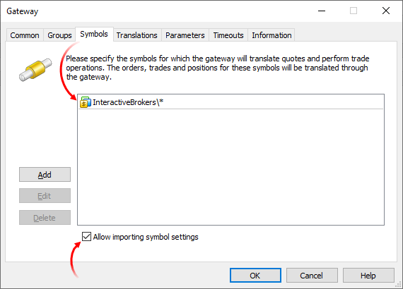

Also, make sure to enable "Allow importing symbol settings" option.

Each symbol description is contained in the instruments.csv file. Each symbol description starts with a new line and has the following format: "<Symbol>,<Type>,<Exchange>". The following values can be used for the instrument type:

  * STK — stock or ETF
  * OPT — option
  * FUT — futures
  * IND — index
  * FOP — futures option
  * CASH — Forex
  * BAG — combo
  * WAR — warrant
  * BOND — bond
  * CMDTY — commodity
  * FUND — mutual fund

Example of instruments.csv contents:

AAPL,STK,NASDAQ   
MSFT,STK,NASDAQ   
MSFT,STK,MEXI   
LE,FUT,GLOBEX   
ES,FUT,GLOBEX   
NQ,FUT,GLOBEX   
EUR,FUT,GLOBEX   
GBL,FUT,DTB   
DAX,FUT,DTB   
EUR.USD,CASH,IDEALPRO   
ES,FUT,GLOBEX,201912   
ES,FOP,GLOBEX,201912  
---  
  
This file can be edited and thus you can add new symbols or delete unused ones.

A symbol name used by Interactive Brokers can differ from its traditional name used on the exchange. The same applies to the exchange name. To check symbol and exchange names, please visit the Interactive Brokers website, section [Product Listings](https://www.interactivebrokers.co.uk/en/index.php?f=45167). For example, to find Microsoft stocks traded on the NASDAQ exchange, perform the following:

1\. Select the NASDAQ exchange (NASDAQ) from the list:

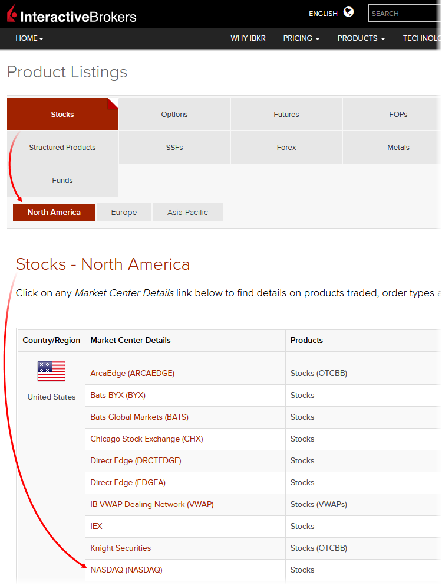

2\. Find the company name by specifying Microsoft in the search bar and find the symbol name in the table. Next, open the page with the detailed symbol description: it features the names of the exchange in which the instrument is traded:

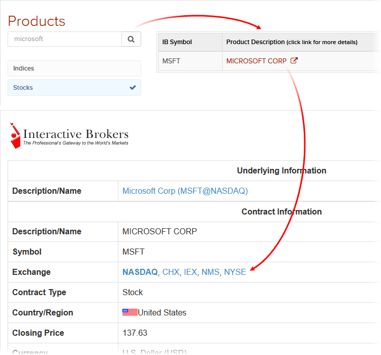

In this example, the MSFT security is traded on five exchanges: NASDAQ, CHX, IEX, NMS, NYSE, however the main exchange is the one marked in bold, i.e. NASDAQ. Thus, the following should be specified in file instruments.csv: MSFT,STK,NASDAQ.

### Creating symbols manually (#creating-symbols-manually)

Instead of using the built-in list, you can create your own list of required sybmols. You only need to create a configuration with proper naming and leave default settings. Using the platform list, the gateway will request appropriate configurations from Interactive Brokers and will update them if the symbol is found.

We recommend creating all symbols in a separate subcategory, for example InteractiveBrokers. This will enable efficient control of traders' access to liquidity using [group settings (#symbols)](../../Platform-Setup/Groups/Group-Settings.md#symbols). All symbols should be named according to the following rule: <Symbol>.<Exchange>. For example, AAPL.NASDAQ, MSFT.MEXI etc.

After creating all required symbols allow the gateway access to them. This can be done by adding the relevant symbol category to the ["Symbols" section under gateway settings (#symbols)](../../Platform-Setup/Gateways/Configuration-of.md#symbols):

Also, make sure to enable "Allow importing symbol settings" option.

The gateway will regularly (at least once a day) request symbol specifications on the Interactive Brokers side and, if necessary, update settings for these symbols in the MetaTrader 5 platform. If any of the symbols is not available for trading in InteractiveBrokers, the gateway will move it to the InteractiveBrokers\Deleted group.

To prevent the gateway from using the built-in list of symbols, set "No" for the parameter "Import Default Symbols".

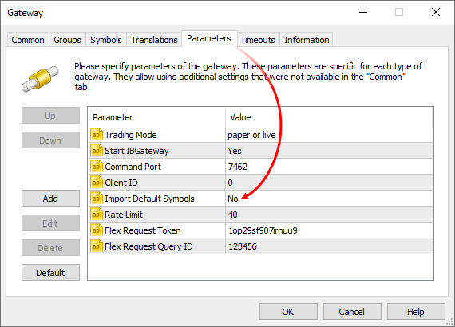

## Obtaining the history of trades (#history)

One of the main gateway purposes is to ensure a complete and correct trading history for each account on the MetaTrader 5 side. This is also required for a proper calculation of current open positions.

The gateway transmits all executed deals to the platform in real time. This includes results of operations requested directly from the platform as well as deals executed via other clients (for example, TWS). If the gateway is stopped for some time, it will need to retrieve from Interactive Brokers the history of all deals which were performed within this period. The gateway has two mechanisms, which are used depending on the downtime duration:

  * If the gateway was stops for no more than one trading day, the history of deals for the current trading day is requested.
  * When the gateway was down for a longer period, the history for the last year is requested.

No additional setup is required for requesting the last day deals, while the gateway can automatically retrieve them if necessary. The history of deals for the last year is requested from special Flex reports provided by Interactive Brokers. To enable access to the reports, you should set up a template and receive a token via a personal account.

> The history of deals can only be obtained when connected via IB Gateway. This functionality is not supported for TWS.

### Creating a Flex Token (#flex-token)

Go to your [personal account on the Interactive Brokers website](https://www.interactivebrokers.co.uk/sso/Login?RL=1) and select Settings — Account Settings section from the main menu. Then click the gear icon next to the Flex Web Service:

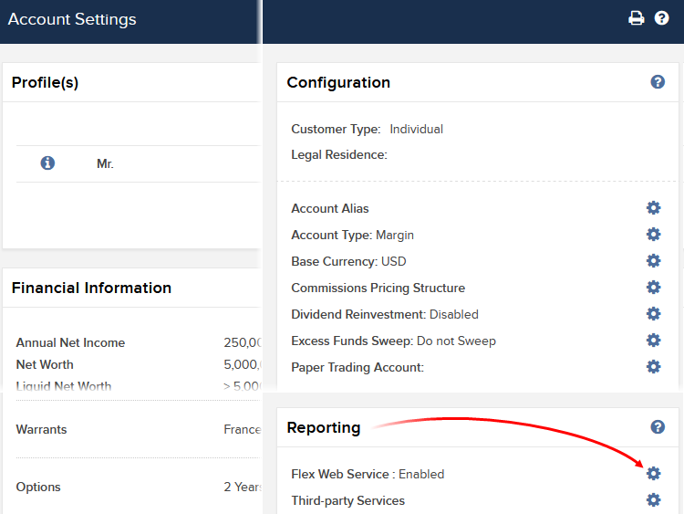

The "Configure Flex Web Service" window will open. Check the box next to "Flex Web Service Status" and click "GENERATE NEW TOKEN":

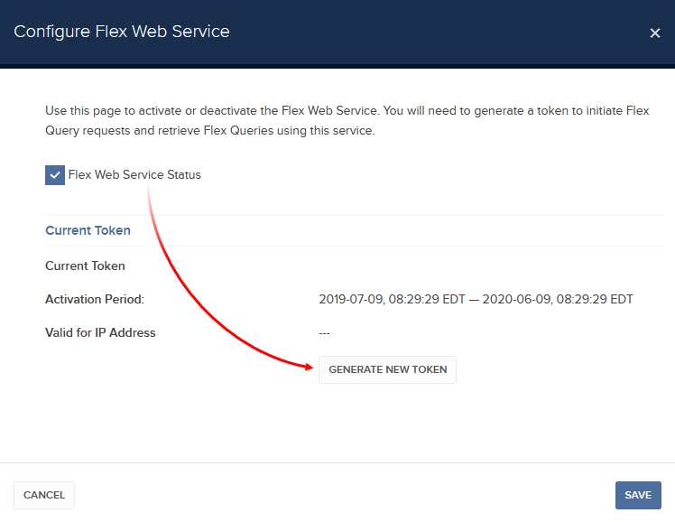

In the next step, select the token validity period of 1 year and click "GENERATE NEW TOKEN". Specify the the generated token in the "Flex Request Token" gateway parameter.

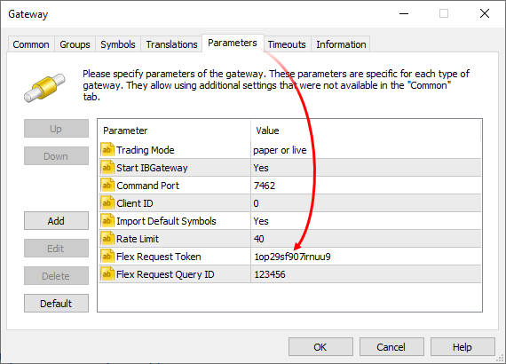

> When the token expires, generate a new one and update the corresponding gateway parameter.

### Creating a Flex Report template (#flex-report)

Open the menu in your personal account and go to the Reports — Tax Docs section:

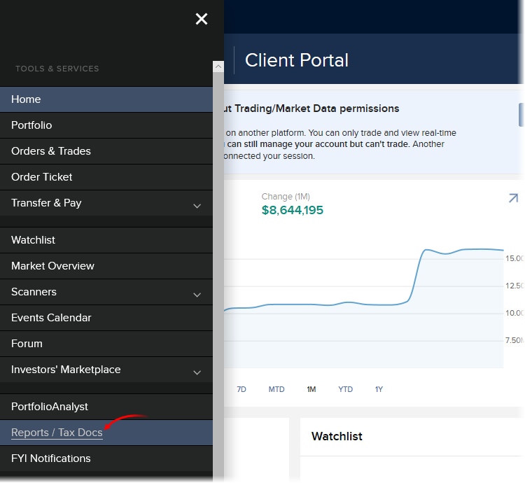

Add a new report on the "Flex Queries" tab. Click the plus icon in the "Activity Flex Query" section:

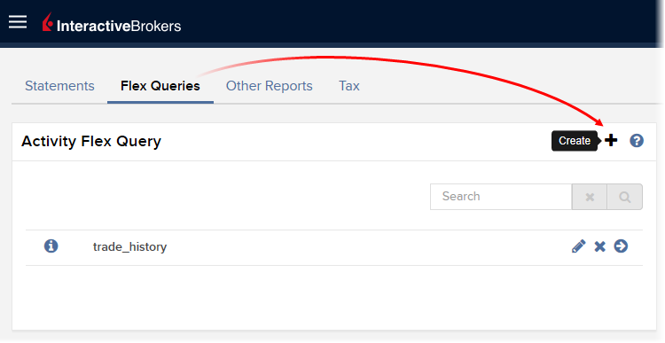

Specify the desired name for the report, and then select "Trades" under Sections.

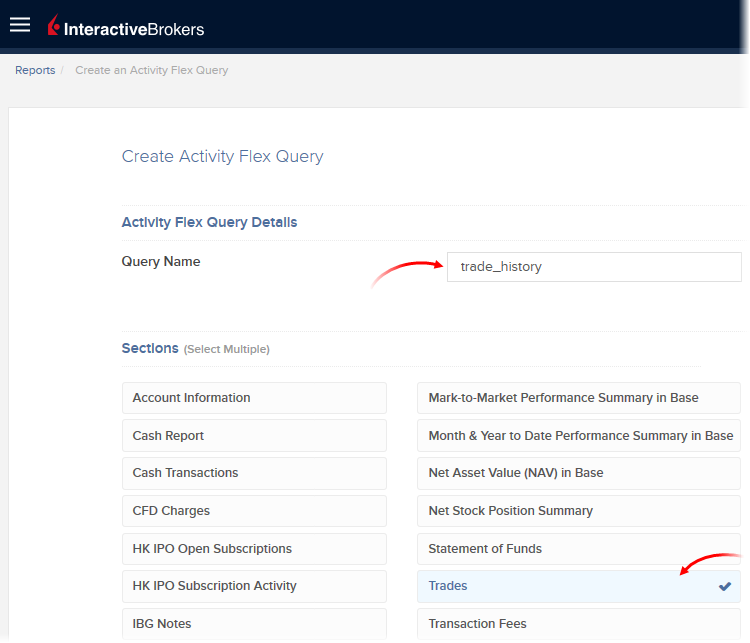

In the next window, select "Executions" and the following fields:

  * AccountID
  * Symbol
  * Currency
  * Conid
  * Date/Time
  * ListingEchange
  * Exchange
  * TradeID
  * IBExecutionID
  * Quantity
  * TradePrice
  * IbCommission

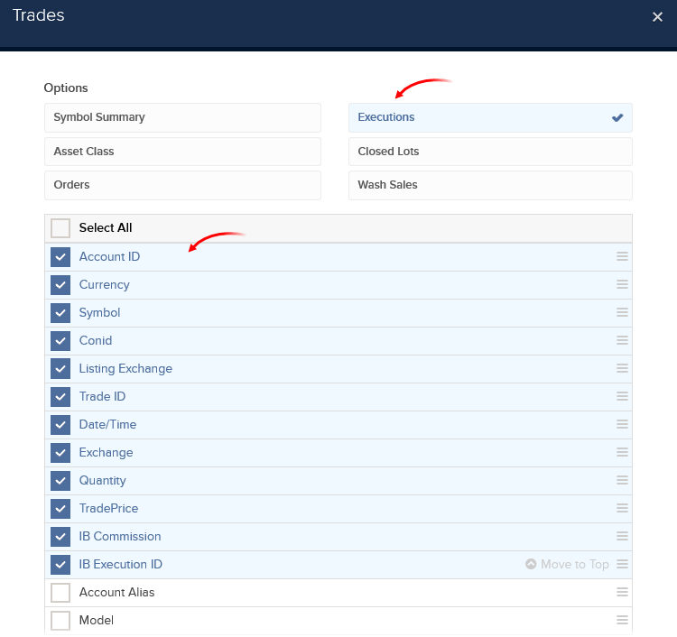

Then click "Save". Select the following options under the "Delivery Configuration" section:

  * Accounts — all accounts in Interactive Brokers which are available to the gateway
  * Models — Optional
  * Format — XML
  * Period — Last 365 Calendar Days

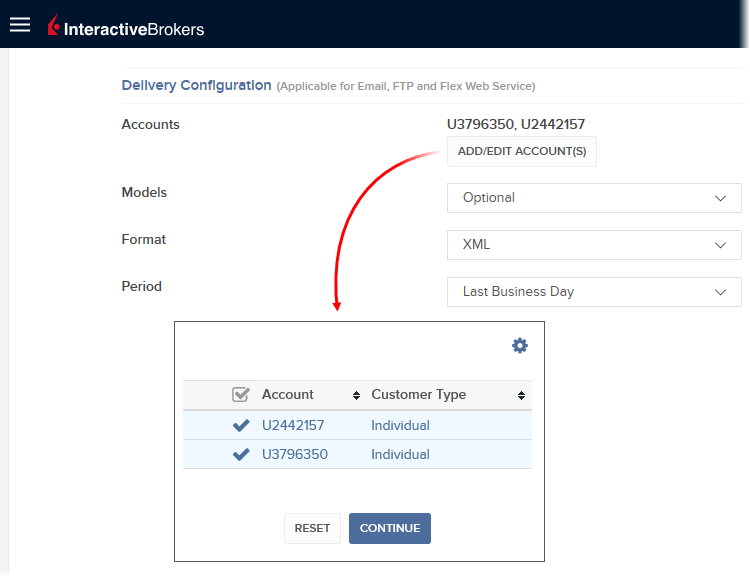

Set the required data format under the "General Configuration" section:

  * DateFormat — yyyMMdd
  * TimeFormat — HH:mm:ss
  * Date/Time Separator — single-space

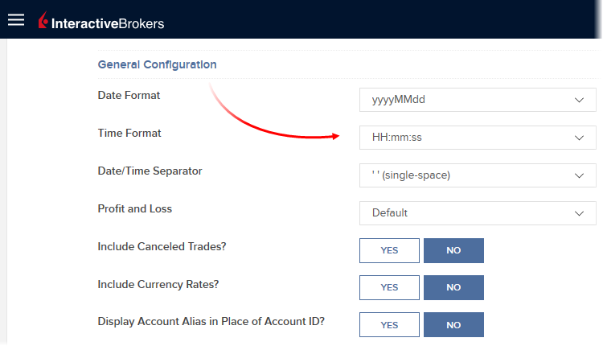

Then click "Continue". Continue settings in the next window and click "Create".

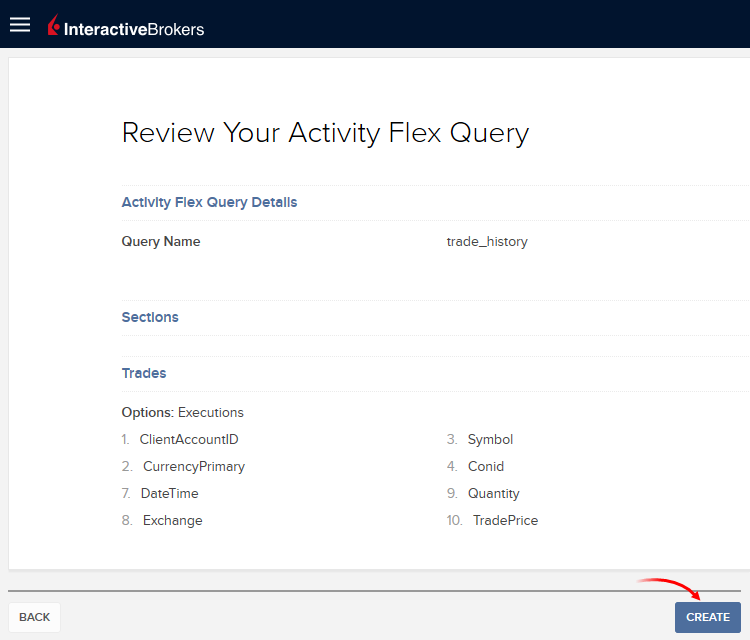

You can find out the new report ID by clicking on the edit button:

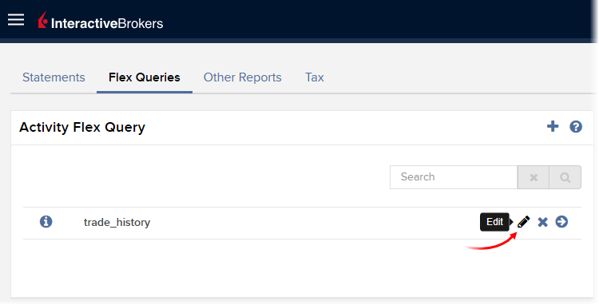

The report ID will be shown in the upper part of the window. Copy this text.

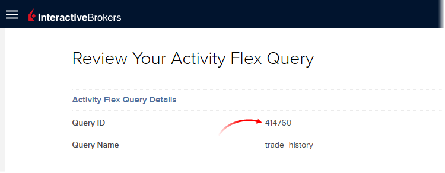

Paste this ID as value of the "Flex Request Query ID" parameter in gateway settings:

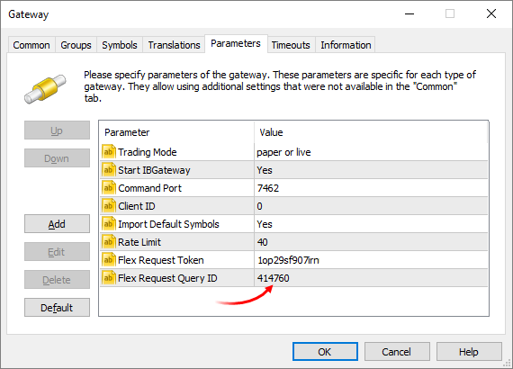

## Interactive Brokers API request limit (#limitations)

Interactive limits request sending frequency to 50 requests per second. Depending on the IB Gateway version used by the gateway, the exceeding the limit may have different consequences:

  * IB Gateway version below 974 — if the limit is exceeded, connection with IB Gateway (or TWS) is automatically closed.
  * IB Gateway version above 974 — if the limit is exceeded, connection is not closed, but request processing can slow down significantly.

You can set your own limit to the frequency of request sending by gateway, using the Rate Limit parameter. It is set to 40 by default, which is the recommended request frequency for the stable operation with IB Gateway version below 974.

## Configuring groups trading accounts (#accounts)

[Create groups](../../Platform-Setup/Groups.md) for trading accounts, whose operations will be forwarded via the Interactive Brokers gateway. For example, real\ib. Then add it to the "Groups" section of gateway settings:

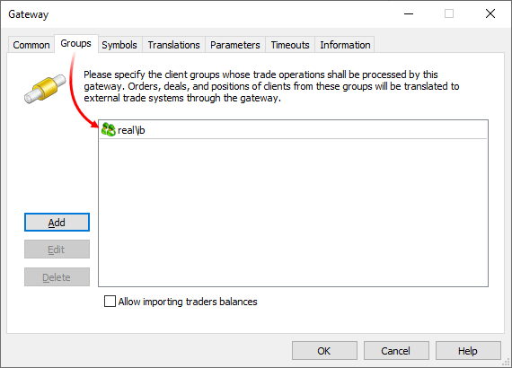

In the specified group, create accounts trade operations from which will be processed by the gateway.

The gateway trades in the one-to-one mode, i.e. each trading account on the Interactive Brokers side can correspond to only one account on the MetaTrader 5 platform side. Therefore, in the ["Account" section (#account)](../../Platform-Setup/Accounts/Editing-Account.md#account) of each account to be managed by the gateway you should specify an appropriate account code on the Interactive Brokers side. Specify your Interactive Brokers gateway configuration as the gateway ID.

## Configuring Trade Requests Routing (#routing)

Configure the routing to forward client requests to the Interactive Brokers gateway. To do this, add a routing rule to the relevant [MetaTrader 5 Administrator](../../Platform-Setup/Routing.md) section.

Select "Process to dealers" as an action in common settings. Assign this routing rule for all requests and orders. In additional conditions, indicate groups of clients, whose requests will be passed to the gateway.

In the screenshots below all orders created by users in the real\ib\* groups for the symbols from the InteractiveBrokers\* section will be forwarded to the gateway for processing.

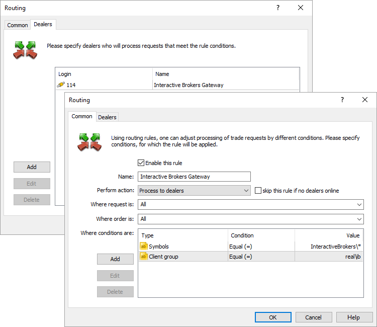

Once the rule has been added, set the required [priority (#execution)](../../Platform-Setup/Routing.md#execution) for it relative to other rules, by moving it to the desired position in the list.

## Receiving Level 1 market data (#marketdata)

The gateway enables broadcasting of real-time financial symbol quotes to the platform. The data include the best Bid and Ask prices, as well as prices and volumes of performed trades (Last, Volume).

To start receiving symbol quotes, add them to the "Marketdata" or any nested subgroup. For example, you have added all symbols, which should be processed via Interactive Brokers, to the InteractiveBrokers\* subgroup. Create the "Marketdata" subgroup under this group and add to it all the symbols for which you want to receive quotes.

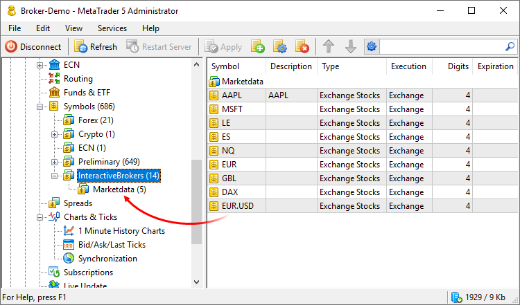

After that, the gateway will subscribe to appropriate Interactive Brokers data and will start delivering them to the platform. In the above example, the gateway will provide quotes for 5 symbols of the 14 symbols operated via Interactive Brokers. To stop receiving symbol quotes, move it away from the Marketdata subgroup.

Please note that the "Marketdata" symbol group must be accessible to the gateway. For example, if you create it under the InteractiveBrokers\* section which has earlier been added to the gateway settings, no additional actions will be required. If you create it under a different section, you should add an appropriate path to the gateway settings.

  * You can enable or disable the delivery of quotes at any time, by moving the symbols to/from the "Marketdata" subgroup. The gateway will immediately subscribe or unsubscribe from the relevant data.
  * Be default, Interactive Brokers enables the delivery of quotes for [up to 100 financial instruments simultaneously (#market-lines)](https://interactivebrokers.github.io/tws-api/market_data.html#market-lines). If quotes for more symbols are required, please contact Interactive Brokers and request an appropriate subscription.
  * Receiving quotes from Interactive Brokers is optional. You can use the gateway only for working with trading operations, while enabling data delivery via separate datafeeds, such as [IQ Feeder](../Data-Feeds/IQFeeder.md).

  
---  
  

## Using Multiple Gateways Simultaneously (#multiple)

The platform does not impose restrictions on the simultaneous use of multiple copies of Interactive Brokers gateways, neither technically nor from the point of view of license permissions. It means you can forward trading operations for execution via several Interactive Brokers accounts.

Please pay attention to the following requirements when configuring the gateways:

1\. All gateways must use different logins for connection to InteractiveBrokers. They must use different ports for establishing an API connection with the IB Gateway application:

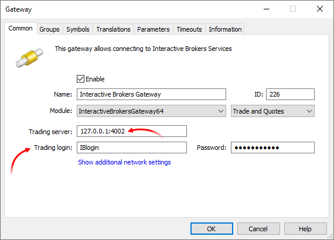

2\. Command Port parameter values must be different.

3\. Each gateway must use Flex token and Flex query ID specifically configured for its login.

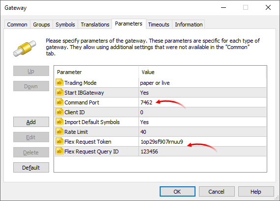

4\. Appropriate gateway configurations must be specified in trading accounts on the MetaTrader 5 side. The specified Interactive Brokers accounts must be available to the selected gateways.

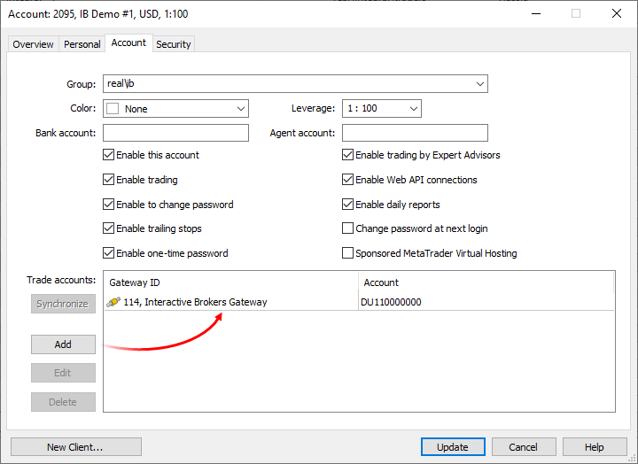

5\. If several gateways have access to the same symbols in the MetaTrader 5 trading platform, it is recommended to disable the "Allow importing symbol settings" option for all but one of the gateways.

## Configuring operation through a proxy server (#proxy)

In case the Internet access is provided through a proxy on the machine where the gateway is running, specify the relevant parameters:

  * Proxy Server — the proxy server address in the format of <protocol>://<address>:<port>. For example, socks4://192.168.0.1:4145. Supported protocols include http, socks4 and socks5. Gateway queries, such as flex report requests, will be sent through the specified server.
  * Proxy Login — a login for authentication in the proxy server.
  * Proxy Password — a password for authentication in the proxy server.

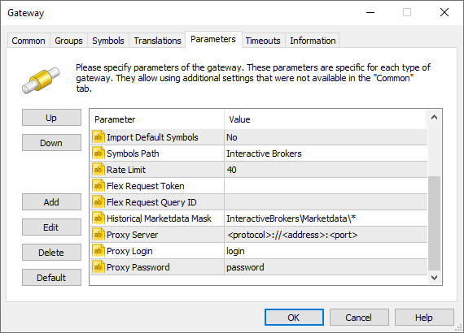
