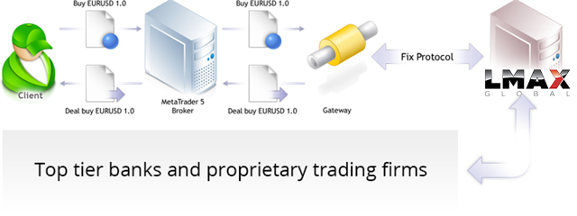
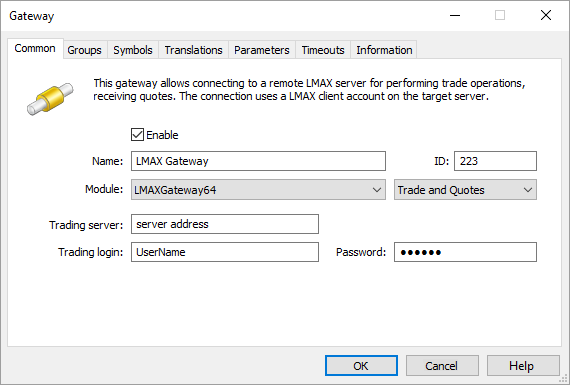
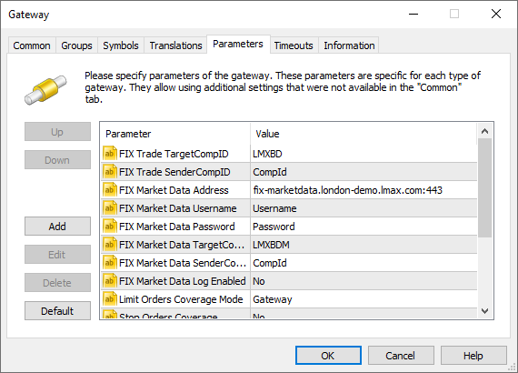
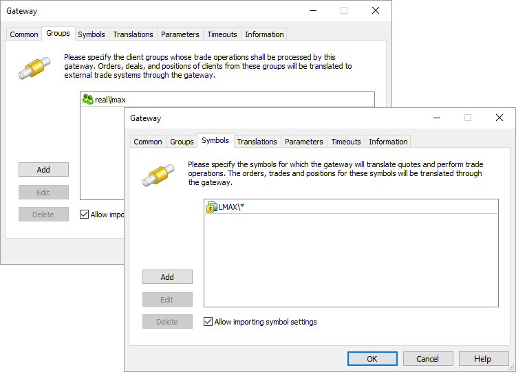
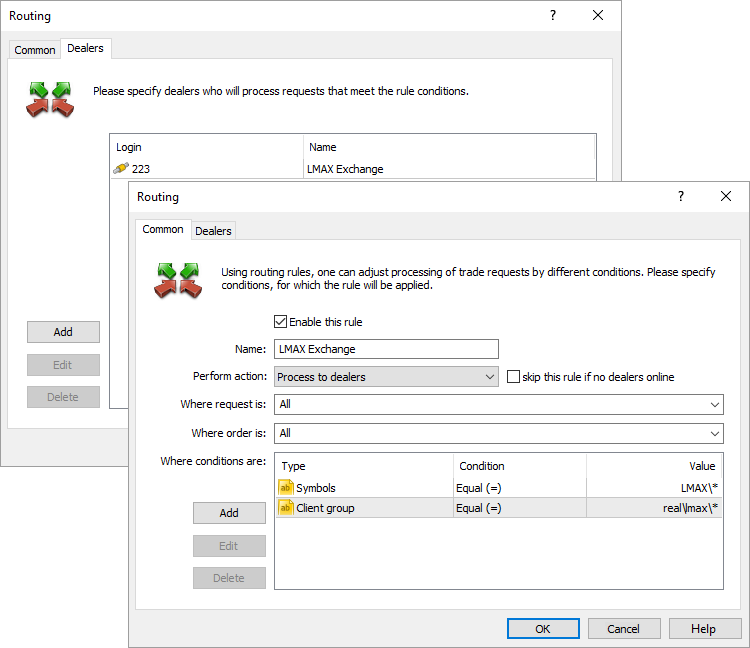
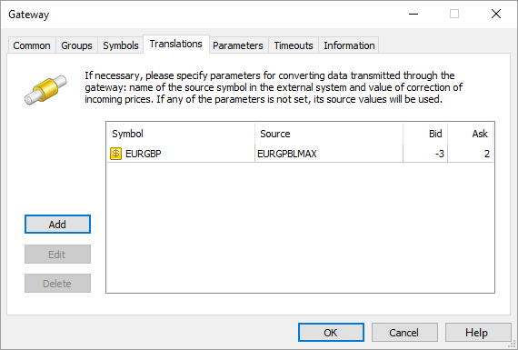

[🏠 Document Start](../../../README.md) / [MetaTrader 5 Trading Platform](../../../MetaTrader-5-Trading-Platform.md) / [Platform Components](../../Platform-Components.md) / [Gateways](../Gateways.md) / LMAX Global

[Previous](Cboe-FX.md) | [Next](FXCM-PRO.md)

# MetaTrader 5 Gateway to LMAX Global (#metatrader-5-gateway-to-lmax-global)

[LMAX Global](https://www.lmax.com/global) is a large London-based multilateral trading facility (MTF) providing access to the institutional level liquidity. Being registered as MFT, LMAX applies exchange style trading model – the market depth is formed only by limit orders of major financial institutions. LMAX provides reliable execution within three milliseconds at more than 70 Forex and CFD symbols, transparent operation, anonymous trading and access to twenty market depth levels.

MetaTrader 5 Gateway to LMAX is a simple, fast and secure integration solution for brokers. The gateway provides institutional level liquidity when working in MetaTrader 5.

LMAX Global key advantages:

  * Over 70 Forex and CFD symbols
  * Metals, indices and commodities
  * Average trading operation execution time – 4 ms
  * Processing up to 40 000 orders per second
  * No deviations, requotes and "last look" (canceling order at the last moment)
  * Commission discounts depending on a broker's turnover
  * LMAX Global trading systems (matching engine) are located in London (Equinix LD4 data center) and Tokyo (Equinix TY3 data center). The system can be accessed both via the Internet and via cross connect cable in the data center where LMAX\s servers are hosted.

The complete list of advantages and available trading instruments can be found on the [official website](https://www.lmax.com/exchange/trading "LMAX Global advantages").

## Getting started with LMAX Global (#getting-started-with-lmax-global)

First, connect LMAX Global using the contact details on the official website: <https://www.lmax.com/global/contact>. After concluding an agreement, you will receive all necessary data for connecting to LMAX Global trading system.

> [Order MetaTrader 5 Gateway to LMAX Global](https://support.metaquotes.net/en/market/product/268)

## How the gateway works (#how-the-gateway-works)

MetaTrader 5 Gateway to LMAX Global is a separate LMAXGateway64.exe module that uses the MetaTrader 5 Gateway API for operation. The gateway works via two FIX channels: the first one is for trading, while the second one is for market data.

All orders entered in LMAX Global are transferred to the unified requests database. The system selects appropriate orders automatically executing opposite orders with matching parameters (symbol, price etc.)

### Market data (#market-data)

MetaTrader 5 Gateway to LMAX Global automatically imports all the necessary symbols and processes their properties. The administrator only needs to perform a primary [setup (#symbols)](LMAX-Global.md#symbols).

Price data is transmitted in real time. The gateway is capable of narrowing or expanding prices on the go: quotes can be converted according to the settings when passing them to the platform and then re-converted back to their original state when passing trade operations to LMAX Global. Detailed information on [prices conversion (#markup)](LMAX-Global.md#markup) is available below.

### Trading operations (#trading-operations)

Orders are sent to MetaTrader 5 Gateway to LMAX for processing in accordance with the set [routing rules (#routing)](LMAX-Global.md#routing). Processing of requests depends on the type of the order, as well as on the gateway configuration.

All traders' orders are sent to LMAX Global through a single broker account.

Order type | Execution  
---|---  
Market order | Delivered directly to LMAX Global as a market order.  
Take Profit Buy Limit Sell Limit | Depends on [Limit Orders Coverage Mode (#parameters)](LMAX-Global.md#parameters): Limit Orders Coverage Mode=Gateway (default) Limit orders are processed on the side of LMAX Exchnage. Once a limit order has been placed by a client, an appropriate order is sent to LMAX Global. There it is placed in the aggregate Depth of Market awaiting for an opposite request with the same price to appear. Thus, clients can see their requests in the Depth of Market in the client terminal in real time. Take Profit orders are processed the same way as in Limit mode. The LMAX Global system checks the availability of the required amount of funds to cover any type of order placed via the gateway. However, the check is performed on the broker's general account, on behalf of which the work is carried out. [Margin reservation (#margin)](LMAX-Global.md#margin) of the clients should be configured for the appropriate order types in case Limit orders are directly delivered to an external system. By default, the margin is charged on the side of MetaTrader 5 only when market orders are placed. When placing pending orders in an external system, the client's available funds should be controlled on the side of MetaTrader 5 before the orders are transferred to avoid using all broker's funds by the client. Limit Orders Coverage Mode=Limit Limit Orders and Take Profit orders are processed on the side of the MetaTrader 5. Once a limit order is triggered, an equivalent limit order is sent with the expiration time at the end of the current trading day (intraday). Since the price specified in the order is already present in the market, the order will be executed with that price – a market deal will be performed. If the necessary volume of the financial instrument is not available in the market at the specified price, the order will be executed partially. In this case, a client will have a market position as well as a limit order with a residual volume, which will be further processed in a similar way on the side of MetaTrader 5. A limit order with the price equal to a Take Profit level is sent to LMAX Echange at the moment a Take Profit order has been activated. Since the price specified in the order is already present in the market, the order will be executed with that price – a market deal will be performed. If the necessary volume of the financial instrument is not available in the market at the specified price, the order will be executed partially. The client's position will be closed partially. Control over the Take Profit position level with the remaining volume will then be carried out on MetaTrader 5 side.   
Limit mode allows you to protect against slippage, as a limit order is sent to LMAX Global system with a specified price rather than a market order for execution by the current price. Limit Orders Coverage Mode=Market Limit orders and Take Profit orders are processed on the MetaTrader 5 platform side. Once they trigger, an appropriate market order is sent to LMAX Global.  
Buy Stop Sell Stop | Depends on [Stop Orders Coverage (#parameters)](LMAX-Global.md#parameters): Stop Orders Coverage=Y Delivered directly to LMAX Global. Similarly to limit orders, margin reservation of the clients should be configured for the appropriate order types on MetaTrader 5 side in case of direct delivery of stop orders to LMAX Global. Stop Orders Coverage=N Processed on the MetaTrader 5 platform side until their stop price is reached. After a stop order is activated, an appropriate market order will be sent to the LMAX Global system.  
Buy Stop Limit Sell Stop Limit | Depends on Stop Orders Coverage: Stop Orders Coverage=Y Delivered directly to LMAX Global. Similarly to limit orders, margin reservation of the clients should be configured for the appropriate order types on MetaTrader 5 side in case of direct delivery of stop limit orders to LMAX Global. Stop Orders Coverage=N Processed on the MetaTrader 5 side. Upon order activation, an appropriate limit order is created in MetaTrader 5, and this order is then processed in accordance with the value of the Limit Orders Coverage Mode parameter.  
Stop Loss Stop Out | Processed on the MetaTrader 5 side. Once they trigger, an appropriate market order is sent to LMAX Global.  
  
> In case connection to  server is lost, the application will try to restore it repeatedly. If pending orders were executed during the disconnection period, they will be updated in the MetaTrader 5 platform after successful reconnection.

## Gateway setup (#settings)

To start working, add [the new gateway configuration](../../Platform-Setup/Gateways.md):

Set the following parameters on the "Common" tab:

  * ID – unique dealer identifier, on whose behalf the trade requests will be processed. Requests are routed to the gateway according to this identifier.
  * Module – specify LMAXGateway64 and accept the default settings after the module selection.
  * Trading server – LMAX Global server IP-address and the port, where trade requests are processed. This information is provided by LMAX Global as parameters DNS and Port. An encrypted SSL connection to a server is established by default. If you need to establish an unencryprted connection, additionally specify the /nossl key in the address bar. For example: 10.123.100.17:10219/nossl.  
If connection to a trade server is not required (the gateway only receives quotes from LMAX Global), leave this field empty.
  * Trading login – login for connecting the trade flow corresponding to UserName tag (553) in FIX protocol. Provided by LMAX Global.
  * Password – password for connecting the trade flow corresponding to Password tag (554) in FIX protocol. Provided by LMAX Global.

  * ID value must be unique in the field of manager logins and gateway identifiers.
  * The details for connection to the LMAX Global server where trade requests are processed will be provided during the agreement conclusion.

  
---  
  
Now, go to the "Parameters" tab.

Specify the following parameters values here:

  * FIX Trade TargetCompID – standard parameter of the FIX messages heading used for trading messages recipient identification. This parameter is provided by LMAX Global as the value of TargetCompID (56).
  * FIX Trade SenderCompID – standard parameter of the FIX messages heading used for a data sender identification. This parameter is provided by LMAX Global as the value of SenderCompID (49).
  * FIX Market Data Address – IP address and port of the LMAX Global server, from which market (price) data is transmitted. This information is provided by LMAX Global as parameters DNS and Port. An encrypted SSL connection to a server is established by default. If you need to establish an unencryprted connection, additionally specify the /nossl key in the address bar. For example: 10.123.100.17:10219/nossl.  
If connection to a quoting server is not required (the gateway only passes trading operations), leave this field empty.
  * FIX Market Data Username – login for connecting the trade flow corresponding to UserName tag (553) in FIX protocol. Provided by LMAX Global.
  * FIX Market Data Password – password for connecting the trade flow corresponding to Password tag (554) in FIX protocol. Provided by LMAX Global.
  * FIX Market Data TargetCompID – standard parameter of the FIX messages heading used for market messages recipient identification. This parameter is provided by LMAX Global as the value of TargetCompID (56).
  * FIX Market Data SenderCompID – standard parameter of the FIX messages heading used for a market data sender identification. This parameter is provided by LMAX Global as the value of SenderCompID (49).
  * FIX Market Data Log Enabled – if Yes, the gateway saves FIX connection (market flow) logs. Enable the parameter only in case of the gateway operation issues. The default value is No.
  * Limit Orders Coverage Mode – the mode of processing of Limit and Take Profit orders by the gateway. This parameter simplifies configuration of trade requests routing to the gateway, since there is no need to create a separate rule for routing the appropriate order types. Three processing modes are available:
    * Market – limit and Take Profit orders are processed on the MetaTrader 5 platform side. If an order is activated, an appropriate market order is sent to the LMAX Global system.
    * Limit – limit and Take Profit orders are processed on the MetaTrader 5 side.  
Once a limit order is triggered, an equivalent limit order is sent to LMAX Global. The order remains valid till the end of the current trading day (intraday). Since the price specified in the order is already present in the market, the order will be executed with that price – a market deal will be performed. If the necessary volume of the financial instrument is not available in the market at the specified price, the order will be executed partially. In this case, a client will have a market position as well as a limit order with a residual volume, which will be further processed in a similar way on the side of MetaTrader 5.   
A limit order with the price equal to a Take Profit level is sent to LMAX Global at the moment a Take Profit order has been activated. Since the price specified in the order is already present in the market, the order will be executed with that price – a market deal will be performed. If the necessary volume of the financial instrument is not available in the market at the specified price, the order will be executed partially. The client's position will be closed partially. Control over the Take Profit position level with the remaining volume will then be carried out on the MetaTrader 5 side.   
Limit mode allows to protect against slippage, as a limit order is sent to the LMAX Global system with a specified price rather than a market order for execution by the current price. In addition, this mode allows you not to reserve margin on a client's account before sending an order to LMAX Global.
    * Gateway – limit orders are processed on the LMAX Global side. Once a limit order has been placed by a client, an appropriate order is sent to LMAX Global. Take Profit orders are processed the same way as in the Limit mode.
  * Stop Orders Coverage – mode of handling stop and stop limit orders. In case of 'Y' value, these order types will be transferred to LMAX Global directly. In case of 'N' value, the orders will be processed inside MetaTrader 5 platform until their stop price is reached. After a stop order is activated, an appropriate market order will be sent to the LMAX Global system. After a stop limit order has been activated, a limit order is created, which will be processed according to Limit Orders Coverage Mode parameter value.
  * Quotes Delay — delay of transmitted quotes in seconds. The maximum duration of quotes delay is 20 minutes (1200 seconds). The flow of delayed quotes is neither thinned out, nor changed. A quote is passed to MetaTrader 5 History Server only after the expiration of delay period since the quote has arrived to Gateway API. If the temporary delay parameter is not defined, the quote delay is not used. Changes in depth of market and price statistics are delayed together with the quotes flow.
  * Quotes Tickstats Sample — the minimum frequency of sending price statistics in milliseconds. This parameter allows thinning out updates of price statistics reducing the traffic.
  * Quotes Ticks Sample — the minimum frequency of sending quotes in milliseconds. This parameter allows thinning out updates of quotes reducing the traffic. It is recommended for use on demo servers only.
  * Quotes Books Sample — the minimum frequency of depth of market updates in milliseconds. This parameter allows thinning out updates of the depth of market reducing the traffic. It is recommended for use on demo servers only.

  * In no circumstances it is allowed to change operations transfer mode while in operation. Changing the mode is allowed only after all client positions are closed.
  * Margin reservation of the clients should be configured for the appropriate order types [in case Limit, Stop and/or Stop Limit orders (#margin)](LMAX-Global.md#margin) are directly transferred to an external system.

  
---  
  
The next stage is to specify the groups of the clients, whose requests will be processed via the MetaTrader 5 Gateway to LMAX, as well as symbols, by which the gateway processes trading operations and broadcasts quotes.

The gateway supports [more than 100 LMAX instruments (#supported-symbols)](LMAX-Global.md#supported-symbols). Make sure to enable "Allow importing symbol settings" option. The gateway imports symbols from LMAX Global to Symbols/Preliminary/LMAX directory of the MetaTrader 5 and manages their parameters.

  * Initially, all imported symbols have trading ability disabled. System administrator must relocate imported symbols to the proper subgroup and allow trading for them.
  * After the symbols are relocated and trading abilities are enabled, the main trading server must be restarted.

  * Only [Market or Exchange execution](../../Platform-Setup/Symbols/Symbol-Settings/Execution.md) can be used for the symbols. In all other cases, operations will be rejected.

  * In case the gateway transmits configuration for the symbol that is already present in the platform, the configuration is updated. In this case the symbol is not transferred and its trading ability is not turned off.
  * The gateway supports conversion of symbols and quotes. For details, please view the [Symbol and Price Translation](../../Platform-Setup/Gateways/Symbol-and-Price-Translation.md) section.

  
---  
  

## Margin setup (#margin)

Margin reservation of the clients should be configured for the appropriate order types in case Limit, Stop and/or Stop Limit orders are directly transferred to an external system.

The external system checks the funds that are necessary to provide any type of order placed via the gateway. However, the check is performed on the broker's general account, on behalf of which the work is carried out.

By default, the margin is charged on the side of MetaTrader 5 only when market orders are placed. When placing pending orders in an external system, the client's available funds should be controlled on the side of MetaTrader 5 before the orders are transferred to avoid using all broker's funds by the client.

After an order has been transferred to the external system, MetaTrader 5 platform is not able to check the client's margin sufficiency any more. After the order has been executed in the external system, the gateway cannot ignore that fact. Therefore, the appropriate trading operation is performed in the platform.

Set non-zero coefficients for the orders directly transferred to the external trading system in symbol settings for the appropriate symbols:

## Configuring trade requests routing (#routing)

Configure the routing to let the client requests to be transmitted to the LMAX Global gateway. To do this, add a routing rule to the relevant [MetaTrader 5 Administrator](../../Platform-Setup/Routing.md) section.

Select "Process to dealers" as an action in common settings. Assign this routing rule for all requests and orders. In additional conditions, indicate groups of clients, whose requests will be passed to the gateway.

The screenshots below all orders created by users in the real\lmax\* groups by symbols from the LMAX\* section will be sent to the gateway for processing.

After the correct execution of the steps described above, the gateway will be ready for work.

## Changing Symbols Names and Markups (#markup)

The gateway receives the prices from LMAX Global and transmits them to clients considering markups. Thus, a brokerage company receives its profit share from each deal performed at LMAX Global. Markup values are set separately for Bid and Ask prices by each symbol:

Besides, you can configure matching of symbol names used in LMAX Global with the names used in your MetaTrader 5 platform. For example, if the symbol name in LMAX Global is EURGBPLMAX, and it is called EURGBP in the MetaTrader 5, enter EURGBP in the "Symbol" field and EURGBPLMAX in the "Source" field.

The above screenshot shows price conversion: at every tick, the Bid price will be reduced by 3 points, and the Ask price will be increased by 2 points. Below is a schematic example of the correction:

LMAX Global | >>> | ask price | EURGBP 0.83004 | >>> | MetaTrader 5 server  
---|---|---|---|---|---  
MetaTrader 5 server | >>> | ask price | EURGBP 0.83006 | >>> | Client terminal  
Client terminal | >>> | buy limit | EURGBP 0.83006 | >>> | MetaTrader 5 server  
MetaTrader 5 server | >>> | buy limit | EURGBP 0.83004 | >>> | LMAX Global  
LMAX Global | >>> | buy limit execution | EURGBP 0.83004 | >>> | MetaTrader 5 server  
MetaTrader 5 server | >>> | buy limit execution | EURGBP 0.83006 | >>> | Client terminal  
  
A broker gains 2 pips of profit in this example. The price is sent to the client terminal only after the correction, so the clients work only with the corrected prices. If no correction is set for a symbol, the client will work with the original prices submitted by LMAX Global.

## Prices Round Off (#prices-round-off)

During the gateway's operation, accuracy of quotes (decimal places) passed for some symbol may change in the external trading system. Decrease in price accuracy at the external trading system's side does not affect the gateway's operation. It still transmits prices with less accuracy. However, if the number of decimal places at the external system's side increases, the gateway starts rounding off the passed prices.

Suppose that the accuracy of quotes has changed from 4 to 5 digits. Obtained five-digit quotes are rounded up by the gateway and used for creating the Market Depth. The round off is always performed in broker's favor. Thus, buy requests of 1.23447, 1.23441 are rounded up to 1.2345, while sell ones of 1.23447, 1.23441 are rounded down to 1.23440.

Changes in symbol price accuracy are recorded in the gateway journal.

## Volume conversion for different contract sizes (#volume-conversion-for-different-contract-sizes)

The gateway automatically converts the volume of orders sent to the exchange if the symbol's contract size in MetaTrader 5 differs from its contract size on the LMAX side. For example, if the contract size on the platform side is 10,000 while LMAX provides the size of 100,000, the 1-lot order will be sent to the exchange as a 0.1-lot order.

Before changing the contract size on the platform side, make sure that you do not have open positions or orders for LMAX symbols. Restart the gateway after changing the contract size. After that an entry about mismatching contract sizes will be printed to the gateway journal, such as:

Gateway symbol AUDCHFLMAX contract sizes are different at MT5 (500000.00) and LMAX (10000.00)  
---  
  

## Fill Policy and Order Expiration (#fill-policy-and-order-expiration)

When sending an order from the MetaTrader 5 client terminal, traders can set the order [execution policy (#fill-policy)](../../Platform-Setup/Symbols/Symbol-Settings/Trade.md#fill-policy) (FOK, IOC or Return) and [expiration time (#expiration)](../../Platform-Setup/Symbols/Symbol-Settings/Trade.md#expiration) (Good Till Canceled or Today, expiration by a certain date or time is not supported). In LMAX Global trading system, these parameters are combined into one – Time in Force. Therefore, the gateway performs the following changes when passing the orders:

  * If FOK or IOC fill policy is set for an order, the same policy is applied in LMAX Global system.
  * If a market order with Return fill policy is placed, it will be passed to LMAX Global system in Good Till Canceled (GTC) mode.
  * If a limit order with Return fill policy is placed, expiration time from MetaTrader 5 (Good Till Canceled or Today) is inserted into the appropriate order parameter in LMAX Global system.
  * If a limit order is activated in MetaTrader 5 platform and the gateway works in the mode of passing limit orders (Limit Orders Coverage Mode = Limit), a limit order with Today execution policy is passed to LMAX Global system.
  * If a position take profit is activated in MetaTrader 5 platform and the gateway works in the mode of passing limit orders (Limit Orders Coverage Mode = Limit or Limit Orders Coverage Mode = Gateway), a limit order with Today execution policy is passed to LMAX Global system.

## Additional (#additional)

For the proper operation of the gateway, the time on the computer where the gateway is running, should be synchronized with the master time source server. If time is not configured, the gateway will print the following error into the journal:

2016.09.30 13:34:34.576 Gateway session logout (SendingTime accuracy problem.)  
---  
  
If your computer is not a member of a domain, you can synchronize your computer clock with an Internet time server in Control Panel - Date and Time - Internet Time. Otherwise you can start time synchronization using the command line:

net time /domain  
---  
  

## Supported Assets (#supported-symbols)

Currently, the gateway supports the following trading symbols:

Imported symbol name | Symbol name on the LMAX side  
---|---  
AUDCADLMAX | AUD/CAD  
AUDCHFLMAX | AUD/CHF  
AUDJPYLMAX | AUD/JPY  
AUDNZDLMAX | AUD/NZD  
AUDUSDLMAX | AUD/USD  
CADCHFLMAX | CAD/CHF  
CADJPYLMAX | CAD/JPY  
CHFJPYLMAX | CHF/JPY  
EURAUDLMAX | EUR/AUD  
EURCADLMAX | EUR/CAD  
EURCHFLMAX | EUR/CHF  
EURCZKLMAX | EUR/CZK  
EURDKKLMAX | EUR/DKK  
EURGBPLMAX | EUR/GBP  
EURHKDLMAX | EUR/HKD  
EURHUFLMAX | EUR/HUF  
EURJPYLMAX | EUR/JPY  
EURMXNLMAX | EUR/MXN  
EURNOKLMAX | EUR/NOK  
EURNZDLMAX | EUR/NZD  
EURPLNLMAX | EUR/PLN  
EURRUBLMAX | EUR/RUB  
EURSEKLMAX | EUR/SEK  
EURSGDLMAX | EUR/SGD  
EURTRYLMAX | EUR/TRY  
EURUSDLMAX | EUR/USD  
EURZARLMAX | EUR/ZAR  
GBPAUDLMAX | GBP/AUD  
GBPCADLMAX | GBP/CAD  
GBPCHFLMAX | GBP/CHF  
GBPCZKLMAX | GBP/CZK  
GBPDKKLMAX | GBP/DKK  
GBPHKDLMAX | GBP/HKD  
GBPHUFLMAX | GBP/HUF  
GBPJPYLMAX | GBP/JPY  
GBPMXNLMAX | GBP/MXN  
GBPNOKLMAX | GBP/NOK  
GBPNZDLMAX | GBP/NZD  
GBPPLNLMAX | GBP/PLN  
GBPSEKLMAX | GBP/SEK  
GBPSGDLMAX | GBP/SGD  
GBPTRYLMAX | GBP/TRY  
GBPUSDLMAX | GBP/USD  
GBPZARLMAX | GBP/ZAR  
NOKSEKLMAX | NOK/SEK  
NZDCADLMAX | NZD/CAD  
NZDCHFLMAX | NZD/CHF  
NZDJPYLMAX | NZD/JPY  
NZDSGDLMAX | NZD/SGD  
NZDUSDLMAX | NZD/USD  
USDCADLMAX | USD/CAD  
USDCHFLMAX | USD/CHF  
USDCNHLMAX | USD/CNH  
USDCZKLMAX | USD/CZK  
USDDKKLMAX | USD/DKK  
USDHKDLMAX | USD/HKD  
USDHUFLMAX | USD/HUF  
USDILSLMAX | USD/ILS  
USDJPYLMAX | USD/JPY  
USDMXNLMAX | USD/MXN  
USDNOKLMAX | USD/NOK  
USDPLNLMAX | USD/PLN  
USDRUBLMAX | USD/RUB  
USDSEKLMAX | USD/SEK  
USDSGDLMAX | USD/SGD  
USDTRYLMAX | USD/TRY  
USDZARLMAX | USD/ZAR  
XAUUSDLMAX | Gold (Spot)  
XAUUSDmLMAX | Gold (Spot Mini)  
XAUEURLMAX | XAU/EUR  
XAUAUDLMAX | XAU/AUD  
XAGUSDLMAX | Silver (Spot)  
XAGUSDmLMAX | Silver (Spot Mini)  
XAGAUDLMAX | XAG/AUD  
XPTUSDLMAX | XPT/USD  
XPDUSDLMAX | XPD/USD  
XBRUSDLMAX | UK Brent (Spot)  
XBOUSDLMAX | UK Brent (Spot) +100  
XTIUSDLMAX | US Crude (Spot)  
XTUUSDLMAX | US Crude (Spot) +100  
XNGUSDLMAX | US Natural Gas (Spot)  
AUS200LMAX | Australia 200  
STOXX50ELMAX | Europe 50  
FCHILMAX | France 40  
GDAXILMAX | Germany 30  
GDAXImLMAX | Germany 30 (Mini)  
HSILMAX | Hong Kong 50  
J225LMAX | Japan 225  
SPN35LMAX | Spain 35  
UK100LMAX | UK 100  
SPXLMAX | US SPX 500  
SPXmLMAX | US SPX 500 (Mini)  
NDXLMAX | US Tech 100  
NDXmLMAX | US Tech 100 (Mini)  
WS30LMAX | Wall Street 30  
WS30mLMAX | Wall Street 30 (Mini)  
XBTUSDLMAX | XBT/USD  
XETUSDLMAX | XET/USD  
XBNUSDLMAX | XBN/USD  
XLCUSDLMAX | XLC/USD  
XRPUSDLMAX | XRP/USD  
XBNJPYLMAX | XBN/JPY  
XBTJPYLMAX | XBT/JPY  
XETJPYLMAX | XET/JPY  
XLCJPYLMAX | XLC/JPY  
XRPJPYLMAX | XRP/JPY
